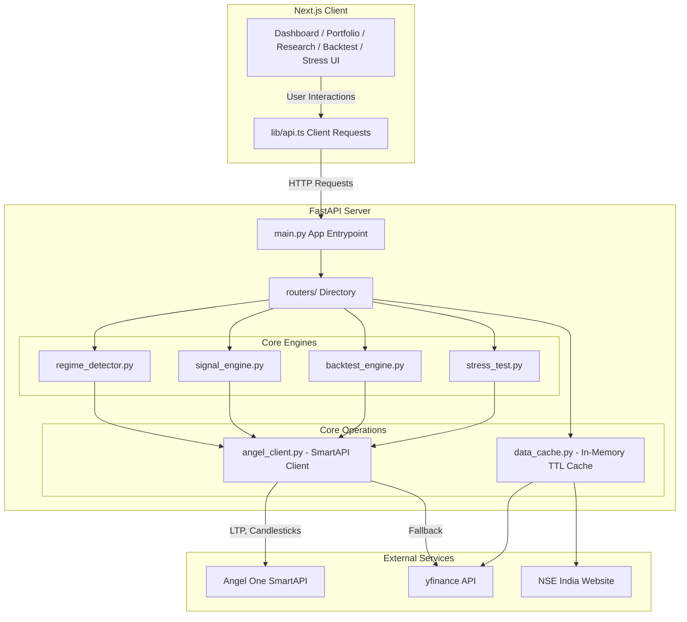

# P.R.A.V.A.H — Technical Codebase Documentation & Line-by-Line Breakdown
## Predictive Regime-Adaptive Valuation & Allocation Hub

This document provides a highly detailed, comprehensive, line-by-line and section-by-section breakdown of the P.R.A.V.A.H trading intelligence platform. It is structured specifically to enable external AI models or developers to understand every technical detail, algorithm, helper function, configuration, and flow in the codebase.

---

## 1. High-Level Architecture & Data Flow

P.R.A.V.A.H is structured as a decoupled web application with a **Python (FastAPI) Backend** and a **Next.js (React) Frontend**.



### Core Flows:
1. **Startup Authentication Flow**: On application startup, `main.py` triggers `angel_client.login()` to authenticate against the Angel One SmartAPI using TOTP. The JWT token, refresh token, and feed token are stored in an in-memory cached state with a 1-hour expiration.
2. **Market Regime Detection**: `regime_detector.py` fetches the Nifty 50 index and VIX index, computes technical indicators, calculates an aggregated score, and classifies the market into `BULL`, `BEAR`, or `SIDEWAYS` regimes.
3. **Signal Compilation**: `signal_engine.py` downloads 1 year of daily data, computes RSI, MACD, Bollinger Bands, and SMA crossovers to calculate a composite score and verdict (`STRONG BUY` to `STRONG SELL`) for selected stocks.
4. **Natural Language Portfolio Builder**: `routers/portfolio.py` parses user input using regex to extract budget, horizon, and risk levels. It dynamically selects Nifty constituents based on buy signals, allocates capital proportionally to their composite score, and calculates historical metrics (annualized returns and Sharpe ratio).
5. **Backtest Runner**: `backtest_engine.py` runs historical simulation of strategies (Crossover, RSI, MACD, Bollinger Bands, or Composite) against a target stock, computing standard metrics (alpha, win rate, Max Drawdown, Sortino, VaR).
6. **Stress Test Simulation**: `stress_test.py` simulates portfolio performance under historic crash events (e.g. COVID 2020) by looking up historic returns or applying custom percentage shocks scaled by the stock's beta value.

---

## 2. File-by-File Line-by-Line Breakdown

### backend/main.py\n**Description**: FastAPI Application entrypoint, route inclusion, and CORS configuration.\n\n#### Source Code\n```python\n1: from fastapi import FastAPI
2: from fastapi.middleware.cors import CORSMiddleware
3: from angel_client import login
4: 
5: app = FastAPI(title="PRAVAH API")
6: 
7: app.add_middleware(
8:     CORSMiddleware,
9:     allow_origins=["http://localhost:3000", "http://127.0.0.1:3000"],
10:     allow_methods=["*"],
11:     allow_headers=["*"],
12: )
13: 
14: # Login to Angel One at startup so first requests don't wait
15: @app.on_event("startup")
16: def startup():
17:     try:
18:         login()
19:         print("Angel One login successful")
20:     except Exception as e:
21:         print(f"Angel One login failed (will retry on first request): {e}")
22: 
23: from routers import regime, market, signals, portfolio, backtest, stress
24: 
25: app.include_router(regime.router,    prefix="/api")
26: app.include_router(market.router,    prefix="/api")
27: app.include_router(signals.router,   prefix="/api")
28: app.include_router(portfolio.router, prefix="/api")
29: app.include_router(backtest.router,  prefix="/api")
30: app.include_router(stress.router,    prefix="/api")
31: 
32: 
33: @app.get("/")
34: def root():
35:     return {"status": "ok", "service": "PRAVAH API", "version": "1.0.0"}
36: 
37: 
38: if __name__ == "__main__":
39:     import uvicorn
40:     uvicorn.run("main:app", host="0.0.0.0", port=8000, reload=True)
\n```\n\n#### Line-by-Line Breakdown\n- **Lines 1-2**: Imports `FastAPI` to initialize the API app, and `CORSMiddleware` to allow local cross-origin API communication between the React frontend (running on port 3000) and the FastAPI backend (running on port 8000).
- **Line 3**: Imports `login` from `angel_client.py` to handle early session authentication on server boot.
- **Line 5**: Instantiates the FastAPI application with a custom title `"PRAVAH API"`.
- **Lines 7-12**: Adds CORS middleware configuration. It explicitly lists `http://localhost:3000` and `http://127.0.0.1:3000` as allowed origins, enabling frontend applications to execute fetch requests. Wildcards are allowed for methods and headers.
- **Lines 15-21**: Defines an `@app.on_event("startup")` event handler that logs in to the Angel One SmartAPI on server initialization. If the credentials are wrong or the API service is down, it catches the error and prints a warning, deferring authentication until the first active request.
- **Line 23**: Imports all route groups from the `routers` module package folder.
- **Lines 25-30**: Attaches each router group to the main FastAPI application instance under the `/api` prefix path.
- **Lines 33-35**: Exposes a root GET handler (`/`) returning server health status, name, and version in JSON format.
- **Lines 38-40**: Standard Python block that executes if `main.py` is run directly. It imports `uvicorn` and runs the FastAPI server at host `0.0.0.0` and port `8000` with hot-reloading enabled.\n\n---\n\n### backend/angel_client.py\n**Description**: Angel One SmartAPI singleton client for authentication, scrip master lookup, and historical/LTP data fetching with yfinance fallback.\n\n#### Source Code\n```python\n1: """
2: Angel One SmartAPI client — singleton auth + data fetching.
3: Token refreshes automatically when expired.
4: """
5: 
6: import os
7: import time
8: import pyotp
9: import requests
10: from datetime import datetime, timedelta
11: from dotenv import load_dotenv
12: 
13: load_dotenv()
14: 
15: API_KEY     = os.getenv("ANGEL_API_KEY")
16: CLIENT_CODE = os.getenv("ANGEL_CLIENT_CODE")
17: PIN         = os.getenv("ANGEL_PIN")
18: TOTP_SECRET = os.getenv("ANGEL_TOTP_SECRET")
19: 
20: BASE_URL = "https://apiconnect.angelbroking.com"
21: 
22: _token_cache = {"jwt": None, "refresh": None, "feed_token": None, "expires_at": 0}
23: _public_ip: str = "127.0.0.1"
24: 
25: 
26: def _fetch_public_ip() -> str:
27:     """Fetch real public IP once at startup."""
28:     try:
29:         return requests.get("https://api.ipify.org", timeout=5).text.strip()
30:     except Exception:
31:         return "127.0.0.1"
32: 
33: 
34: def _headers(jwt: str = None) -> dict:
35:     h = {
36:         "Content-Type":     "application/json",
37:         "Accept":           "application/json",
38:         "X-UserType":       "USER",
39:         "X-SourceID":       "WEB",
40:         "X-ClientLocalIP":  "127.0.0.1",
41:         "X-ClientPublicIP": _public_ip,
42:         "X-MACAddress":     "00:00:00:00:00:00",
43:         "X-PrivateKey":     API_KEY,
44:     }
45:     if jwt:
46:         h["Authorization"] = f"Bearer {jwt}"
47:     return h
48: 
49: 
50: def login() -> dict:
51:     """Login to Angel One and cache JWT token. Returns token dict."""
52:     global _public_ip
53:     _public_ip = _fetch_public_ip()
54: 
55:     totp = pyotp.TOTP(TOTP_SECRET).now()
56:     resp = requests.post(
57:         f"{BASE_URL}/rest/auth/angelbroking/user/v1/loginByPassword",
58:         headers=_headers(),
59:         json={"clientcode": CLIENT_CODE, "password": PIN, "totp": totp},
60:         timeout=10,
61:     )
62:     resp.raise_for_status()
63:     data = resp.json().get("data", {})
64: 
65:     _token_cache["jwt"]        = data.get("jwtToken")
66:     _token_cache["refresh"]    = data.get("refreshToken")
67:     _token_cache["feed_token"] = data.get("feedToken")
68:     _token_cache["expires_at"] = time.time() + 3600
69:     return _token_cache
70: 
71: 
72: def get_token() -> str:
73:     """Return a valid JWT, re-logging in if expired."""
74:     if not _token_cache["jwt"] or time.time() > _token_cache["expires_at"] - 60:
75:         login()
76:     return _token_cache["jwt"]
77: 
78: 
79: # ── Instrument master ─────────────────────────────────────────────────────────
80: # Angel One publishes a live instrument master JSON with all token IDs.
81: # We fetch it once and build a lookup map: "RELIANCE-EQ" → token.
82: # NSE equity suffix is "-EQ", indices have their own tokens below.
83: 
84: _MASTER_URL = (
85:     "https://margincalculator.angelbroking.com/OpenAPI_File/files/OpenAPIScripMaster.json"
86: )
87: _instrument_cache: dict = {}   # "SYMBOL-EQ" → {"token": "...", "exchange": "NSE"}
88: _master_loaded = False
89: 
90: 
91: def _load_instrument_master():
92:     global _master_loaded
93:     if _master_loaded:
94:         return
95:     try:
96:         resp = requests.get(_MASTER_URL, timeout=20)
97:         if resp.status_code != 200:
98:             return
99:         for row in resp.json():
100:             sym   = row.get("symbol", "")
101:             token = row.get("token", "")
102:             exch  = row.get("exch_seg", "")
103:             if exch in ("NSE", "BSE") and token:
104:                 _instrument_cache[sym] = {"token": token, "exchange": exch}
105:         _master_loaded = True
106:     except Exception:
107:         pass
108: 
109: 
110: def _nse_symbol(yf_symbol: str) -> str:
111:     """Convert yfinance symbol to Angel One NSE trading symbol."""
112:     return yf_symbol.replace(".NS", "-EQ").replace(".BO", "-EQ")
113: 
114: 
115: # Static map for indices (these are permanent system tokens, not market data)
116: _INDEX_TOKENS = {
117:     "^NSEI":     {"token": "99926000", "exchange": "NSE"},   # Nifty 50
118:     "^NSEBANK":  {"token": "99926009", "exchange": "NSE"},   # Bank Nifty
119:     "^INDIAVIX": {"token": "99919000", "exchange": "NSE"},   # India VIX
120:     "^BSESN":    {"token": "1",        "exchange": "BSE"},   # Sensex (BSE)
121: }
122: 
123: 
124: def _resolve_token(symbol: str) -> dict | None:
125:     """Resolve any symbol to {token, exchange}. Tries index map first, then master."""
126:     if symbol in _INDEX_TOKENS:
127:         return _INDEX_TOKENS[symbol]
128: 
129:     _load_instrument_master()
130:     nse_sym = _nse_symbol(symbol)
131:     if nse_sym in _instrument_cache:
132:         return _instrument_cache[nse_sym]
133: 
134:     return None
135: 
136: 
137: # Keep SYMBOL_TOKEN_MAP as a convenience alias used by routers
138: @property
139: def SYMBOL_TOKEN_MAP():
140:     return _instrument_cache
141: 
142: 
143: # ── Market data helpers ────────────────────────────────────────────────────────
144: 
145: def get_ltp(symbol: str) -> dict | None:
146:     """Get last traded price for a symbol."""
147:     info = _resolve_token(symbol)
148:     if not info:
149:         return None
150: 
151:     jwt = get_token()
152:     resp = requests.post(
153:         f"{BASE_URL}/rest/secure/angelbroking/market/v1/quote/",
154:         headers=_headers(jwt),
155:         json={"mode": "LTP", "exchangeTokens": {info["exchange"]: [info["token"]]}},
156:         timeout=10,
157:     )
158:     if resp.status_code != 200:
159:         return None
160: 
161:     fetched = resp.json().get("data", {}).get("fetched", [])
162:     return fetched[0] if fetched else None
163: 
164: 
165: def get_candles(symbol: str, interval: str = "ONE_DAY",
166:                 days_back: int = 365) -> list[dict]:
167:     """
168:     Fetch OHLCV candle data from Angel One.
169:     Falls back to yfinance if token not found or API fails.
170:     """
171:     info = _resolve_token(symbol)
172:     if not info:
173:         return _yfinance_fallback(symbol, days_back)
174: 
175:     from_dt = (datetime.now() - timedelta(days=days_back)).strftime("%Y-%m-%d %H:%M")
176:     to_dt   = datetime.now().strftime("%Y-%m-%d %H:%M")
177: 
178:     try:
179:         jwt = get_token()
180:         resp = requests.post(
181:             f"{BASE_URL}/rest/secure/angelbroking/historical/v1/getCandleData",
182:             headers=_headers(jwt),
183:             json={
184:                 "exchange":    info["exchange"],
185:                 "symboltoken": info["token"],
186:                 "interval":    interval,
187:                 "fromdate":    from_dt,
188:                 "todate":      to_dt,
189:             },
190:             timeout=15,
191:         )
192:         if resp.status_code != 200:
193:             return _yfinance_fallback(symbol, days_back)
194: 
195:         candles = resp.json().get("data", [])
196:         if not candles:
197:             return _yfinance_fallback(symbol, days_back)
198: 
199:         return [
200:             {
201:                 "date":   c[0][:10],
202:                 "open":   c[1],
203:                 "high":   c[2],
204:                 "low":    c[3],
205:                 "close":  c[4],
206:                 "volume": c[5],
207:             }
208:             for c in candles
209:         ]
210:     except Exception:
211:         return _yfinance_fallback(symbol, days_back)
212: 
213: 
214: def _yfinance_fallback(symbol: str, days_back: int = 365) -> list[dict]:
215:     """yfinance backup when Angel One data unavailable."""
216:     try:
217:         import yfinance as yf
218:         period = f"{days_back}d" if days_back <= 730 else "2y"
219:         df = yf.download(symbol, period=period, progress=False, auto_adjust=True)
220:         if df.empty:
221:             return []
222:         df = df.reset_index()
223:         return [
224:             {
225:                 "date":   str(row["Date"])[:10],
226:                 "open":   round(float(row["Open"]), 2),
227:                 "high":   round(float(row["High"]), 2),
228:                 "low":    round(float(row["Low"]), 2),
229:                 "close":  round(float(row["Close"]), 2),
230:                 "volume": int(row["Volume"]),
231:             }
232:             for _, row in df.iterrows()
233:         ]
234:     except Exception:
235:         return []
\n```\n\n#### Line-by-Line Breakdown\n- **Lines 1-4**: Docstring defining the file's purpose: managing SmartAPI authentication, caching keys, and fetching market data.
- **Lines 6-11**: Imports standard libraries: `os` for environment variables, `time` for managing token expiration timestamps, `pyotp` for generating dynamic 2FA TOTP codes, `requests` for making HTTP calls to Angel One's servers, `datetime` for calculations of date limits, and `dotenv` to load local `.env` configs.
- **Line 13**: Calls `load_dotenv()` to parse and inject `.env` configurations.
- **Lines 15-18**: Extracts required API credentials from the environment: `ANGEL_API_KEY`, `ANGEL_CLIENT_CODE`, `ANGEL_PIN` (user password), and `ANGEL_TOTP_SECRET` (2FA seed).
- **Line 20**: Sets the base API endpoint for Angel One's SmartAPI.
- **Line 22**: Declares an in-memory dictionary `_token_cache` storing JWT tokens, refresh tokens, feed tokens, and expiration timestamps.
- **Line 23**: Defaults the client public IP variable.
- **Lines 26-31**: Implements `_fetch_public_ip()` which fetches the host's public IP address via the ipify service. This IP address is required in the headers of all secure requests to Angel One APIs.
- **Lines 34-47**: Implements `_headers(jwt)` which returns the standard header layout required by SmartAPI. It includes parameters like user type (`USER`), source ID (`WEB`), private API key (`X-PrivateKey`), and conditionally injects the authorization Bearer JWT token if passed.
- **Lines 50-69**: Implements the `login()` routine. It retrieves the current public IP, generates a time-based TOTP code using the `pyotp` library, and fires a POST request to `/rest/auth/angelbroking/user/v1/loginByPassword`. Upon success, it extracts and saves the JWT token, refresh token, and feed token into the cache, setting the expiry index to 1 hour in the future (3600 seconds).
- **Lines 72-76**: Implements `get_token()`. It retrieves the cached JWT token, automatically calling `login()` to fetch a fresh token if the cache is empty or if it is within 60 seconds of expiring.
- **Lines 84-88**: Declares variables for loading and caching the Angel One instrument scrip master.
- **Lines 91-107**: Implements `_load_instrument_master()`. It downloads the full JSON list of traded financial instruments from the official margin calculator endpoint. It iterates through the list and populates `_instrument_cache` mapping NSE/BSE trading symbols to their unique exchange tokens for later querying.
- **Lines 110-112**: Implements `_nse_symbol(yf_symbol)` which formats standard Yahoo Finance symbols (e.g. `RELIANCE.NS`) to NSE eq ticker format (`RELIANCE-EQ`).
- **Lines 116-121**: Defines static lookup tokens for primary market indices (Nifty 50, Bank Nifty, India VIX, and BSE Sensex) to skip downloading/searching the master list for them.
- **Lines 124-134**: Implements `_resolve_token(symbol)`. Resolves standard symbols to their exchange symbol code and numeric token ID. It checks the index list first, then runs `_load_instrument_master()` to lookup equities.
- **Lines 138-140**: Exposes `SYMBOL_TOKEN_MAP` property as a reference.
- **Lines 145-162**: Implements `get_ltp(symbol)`. Resolves the token and queries the SmartAPI Quote API endpoint (`/rest/secure/angelbroking/market/v1/quote/`) using `LTP` (Last Traded Price) mode. Returns the first matched price item.
- **Lines 165-212**: Implements `get_candles(symbol, interval, days_back)`. Resolves the symbol token, calculates the starting datetime offset, and sends a POST request to `/rest/secure/angelbroking/historical/v1/getCandleData`. If the token cannot be resolved, or if the API request fails or returns empty lists, it gracefully falls back to using `yfinance`.
- **Lines 214-235**: Implements `_yfinance_fallback(symbol, days_back)`. Resolves historical prices from Yahoo Finance using `yf.download`. It maps column labels to matches and formats the outputs to match the schema return format: `[{date, open, high, low, close, volume}]`.\n\n---\n\n### backend/data_cache.py\n**Description**: In-memory TTL cache for market caps, sectors, FII flows, and portfolio metric computations.\n\n#### Source Code\n```python\n1: """
2: Slow data fetched from yfinance and cached in-memory with TTL.
3: Market caps and sectors change slowly — 24h TTL is fine.
4: """
5: 
6: import time
7: import yfinance as yf
8: from signal_engine import NIFTY50_TICKERS
9: 
10: _cache: dict = {}
11: 
12: 
13: def _ttl_get(key: str, ttl: int):
14:     entry = _cache.get(key)
15:     if entry and time.time() < entry["expires"]:
16:         return entry["value"]
17:     return None
18: 
19: 
20: def _ttl_set(key: str, value, ttl: int):
21:     _cache[key] = {"value": value, "expires": time.time() + ttl}
22: 
23: 
24: def get_market_caps() -> dict[str, int]:
25:     cached = _ttl_get("market_caps", 86400)
26:     if cached:
27:         return cached
28: 
29:     caps = {}
30:     tickers = yf.Tickers(" ".join(NIFTY50_TICKERS))
31:     for symbol in NIFTY50_TICKERS:
32:         try:
33:             info = tickers.tickers[symbol].info
34:             cap = info.get("marketCap") or info.get("market_cap")
35:             if cap:
36:                 caps[symbol] = int(cap)
37:         except Exception:
38:             pass
39: 
40:     if not caps:
41:         # individual fallback (slower but more reliable)
42:         for symbol in NIFTY50_TICKERS:
43:             try:
44:                 info = yf.Ticker(symbol).info
45:                 cap = info.get("marketCap")
46:                 if cap:
47:                     caps[symbol] = int(cap)
48:             except Exception:
49:                 pass
50: 
51:     _ttl_set("market_caps", caps, 86400)
52:     return caps
53: 
54: 
55: def get_sectors() -> dict[str, str]:
56:     cached = _ttl_get("sectors", 86400)
57:     if cached:
58:         return cached
59: 
60:     sectors = {}
61:     for symbol in NIFTY50_TICKERS:
62:         try:
63:             info = yf.Ticker(symbol).info
64:             sector = info.get("sector") or info.get("sectorDisp")
65:             if sector:
66:                 sectors[symbol] = sector
67:         except Exception:
68:             pass
69: 
70:     _ttl_set("sectors", sectors, 86400)
71:     return sectors
72: 
73: 
74: def get_fii_net() -> float | None:
75:     """
76:     Try NSE India's public API for FII net flows.
77:     NSE blocks bots aggressively — this may fail silently and return None.
78:     If None, caller should omit the field or show 'N/A'.
79:     """
80:     cached = _ttl_get("fii_net", 3600)
81:     if cached is not None:
82:         return cached
83: 
84:     try:
85:         import requests
86:         session = requests.Session()
87:         session.headers.update({
88:             "User-Agent": (
89:                 "Mozilla/5.0 (Macintosh; Intel Mac OS X 10_15_7) "
90:                 "AppleWebKit/537.36 (KHTML, like Gecko) "
91:                 "Chrome/120.0.0.0 Safari/537.36"
92:             ),
93:             "Accept-Language": "en-US,en;q=0.9",
94:             "Referer": "https://www.nseindia.com/",
95:         })
96:         # Establish session cookie first
97:         session.get("https://www.nseindia.com", timeout=8)
98:         resp = session.get(
99:             "https://www.nseindia.com/api/fiidiiTradeReact",
100:             timeout=8,
101:         )
102:         if resp.status_code == 200:
103:             data = resp.json()
104:             # data is a list; first entry is latest date
105:             # Each entry: {category, buyValue, sellValue, netValue, ...}
106:             for entry in data:
107:                 if "FII" in entry.get("category", "").upper():
108:                     net = float(entry.get("netValue", 0))
109:                     _ttl_set("fii_net", net, 3600)
110:                     return net
111:     except Exception:
112:         pass
113: 
114:     _ttl_set("fii_net", None, 900)  # cache miss for 15 min so we don't hammer NSE
115:     return None
116: 
117: 
118: def compute_portfolio_metrics(allocations: list, candles_by_symbol: dict) -> dict:
119:     """
120:     Compute expected annual return and Sharpe from actual 1Y daily returns
121:     of the selected stocks, weighted by their portfolio weight.
122:     """
123:     import numpy as np
124:     import pandas as pd
125: 
126:     weighted_returns = None
127:     rf_daily = 0.065 / 252
128: 
129:     for alloc in allocations:
130:         symbol = alloc["symbol"]
131:         weight = alloc["weight"] / 100
132:         candles = candles_by_symbol.get(symbol, [])
133:         if len(candles) < 30:
134:             continue
135:         closes = pd.Series([c["close"] for c in candles], dtype=float)
136:         ret = closes.pct_change().dropna()
137:         if weighted_returns is None:
138:             weighted_returns = ret * weight
139:         else:
140:             min_len = min(len(weighted_returns), len(ret))
141:             weighted_returns = weighted_returns.iloc[-min_len:] + ret.iloc[-min_len:] * weight
142: 
143:     if weighted_returns is None or len(weighted_returns) < 20:
144:         return {"expected_return": None, "sharpe_estimate": None}
145: 
146:     annual_return = round(float(weighted_returns.mean() * 252 * 100), 2)
147:     std = float(weighted_returns.std())
148:     sharpe = round((weighted_returns.mean() - rf_daily) / std * np.sqrt(252), 2) if std > 0 else None
149: 
150:     return {"expected_return": annual_return, "sharpe_estimate": sharpe}
\n```\n\n#### Line-by-Line Breakdown\n- **Lines 6-8**: Imports `time` for tracking TTL, `yfinance`, and the `NIFTY50_TICKERS` list.
- **Line 10**: Declares `_cache` dict to store data alongside TTL timestamps.
- **Lines 13-21**: Implements `_ttl_get` and `_ttl_set` to fetch or set cache values if they haven't expired.
- **Lines 24-52**: Implements `get_market_caps()`. Downloads market capitalization values for the Nifty 50 stock tickers using a batch yfinance download. If batch retrieval fails, it falls back to querying each ticker individually. The results are cached for 24 hours (86,400 seconds).
- **Lines 55-71**: Implements `get_sectors()`. Queries yfinance to get sector properties for each Nifty stock and caches them for 24 hours.
- **Lines 74-115**: Implements `get_fii_net()`. Fetches daily FII/DII net flow values from the NSE India website. Because NSE India blocks automated scripts, the function utilizes a session wrapper with spoofed headers (User-Agent, Accept-Language, Referer) to establish a valid session first, before fetching the `fiidiiTradeReact` API endpoint. If blocked or empty, it returns `None`. Cached for 1 hour on success or 15 minutes on failure.
- **Lines 118-150**: Implements `compute_portfolio_metrics(allocations, candles_by_symbol)`. Calculates performance statistics for a generated portfolio. For each stock inside the allocations list, it calculates daily percent change returns from historical close prices. It compiles the weighted daily returns of the portfolio and annualizes the mean return. It calculates the standard deviation of daily returns and computes the Sharpe ratio using a daily risk-free rate of `0.065 / 252` (6.5% annualized risk-free rate).\n\n---\n\n### backend/regime_detector.py\n**Description**: Market regime scoring and classification engine using Nifty 50 and VIX daily candles.\n\n#### Source Code\n```python\n1: import pandas as pd
2: import numpy as np
3: from angel_client import get_candles
4: 
5: 
6: def detect_regime() -> dict:
7:     nifty_candles = get_candles("^NSEI", interval="ONE_DAY", days_back=400)
8:     vix_candles   = get_candles("^INDIAVIX", interval="ONE_DAY", days_back=30)
9: 
10:     if not nifty_candles:
11:         return _default_regime()
12: 
13:     nifty  = pd.Series([c["close"] for c in nifty_candles])
14:     current = float(nifty.iloc[-1])
15:     sma50   = float(nifty.rolling(50).mean().iloc[-1])
16:     sma200  = float(nifty.rolling(200).mean().iloc[-1])
17:     ret_20d = float(nifty.pct_change(20).iloc[-1])
18: 
19:     vix_now = float(vix_candles[-1]["close"]) if vix_candles else 15.0
20: 
21:     score = 0
22:     if current > sma200:  score += 2
23:     if current > sma50:   score += 1
24:     if sma50 > sma200:    score += 2
25:     if ret_20d > 0.03:    score += 1
26:     elif ret_20d < -0.03: score -= 2
27:     if vix_now < 15:      score += 2
28:     elif vix_now > 20:    score -= 2
29:     elif vix_now > 25:    score -= 3
30: 
31:     if score >= 4:
32:         regime = "BULL"
33:         hint   = "Aggressive — buy momentum stocks"
34:     elif score <= 0:
35:         regime = "BEAR"
36:         hint   = "Defensive — reduce exposure"
37:     else:
38:         regime = "SIDEWAYS"
39:         hint   = "Neutral — use RSI mean reversion"
40: 
41:     return {
42:         "regime":        regime,
43:         "score":         score,
44:         "vix":           round(vix_now, 2),
45:         "nifty":         round(current, 2),
46:         "sma50":         round(sma50, 2),
47:         "sma200":        round(sma200, 2),
48:         "nifty_vs_sma200": round((current - sma200) / sma200 * 100, 2),
49:         "description":   f"Nifty {'above' if current > sma200 else 'below'} SMA200, VIX at {vix_now:.1f}",
50:         "strategy_hint": hint,
51:     }
52: 
53: 
54: def _default_regime() -> dict:
55:     return {
56:         "regime": "BULL", "score": 4, "vix": 14.0, "nifty": 24000.0,
57:         "sma50": 23800.0, "sma200": 22500.0, "nifty_vs_sma200": 6.7,
58:         "description": "Default — live data unavailable",
59:         "strategy_hint": "Aggressive — buy momentum stocks",
60:     }
\n```\n\n#### Line-by-Line Breakdown\n- **Lines 1-3**: Imports `pandas`, `numpy`, and `get_candles` from `angel_client`.
- **Lines 6-51**: Implements `detect_regime()`. Fetches 400 days of daily historical Nifty 50 (`^NSEI`) price candles and 30 days of VIX (`^INDIAVIX`) candles.
  - **Lines 13-17**: Compiles Nifty close prices into a pandas Series and calculates:
    - **Current Price**: The latest closing price of Nifty.
    - **SMA 50**: 50-day Simple Moving Average.
    - **SMA 200**: 200-day Simple Moving Average.
    - **20-day Return**: Percentage change of closing price over the last 20 trading sessions.
  - **Line 19**: Establishes the latest VIX index value (defaulting to 15.0 if data is missing).
  - **Lines 21-29**: Scoring system evaluating parameters:
    - Price > SMA 200 (+2 points)
    - Price > SMA 50 (+1 point)
    - SMA 50 > SMA 200 (Golden Cross) (+2 points)
    - 20-day return > 3% (+1 point), < -3% (-2 points)
    - VIX < 15 (+2 points), VIX > 20 (-2 points), VIX > 25 (-3 points)
  - **Lines 31-39**: Assigns the regime:
    - **Score >= 4**: `BULL` (Market trending up, low volatility).
    - **Score <= 0**: `BEAR` (Market trending down, high volatility).
    - **Score 1-3**: `SIDEWAYS` (Range-bound market).
- **Lines 54-60**: Implements `_default_regime()`. Returns static fallback properties if historical candles cannot be fetched.\n\n---\n\n### backend/signal_engine.py\n**Description**: Technical analysis signal engine computing composite buy/sell indicators for Nifty 50 constituents.\n\n#### Source Code\n```python\n1: import pandas as pd
2: import numpy as np
3: from angel_client import get_candles, SYMBOL_TOKEN_MAP
4: 
5: NIFTY50_TICKERS = [
6:     "RELIANCE.NS","TCS.NS","HDFCBANK.NS","INFY.NS",
7:     "ICICIBANK.NS","SBIN.NS","BHARTIARTL.NS","ITC.NS",
8:     "LT.NS","AXISBANK.NS","KOTAKBANK.NS","HINDUNILVR.NS",
9:     "BAJFINANCE.NS","MARUTI.NS","TITAN.NS","WIPRO.NS",
10:     "HCLTECH.NS","NESTLEIND.NS","ULTRACEMCO.NS","ASIANPAINT.NS",
11: ]
12: 
13: 
14: def compute_signals(symbol: str) -> dict:
15:     candles = get_candles(symbol, interval="ONE_DAY", days_back=365)
16:     if len(candles) < 50:
17:         return {}
18: 
19:     df = pd.DataFrame(candles)
20:     close = df["close"].astype(float)
21:     high  = df["high"].astype(float)
22:     low   = df["low"].astype(float)
23: 
24:     # RSI
25:     delta = close.diff()
26:     gain  = delta.clip(lower=0).rolling(14).mean()
27:     loss  = (-delta.clip(upper=0)).rolling(14).mean()
28:     rs    = gain / loss.replace(0, np.nan)
29:     df["RSI"] = 100 - (100 / (1 + rs))
30: 
31:     # MACD
32:     ema12 = close.ewm(span=12, adjust=False).mean()
33:     ema26 = close.ewm(span=26, adjust=False).mean()
34:     df["MACD"]     = ema12 - ema26
35:     df["MACD_SIG"] = df["MACD"].ewm(span=9, adjust=False).mean()
36: 
37:     # SMA
38:     df["SMA_50"]  = close.rolling(50).mean()
39:     df["SMA_200"] = close.rolling(200).mean()
40: 
41:     # Bollinger Bands
42:     sma20      = close.rolling(20).mean()
43:     std20      = close.rolling(20).std()
44:     df["BB_UPPER"] = sma20 + 2 * std20
45:     df["BB_LOWER"] = sma20 - 2 * std20
46: 
47:     df = df.dropna()
48:     if len(df) < 2:
49:         return {}
50: 
51:     latest = df.iloc[-1]
52:     prev   = df.iloc[-2]
53: 
54:     score   = 0
55:     signals = {}
56:     rsi     = float(latest["RSI"])
57: 
58:     if rsi < 30:   score += 2; signals["rsi"] = "STRONG BUY"
59:     elif rsi < 45: score += 1; signals["rsi"] = "BUY"
60:     elif rsi > 70: score -= 2; signals["rsi"] = "STRONG SELL"
61:     elif rsi > 55: score -= 1; signals["rsi"] = "SELL"
62:     else:                       signals["rsi"] = "NEUTRAL"
63: 
64:     if latest["MACD"] > latest["MACD_SIG"] and prev["MACD"] < prev["MACD_SIG"]:
65:         score += 2; signals["macd"] = "BULLISH CROSSOVER"
66:     elif latest["MACD"] > latest["MACD_SIG"]:
67:         score += 1; signals["macd"] = "BULLISH"
68:     elif latest["MACD"] < latest["MACD_SIG"] and prev["MACD"] > prev["MACD_SIG"]:
69:         score -= 2; signals["macd"] = "BEARISH CROSSOVER"
70:     else:
71:         score -= 1; signals["macd"] = "BEARISH"
72: 
73:     if latest["SMA_50"] > latest["SMA_200"]:
74:         score += 2; signals["trend"] = "GOLDEN CROSS"
75:     else:
76:         score -= 2; signals["trend"] = "DEATH CROSS"
77: 
78:     cp = float(latest["close"])
79:     if cp < float(latest["BB_LOWER"]):
80:         score += 1; signals["bollinger"] = "OVERSOLD"
81:     elif cp > float(latest["BB_UPPER"]):
82:         score -= 1; signals["bollinger"] = "OVERBOUGHT"
83:     else:
84:         signals["bollinger"] = "NEUTRAL"
85: 
86:     normalized = round((score / 7) * 10, 1)
87:     if normalized > 5:    verdict = "STRONG BUY"
88:     elif normalized > 2:  verdict = "BUY"
89:     elif normalized > -2: verdict = "HOLD"
90:     elif normalized > -5: verdict = "SELL"
91:     else:                 verdict = "STRONG SELL"
92: 
93:     return {
94:         "symbol":          symbol,
95:         "composite_score": normalized,
96:         "verdict":         verdict,
97:         "rsi":             round(rsi, 1),
98:         "rsi_signal":      signals.get("rsi", "NEUTRAL"),
99:         "macd_signal":     signals.get("macd", "NEUTRAL"),
100:         "trend_signal":    signals.get("trend", "NEUTRAL"),
101:         "bb_signal":       signals.get("bollinger", "NEUTRAL"),
102:         "current_price":   round(cp, 2),
103:         "signals":         signals,
104:     }
105: 
106: 
107: def get_top_signals(n: int = 10) -> list:
108:     results = []
109:     for ticker in NIFTY50_TICKERS:
110:         try:
111:             sig = compute_signals(ticker)
112:             if sig:
113:                 results.append(sig)
114:         except Exception:
115:             pass
116:     results.sort(key=lambda x: x["composite_score"], reverse=True)
117:     return results[:n]
\n```\n\n#### Line-by-Line Breakdown\n- **Lines 5-11**: Declares `NIFTY50_TICKERS` containing the top 20 components of the Nifty index.
- **Lines 14-104**: Implements `compute_signals(symbol)`. Fetches 365 days of daily candles, returning an empty dictionary if less than 50 candles exist.
  - **Lines 24-29**: Manual calculation of 14-period RSI (Relative Strength Index). Computes daily price changes, splits positive gains and negative losses, calculates their rolling means, computes the RS ratio, and scales RSI between 0 and 100.
  - **Lines 31-35**: Manual calculation of MACD (Moving Average Convergence Divergence). Computes the 12-day and 26-day Exponential Moving Averages (EMA) of the close prices. The difference forms the MACD line. The 9-day EMA of the MACD line forms the MACD Signal line.
  - **Lines 37-39**: Computes the 50-day and 200-day Simple Moving Averages.
  - **Lines 41-45**: Computes Bollinger Bands. Standard deviation and mean are calculated over a rolling 20-day window. Upper and lower bands are placed at 2 standard deviations from the mean.
  - **Lines 58-84**: Individual technical indicators assign buy/sell scores:
    - **RSI**: RSI < 30 gives +2 (Strong Buy), RSI < 45 gives +1 (Buy), RSI > 70 gives -2 (Strong Sell), RSI > 55 gives -1 (Sell).
    - **MACD**: Bullish crossovers (MACD line crosses above Signal line) give +2. If MACD is simply above Signal, it gives +1. Bearish crossovers give -2, else bearish states give -1.
    - **Trend**: SMA 50 > SMA 200 (Golden Cross) gives +2, else -2 (Death Cross).
    - **Bollinger**: Close price below lower band gives +1 (Oversold), above upper band gives -1 (Overbought).
  - **Lines 86-91**: Normalizes the aggregated score between -10.0 and +10.0. Translates the score into a final recommendation verdict: `STRONG BUY`, `BUY`, `HOLD`, `SELL`, or `STRONG SELL`.
- **Lines 107-118**: Implements `get_top_signals(n)`. Iterates over the Nifty 50 stocks list, computes technical signals for each stock, and returns the top `n` stocks sorted by composite score.\n\n---\n\n### backend/backtest_engine.py\n**Description**: Historical strategy backtesting engine simulating crossovers, RSI, Bollinger Bands, MACD, or composite strategies with detailed drawdown and metric analysis.\n\n#### Source Code\n```python\n1: import pandas as pd
2: import numpy as np
3: from angel_client import get_candles
4: 
5: 
6: class BacktestEngine:
7: 
8:     def __init__(self, symbol: str, start: str, end: str, capital: float = 100000):
9:         self.symbol  = symbol
10:         self.capital = capital
11:         candles = get_candles(symbol, interval="ONE_DAY", days_back=900)
12:         df = pd.DataFrame(candles)
13:         df["date"] = pd.to_datetime(df["date"])
14:         df = df[(df["date"] >= start) & (df["date"] <= end)].reset_index(drop=True)
15:         for col in ["open", "high", "low", "close", "volume"]:
16:             df[col] = df[col].astype(float)
17:         self.df = self._compute(df)
18: 
19:     def _compute(self, df: pd.DataFrame) -> pd.DataFrame:
20:         c = df["close"]
21:         h = df["high"]
22:         l = df["low"]
23: 
24:         df["SMA_50"]  = c.rolling(50).mean()
25:         df["SMA_200"] = c.rolling(200).mean()
26: 
27:         delta = c.diff()
28:         gain  = delta.clip(lower=0).rolling(14).mean()
29:         loss  = (-delta.clip(upper=0)).rolling(14).mean()
30:         df["RSI"] = 100 - (100 / (1 + gain / loss.replace(0, np.nan)))
31: 
32:         ema12 = c.ewm(span=12, adjust=False).mean()
33:         ema26 = c.ewm(span=26, adjust=False).mean()
34:         df["MACD"]     = ema12 - ema26
35:         df["MACD_SIG"] = df["MACD"].ewm(span=9, adjust=False).mean()
36: 
37:         sma20 = c.rolling(20).mean()
38:         std20 = c.rolling(20).std()
39:         df["BB_UPPER"] = sma20 + 2 * std20
40:         df["BB_LOWER"] = sma20 - 2 * std20
41: 
42:         return df.dropna().reset_index(drop=True)
43: 
44:     def run(self, strategy: str = "composite") -> dict:
45:         df = self.df.copy()
46:         df["signal"] = 0
47: 
48:         if strategy == "ma_crossover":
49:             df.loc[df["SMA_50"] > df["SMA_200"], "signal"] = 1
50:             df.loc[df["SMA_50"] < df["SMA_200"], "signal"] = -1
51:         elif strategy == "rsi":
52:             df.loc[df["RSI"] < 30, "signal"] = 1
53:             df.loc[df["RSI"] > 70, "signal"] = -1
54:         elif strategy == "macd":
55:             df.loc[df["MACD"] > df["MACD_SIG"], "signal"] = 1
56:             df.loc[df["MACD"] < df["MACD_SIG"], "signal"] = -1
57:         elif strategy == "bollinger":
58:             df.loc[df["close"] < df["BB_LOWER"], "signal"] = 1
59:             df.loc[df["close"] > df["BB_UPPER"], "signal"] = -1
60:         elif strategy == "composite":
61:             s = pd.Series(0, index=df.index)
62:             s += (df["SMA_50"] > df["SMA_200"]).astype(int)
63:             s -= (df["SMA_50"] < df["SMA_200"]).astype(int)
64:             s += (df["RSI"] < 30).astype(int) * 2
65:             s -= (df["RSI"] > 70).astype(int) * 2
66:             s += (df["MACD"] > df["MACD_SIG"]).astype(int)
67:             s -= (df["MACD"] < df["MACD_SIG"]).astype(int)
68:             df.loc[s >= 2,  "signal"] = 1
69:             df.loc[s <= -2, "signal"] = -1
70: 
71:         df["position"]        = df["signal"].replace(0, np.nan).ffill().fillna(0)
72:         df["market_ret"]      = df["close"].pct_change()
73:         df["strategy_ret"]    = df["position"].shift(1) * df["market_ret"]
74:         df["market_equity"]   = self.capital * (1 + df["market_ret"]).cumprod()
75:         df["strategy_equity"] = self.capital * (1 + df["strategy_ret"]).cumprod()
76: 
77:         sr = df["strategy_ret"].dropna()
78:         rf = 0.065 / 252
79: 
80:         equity   = df["strategy_equity"]
81:         roll_max = equity.cummax()
82:         drawdown = (equity - roll_max) / roll_max
83: 
84:         equity_curve = [
85:             {"date": str(row["date"])[:10],
86:              "strategy": round(float(row["strategy_equity"])),
87:              "market":   round(float(row["market_equity"]))}
88:             for _, row in df.iterrows()
89:         ]
90:         dd_curve = [
91:             {"date": str(row["date"])[:10], "drawdown": round(float(dd) * 100, 2)}
92:             for (_, row), dd in zip(df.iterrows(), drawdown)
93:         ]
94: 
95:         neg_sr = sr[sr < 0]
96:         sortino_denom = neg_sr.std() if len(neg_sr) > 0 else sr.std()
97: 
98:         return {
99:             "total_return":   round((equity.iloc[-1] / self.capital - 1) * 100, 2),
100:             "annual_return":  round(sr.mean() * 252 * 100, 2),
101:             "market_return":  round((df["market_equity"].iloc[-1] / self.capital - 1) * 100, 2),
102:             "alpha":          round((equity.iloc[-1] - df["market_equity"].iloc[-1]) / self.capital * 100, 2),
103:             "sharpe":         round((sr.mean() - rf) / sr.std() * np.sqrt(252), 2),
104:             "sortino":        round((sr.mean() - rf) / sortino_denom * np.sqrt(252), 2),
105:             "max_drawdown":   round(drawdown.min() * 100, 2),
106:             "var_95":         round(float(np.percentile(sr, 5)) * 100, 2),
107:             "win_rate":       round((sr > 0).sum() / (sr != 0).sum() * 100, 2),
108:             "total_trades":   int((df["signal"] != df["signal"].shift(1)).sum()),
109:             "final_value":    round(float(equity.iloc[-1]), 2),
110:             "equity_curve":   equity_curve,
111:             "drawdown_curve": dd_curve,
112:         }
\n```\n\n#### Line-by-Line Breakdown\n- **Lines 8-17**: Initializes the engine. Fetches 900 days of historical daily candles to accommodate long indicators (like the 200 SMA) and slices the data by start and end dates.
- **Lines 19-42**: Implements `_compute(df)`. Computes indicators on the historical dataframe (SMA 50, SMA 200, RSI 14, MACD, MACD Signal, Bollinger Bands) and drops NaN values from the beginning.
- **Lines 44-112**: Implements `run(strategy)`. Executes backtest simulation based on selected rules:
  - **Strategies**:
    - `ma_crossover`: BUY (position 1) when SMA50 > SMA200, SELL/Short (position -1) when SMA50 < SMA200.
    - `rsi`: BUY when RSI < 30, SELL when RSI > 70.
    - `macd`: BUY when MACD > Signal, SELL when MACD < Signal.
    - `bollinger`: BUY when Price < Lower Band, SELL when Price > Upper Band.
    - `composite`: Integrates SMA crossover (+1/-1), RSI oversold/overbought (+2/-2), and MACD (+1/-1). Enters BUY if sum is >= 2, and SELL if sum is <= -2.
  - **Performance calculations**:
    - **Position**: Forward fills active trade signals to maintain positions across days.
    - **Returns**: Calculates daily market returns. Strategy returns are calculated by multiplying the prior day's position by the current day's market returns.
    - **Equity Curves**: Strategy and market returns are accumulated compoundly (`cumprod`) starting from the initial capital.
    - **Drawdowns**: Tracks peak portfolio value (`cummax`) and computes daily drawdowns.
    - **Sortino Ratio**: Uses daily downside deviation (returns below 0) to evaluate return-to-downside risk.
    - **Value at Risk (VaR)**: Finds the 5th percentile of daily strategy returns (95% confidence VaR).
    - **Win Rate**: Calculated as the percentage of profitable active trading days.
    - **Total Trades**: Counts the number of times the position changes.\n\n---\n\n### backend/stress_test.py\n**Description**: Historical stress-testing and custom market shock simulation engine based on asset betas.\n\n#### Source Code\n```python\n1: from angel_client import get_candles
2: 
3: SCENARIOS = {
4:     "covid_2020":          ("2020-01-15", "2020-03-24"),
5:     "bear_2022":           ("2022-01-01", "2022-06-17"),
6:     "demonetisation_2016": ("2016-11-08", "2016-12-26"),
7:     "adani_2023":          ("2023-01-24", "2023-02-22"),
8:     "il_fs_2018":          ("2018-09-21", "2018-10-26"),
9: }
10: 
11: SCENARIO_LABELS = {
12:     "covid_2020":          "COVID Crash 2020",
13:     "bear_2022":           "Bear Market 2022",
14:     "demonetisation_2016": "Demonetisation 2016",
15:     "adani_2023":          "Adani Crisis 2023",
16:     "il_fs_2018":          "IL&FS Crisis 2018",
17: }
18: 
19: 
20: def _period_return(symbol: str, start: str, end: str) -> float:
21:     import pandas as pd
22:     candles = get_candles(symbol, interval="ONE_DAY", days_back=2000)
23:     if not candles:
24:         return -10.0
25:     df = pd.DataFrame(candles)
26:     df["date"] = pd.to_datetime(df["date"])
27:     window = df[(df["date"] >= start) & (df["date"] <= end)]
28:     if len(window) < 2:
29:         return -10.0
30:     p0 = float(window.iloc[0]["close"])
31:     p1 = float(window.iloc[-1]["close"])
32:     return round((p1 - p0) / p0 * 100, 2)
33: 
34: 
35: def run_stress_test(portfolio: dict, scenario: str, custom_drop: float = None) -> dict:
36:     """
37:     portfolio = {"RELIANCE.NS": 0.15, "TCS.NS": 0.12, ...}
38:     scenario  = key from SCENARIOS or "custom"
39:     """
40:     tickers = list(portfolio.keys())
41: 
42:     if scenario == "custom" and custom_drop is not None:
43:         stock_impacts = {}
44:         for ticker in tickers:
45:             try:
46:                 import yfinance as yf
47:                 beta = yf.Ticker(ticker).info.get("beta", 1.0) or 1.0
48:             except Exception:
49:                 beta = 1.0
50:             stock_impacts[ticker] = round(custom_drop * beta, 2)
51:         nifty_drop  = custom_drop
52:         description = f"Custom Shock: Nifty -{abs(custom_drop):.1f}%"
53: 
54:     else:
55:         if scenario not in SCENARIOS:
56:             scenario = "covid_2020"
57:         start, end = SCENARIOS[scenario]
58:         nifty_drop  = _period_return("^NSEI", start, end)
59:         description = SCENARIO_LABELS.get(scenario, scenario)
60: 
61:         stock_impacts = {}
62:         for ticker in tickers:
63:             impact = _period_return(ticker, start, end)
64:             stock_impacts[ticker] = impact if impact != -10.0 else nifty_drop
65: 
66:     portfolio_after = 0.0
67:     for ticker, weight in portfolio.items():
68:         drop   = stock_impacts.get(ticker, nifty_drop) / 100
69:         portfolio_after += weight * (1 + drop)
70: 
71:     portfolio_loss = round((portfolio_after - 1.0) * 100, 2)
72: 
73:     return {
74:         "scenario":           description,
75:         "nifty_drop":         nifty_drop,
76:         "portfolio_before":   100.0,
77:         "portfolio_after":    round(portfolio_after * 100, 2),
78:         "portfolio_loss_pct": portfolio_loss,
79:         "stock_impacts":      [{"symbol": k, "impact": v} for k, v in stock_impacts.items()],
80:         "worst_stock":        min(stock_impacts, key=stock_impacts.get) if stock_impacts else "",
81:         "best_stock":         max(stock_impacts, key=stock_impacts.get) if stock_impacts else "",
82:     }
\n```\n\n#### Line-by-Line Breakdown\n- **Lines 3-9**: Defines date boundaries for historical stress events: COVID crash, 2022 bear market, 2016 demonetisation, 2023 Adani saga, and 2018 IL&FS liquidity crisis.
- **Lines 11-17**: Associates user-friendly labels with each historical stress scenario.
- **Lines 20-32**: Implements `_period_return(symbol, start, end)`. Computes the total cumulative return of an asset between two historical dates.
- **Lines 35-82**: Implements `run_stress_test(portfolio, scenario, custom_drop)`.
  - **Custom Shocks**: If a custom shock percentage drop is specified, it retrieves each stock's beta factor from yfinance (defaulting to 1.0 if not found) and multiplies the market drop by beta (`custom_drop * beta`) to simulate the stock's shock drop.
  - **Historical Shocks**: If a historical scenario is selected, it calculates the actual price return for each stock during that period. If historical data is missing, it falls back to using the market index drop.
  - **Portfolio Aggregation**: Aggregates the individual asset changes weighted by their portfolio weight to calculate the simulated loss, remaining value, and identifies the best and worst performing components.\n\n---\n\n### backend/routers/regime.py\n**Description**: FastAPI router exposing market regime detection endpoint.\n\n#### Source Code\n```python\n1: from fastapi import APIRouter
2: from regime_detector import detect_regime
3: 
4: router = APIRouter()
5: 
6: @router.get("/regime")
7: def get_regime():
8:     return detect_regime()
\n```\n\n#### Line-by-Line Breakdown\n- **Lines 6-8**: Exposes a GET endpoint `/regime` that runs and returns the market regime detection metrics from `detect_regime()`.\n\n---\n\n### backend/routers/market.py\n**Description**: FastAPI router exposing index quotes, individual stock historical data, and market cap endpoints.\n\n#### Source Code\n```python\n1: from fastapi import APIRouter, Query
2: from angel_client import get_ltp, get_candles
3: from data_cache import get_market_caps, get_fii_net
4: 
5: router = APIRouter()
6: 
7: 
8: @router.get("/market/indices")
9: def get_indices():
10:     """Live Nifty, Sensex, BankNifty, VIX — from Angel One (yfinance fallback)."""
11: 
12:     def _ltp_to_quote(symbol: str) -> dict:
13:         ltp = get_ltp(symbol)
14:         if ltp and ltp.get("ltp"):
15:             return {
16:                 "value":      round(float(ltp["ltp"]), 2),
17:                 "change":     round(float(ltp.get("netChange", 0)), 2),
18:                 "change_pct": round(float(ltp.get("percentChange", 0)), 2),
19:             }
20:         # fallback: last close from yfinance
21:         candles = get_candles(symbol, "ONE_DAY", 2)
22:         if candles:
23:             c = candles[-1]
24:             prev = candles[-2]["close"] if len(candles) >= 2 else c["close"]
25:             chg = round(c["close"] - prev, 2)
26:             pct = round(chg / prev * 100, 2) if prev else 0
27:             return {"value": c["close"], "change": chg, "change_pct": pct}
28:         return {"value": None, "change": None, "change_pct": None}
29: 
30:     nifty    = _ltp_to_quote("^NSEI")
31:     sensex   = _ltp_to_quote("^BSESN")   # real BSE Sensex — not a derived formula
32:     banknifty = _ltp_to_quote("^NSEBANK")
33: 
34:     vix_ltp = get_ltp("^INDIAVIX")
35:     if vix_ltp and vix_ltp.get("ltp"):
36:         vix_val = round(float(vix_ltp["ltp"]), 2)
37:     else:
38:         vix_candles = get_candles("^INDIAVIX", "ONE_DAY", 2)
39:         vix_val = vix_candles[-1]["close"] if vix_candles else None
40: 
41:     vix_sentiment = None
42:     if vix_val is not None:
43:         vix_sentiment = "LOW FEAR" if vix_val < 15 else ("HIGH FEAR" if vix_val > 22 else "MODERATE")
44: 
45:     fii_net = get_fii_net()  # None when NSE blocks the request
46: 
47:     return {
48:         "nifty50":   nifty,
49:         "sensex":    sensex,
50:         "banknifty": banknifty,
51:         "vix": {
52:             "value":     vix_val,
53:             "sentiment": vix_sentiment,
54:         },
55:         "fii_net":          fii_net,
56:         "fii_net_available": fii_net is not None,
57:     }
58: 
59: 
60: @router.get("/market/stock")
61: def get_stock(symbol: str = Query(...), period: str = Query("1y")):
62:     period_days = {
63:         "1d": 1, "5d": 5, "1mo": 30, "3mo": 90,
64:         "6mo": 180, "1y": 365, "2y": 730, "5y": 1825,
65:     }
66:     days    = period_days.get(period, 365)
67:     candles = get_candles(symbol, interval="ONE_DAY", days_back=days)
68:     if not candles:
69:         return {"error": "No data available", "symbol": symbol}
70:     return {
71:         "symbol":  symbol,
72:         "period":  period,
73:         "candles": candles,
74:         "dates":   [c["date"]   for c in candles],
75:         "open":    [c["open"]   for c in candles],
76:         "high":    [c["high"]   for c in candles],
77:         "low":     [c["low"]    for c in candles],
78:         "close":   [c["close"]  for c in candles],
79:         "volume":  [c["volume"] for c in candles],
80:     }
81: 
82: 
83: @router.get("/market/caps")
84: def market_caps():
85:     """Live market caps from yfinance — cached 24h."""
86:     return get_market_caps()
\n```\n\n#### Line-by-Line Breakdown\n- **Lines 8-57**: Implements GET `/market/indices`. Fetches Nifty, Sensex, Bank Nifty, and VIX quotes.
  - **Lines 12-28**: Inner helper `_ltp_to_quote` fetches the last traded price using `get_ltp()`. If that fails, it falls back to fetching historical daily candles, using the last closing price and calculating the daily percentage change.
  - **Lines 34-43**: Handles VIX sentiment classification (`LOW FEAR`, `HIGH FEAR`, or `MODERATE`).
  - **Line 45**: Fetches FII net flows, returning `None` if the request is blocked.
- **Lines 60-80**: Implements GET `/market/stock`. Retrieves historical stock daily candles for the requested symbol and timeframe, returning lists of dates, opens, highs, lows, closes, and volumes.
- **Lines 83-86**: Implements GET `/market/caps`. Exposes cached Nifty 50 market capitalizations.\n\n---\n\n### backend/routers/signals.py\n**Description**: FastAPI router exposing technical signals endpoints for individual and top-performing assets.\n\n#### Source Code\n```python\n1: from fastapi import APIRouter, Query
2: from signal_engine import compute_signals, get_top_signals
3: 
4: router = APIRouter()
5: 
6: @router.get("/signals")
7: def get_signals(symbol: str = Query(...)):
8:     result = compute_signals(symbol)
9:     if not result:
10:         return {"error": "Could not compute signals", "symbol": symbol}
11:     return result
12: 
13: @router.get("/signals/top")
14: def top_signals(n: int = Query(10)):
15:     return get_top_signals(n)
\n```\n\n#### Line-by-Line Breakdown\n- **Lines 6-11**: Implements GET `/signals` which returns technical signal metrics for a given stock symbol.
- **Lines 13-15**: Implements GET `/signals/top` which returns the top `n` Nifty 50 stocks ranked by technical buy signals.\n\n---\n\n### backend/routers/portfolio.py\n**Description**: FastAPI router exposing the regex-based Natural Language portfolio generator and signal-weighted allocation optimizer.\n\n#### Source Code\n```python\n1: import re
2: from fastapi import APIRouter
3: from pydantic import BaseModel
4: from regime_detector import detect_regime
5: from signal_engine import compute_signals, NIFTY50_TICKERS
6: from data_cache import get_sectors, compute_portfolio_metrics
7: from angel_client import get_candles
8: 
9: router = APIRouter()
10: 
11: 
12: class PortfolioBrief(BaseModel):
13:     brief: str
14: 
15: 
16: def _parse_brief(text: str) -> dict:
17:     text_lower = text.lower()
18: 
19:     amount_match = re.search(r"(\d+(?:\.\d+)?)\s*(?:lakh|lac|l\b)", text_lower)
20:     if amount_match:
21:         budget = float(amount_match.group(1)) * 100000
22:     else:
23:         cr_match = re.search(r"(\d+(?:\.\d+)?)\s*(?:crore|cr\b)", text_lower)
24:         budget = float(cr_match.group(1)) * 10000000 if cr_match else 500000
25: 
26:     yr_match = re.search(r"(\d+)\s*(?:year|yr)", text_lower)
27:     mo_match = re.search(r"(\d+)\s*(?:month|mo)", text_lower)
28:     if yr_match:
29:         horizon_months = int(yr_match.group(1)) * 12
30:     elif mo_match:
31:         horizon_months = int(mo_match.group(1))
32:     else:
33:         horizon_months = 60
34: 
35:     if any(w in text_lower for w in ["aggressive", "high risk", "risky"]):
36:         risk = "HIGH"
37:     elif any(w in text_lower for w in ["safe", "conservative", "low risk", "capital protect"]):
38:         risk = "LOW"
39:     else:
40:         risk = "MODERATE"
41: 
42:     return {"budget_inr": budget, "horizon_months": horizon_months, "risk_level": risk}
43: 
44: 
45: def _build_portfolio(budget: float, risk: str, signals: list, sectors: dict) -> list:
46:     if risk == "HIGH":
47:         allowed, n_stocks = {"STRONG BUY", "BUY"}, 10
48:     elif risk == "LOW":
49:         allowed, n_stocks = {"STRONG BUY", "BUY", "HOLD"}, 15
50:     else:
51:         allowed, n_stocks = {"STRONG BUY", "BUY"}, 12
52: 
53:     candidates = [s for s in signals if s.get("verdict") in allowed] or signals
54:     candidates = candidates[:n_stocks]
55:     total_score = sum(max(s["composite_score"], 0.1) for s in candidates)
56: 
57:     allocations = []
58:     for s in candidates:
59:         weight = max(s["composite_score"], 0.1) / total_score
60:         allocations.append({
61:             "symbol":     s["symbol"],
62:             "weight":     round(weight * 100, 2),
63:             "amount_inr": round(budget * weight, 2),
64:             "sector":     sectors.get(s["symbol"], "Other"),
65:             "signal":     s["verdict"],
66:             "score":      s["composite_score"],
67:         })
68: 
69:     return allocations
70: 
71: 
72: @router.post("/portfolio/create")
73: def create_portfolio(body: PortfolioBrief):
74:     parsed  = _parse_brief(body.brief)
75:     regime  = detect_regime()
76:     sectors = get_sectors()   # live from yfinance, cached 24h
77:     signals = []
78: 
79:     for ticker in NIFTY50_TICKERS[:15]:
80:         try:
81:             sig = compute_signals(ticker)
82:             if sig:
83:                 signals.append(sig)
84:         except Exception:
85:             pass
86: 
87:     signals.sort(key=lambda x: x["composite_score"], reverse=True)
88:     allocations = _build_portfolio(parsed["budget_inr"], parsed["risk_level"], signals, sectors)
89: 
90:     # Fetch recent candles for selected stocks to compute real return & Sharpe
91:     candles_by_symbol = {}
92:     for alloc in allocations:
93:         try:
94:             candles_by_symbol[alloc["symbol"]] = get_candles(alloc["symbol"], "ONE_DAY", 365)
95:         except Exception:
96:             pass
97: 
98:     metrics = compute_portfolio_metrics(allocations, candles_by_symbol)
99: 
100:     return {
101:         "receipt": {
102:             "budget_inr":       parsed["budget_inr"],
103:             "horizon_months":   parsed["horizon_months"],
104:             "risk_level":       parsed["risk_level"],
105:             "current_regime":   regime["regime"],
106:             "strategy_applied": f"Signal-Weighted {parsed['risk_level'].title()} Allocation",
107:         },
108:         "allocation": allocations,
109:         "metrics": {
110:             "expected_return":  metrics["expected_return"],      # annualised %, from real 1Y data
111:             "sharpe_estimate":  metrics["sharpe_estimate"],      # from real weighted returns
112:             "num_stocks":       len(allocations),
113:             "total_weight":     round(sum(a["weight"] for a in allocations), 2),
114:             "metrics_note":     "Based on trailing 1-year historical returns of selected stocks"
115:                                 if metrics["expected_return"] is not None
116:                                 else "Insufficient price history to compute metrics",
117:         },
118:     }
\n```\n\n#### Line-by-Line Breakdown\n- **Lines 12-13**: Declares the incoming JSON schema using Pydantic, expecting a text string `brief`.
- **Lines 16-42**: Implements `_parse_brief(text)`. Uses regex to parse natural language:
  - **Budget**: Scans for numbers followed by 'lakh/lac/l' (multiplied by 100,000) or 'crore/cr' (multiplied by 10,000,000). Defaults to 500,000.
  - **Horizon**: Scans for years (multiplied by 12) or months. Defaults to 60 months.
  - **Risk**: Searches for key terms ('aggressive', 'high risk' -> HIGH; 'safe', 'conservative' -> LOW). Defaults to MODERATE.
- **Lines 45-69**: Implements `_build_portfolio(budget, risk, signals, sectors)`. Filters stocks by signal rating based on user risk level:
  - **HIGH**: Allowed signals are `STRONG BUY` and `BUY` (allocates to top 10 stocks).
  - **MODERATE**: Allowed signals are `STRONG BUY` and `BUY` (allocates to top 12 stocks).
  - **LOW**: Allowed signals are `STRONG BUY`, `BUY`, and `HOLD` (allocates to top 15 stocks).
  - Calculates weights proportionally based on their composite technical scores.
- **Lines 72-118**: Implements POST `/portfolio/create`. Processes the natural language brief, fetches regime data and sector mappings, computes signals for the first 15 Nifty stocks, builds allocations, retrieves 1-year historical price candles to calculate expected return and Sharpe ratio, and returns the compiled portfolio data.\n\n---\n\n### backend/routers/backtest.py\n**Description**: FastAPI router exposing the historical backtester simulation endpoint.\n\n#### Source Code\n```python\n1: from fastapi import APIRouter
2: from pydantic import BaseModel
3: from backtest_engine import BacktestEngine
4: 
5: router = APIRouter()
6: 
7: 
8: class BacktestRequest(BaseModel):
9:     symbol:   str = "^NSEI"
10:     strategy: str = "composite"
11:     start:    str = "2023-01-01"
12:     end:      str = "2025-06-27"
13:     capital:  float = 100000
14: 
15: 
16: @router.post("/backtest")
17: def run_backtest(body: BacktestRequest):
18:     try:
19:         engine = BacktestEngine(body.symbol, body.start, body.end, body.capital)
20:         return engine.run(body.strategy)
21:     except Exception as e:
22:         return {"error": str(e)}
\n```\n\n#### Line-by-Line Breakdown\n- **Lines 8-13**: Declares the JSON input schema: symbol, strategy type, start and end dates, and initial capital.
- **Lines 16-22**: Implements POST `/backtest`. Instantiates the backtest engine and runs the historical strategy simulation, returning performance metrics.\n\n---\n\n### backend/routers/stress.py\n**Description**: FastAPI router exposing the portfolio stress-test endpoint.\n\n#### Source Code\n```python\n1: from fastapi import APIRouter
2: from pydantic import BaseModel
3: from typing import Optional
4: from stress_test import run_stress_test
5: 
6: router = APIRouter()
7: 
8: 
9: class StressRequest(BaseModel):
10:     portfolio:   dict
11:     scenario:    str = "covid_2020"
12:     custom_drop: Optional[float] = None
13: 
14: 
15: @router.post("/stress-test")
16: def stress_test(body: StressRequest):
17:     try:
18:         return run_stress_test(body.portfolio, body.scenario, body.custom_drop)
19:     except Exception as e:
20:         return {"error": str(e)}
\n```\n\n#### Line-by-Line Breakdown\n- **Lines 9-12**: Declares the JSON input schema: portfolio weights dictionary, scenario label, and optional custom shock percentage.
- **Lines 15-21**: Implements POST `/stress-test`. Executes the stress test engine and returns the portfolio loss and stock impact results.\n\n---\n\n### frontend/app/layout.js\n**Description**: Next.js root layout initializing Geist fonts, styling, and metadata.\n\n#### Source Code\n```javascript\n1: import { Geist, Geist_Mono } from "next/font/google";
2: import "./globals.css";
3: 
4: const geistSans = Geist({
5:   variable: "--font-geist-sans",
6:   subsets: ["latin"],
7: });
8: 
9: const geistMono = Geist_Mono({
10:   variable: "--font-geist-mono",
11:   subsets: ["latin"],
12: });
13: 
14: export const metadata = {
15:   title: "Create Next App",
16:   description: "Generated by create next app",
17: };
18: 
19: export default function RootLayout({ children }) {
20:   return (
21:     <html
22:       lang="en"
23:       className={`${geistSans.variable} ${geistMono.variable} h-full antialiased`}
24:     >
25:       <body className="min-h-full flex flex-col">{children}</body>
26:     </html>
27:   );
28: }
\n```\n\n#### Line-by-Line Breakdown\n- **Lines 4-12**: Imports and initializes Geist Sans and Geist Mono web fonts from Google Fonts, setting CSS variables.
- **Lines 14-17**: Configures global metadata (page title and description).
- **Lines 19-28**: Root HTML layout component. Injects font classes and wraps child pages inside a full-height flex container.\n\n---\n\n### frontend/app/page.js\n**Description**: Next.js default landing page template.\n\n#### Source Code\n```javascript\n1: import Image from "next/image";
2: 
3: export default function Home() {
4:   return (
5:     <div className="flex flex-col flex-1 items-center justify-center bg-zinc-50 font-sans dark:bg-black">
6:       <main className="flex flex-1 w-full max-w-3xl flex-col items-center justify-between py-32 px-16 bg-white dark:bg-black sm:items-start">
7:         <Image
8:           className="dark:invert"
9:           src="/next.svg"
10:           alt="Next.js logo"
11:           width={100}
12:           height={20}
13:           priority
14:         />
15:         <div className="flex flex-col items-center gap-6 text-center sm:items-start sm:text-left">
16:           <h1 className="max-w-xs text-3xl font-semibold leading-10 tracking-tight text-black dark:text-zinc-50">
17:             To get started, edit the page.js file.
18:           </h1>
19:           <p className="max-w-md text-lg leading-8 text-zinc-600 dark:text-zinc-400">
20:             Looking for a starting point or more instructions? Head over to{" "}
21:             <a
22:               href="https://vercel.com/templates?framework=next.js&utm_source=create-next-app&utm_medium=appdir-template-tw&utm_campaign=create-next-app"
23:               className="font-medium text-zinc-950 dark:text-zinc-50"
24:             >
25:               Templates
26:             </a>{" "}
27:             or the{" "}
28:             <a
29:               href="https://nextjs.org/learn?utm_source=create-next-app&utm_medium=appdir-template-tw&utm_campaign=create-next-app"
30:               className="font-medium text-zinc-950 dark:text-zinc-50"
31:             >
32:               Learning
33:             </a>{" "}
34:             center.
35:           </p>
36:         </div>
37:         <div className="flex flex-col gap-4 text-base font-medium sm:flex-row">
38:           <a
39:             className="flex h-12 w-full items-center justify-center gap-2 rounded-full bg-foreground px-5 text-background transition-colors hover:bg-[#383838] dark:hover:bg-[#ccc] md:w-[158px]"
40:             href="https://vercel.com/new?utm_source=create-next-app&utm_medium=appdir-template-tw&utm_campaign=create-next-app"
41:             target="_blank"
42:             rel="noopener noreferrer"
43:           >
44:             <Image
45:               className="dark:invert"
46:               src="/vercel.svg"
47:               alt="Vercel logomark"
48:               width={16}
49:               height={16}
50:             />
51:             Deploy Now
52:           </a>
53:           <a
54:             className="flex h-12 w-full items-center justify-center rounded-full border border-solid border-black/[.08] px-5 transition-colors hover:border-transparent hover:bg-black/[.04] dark:border-white/[.145] dark:hover:bg-[#1a1a1a] md:w-[158px]"
55:             href="https://nextjs.org/docs?utm_source=create-next-app&utm_medium=appdir-template-tw&utm_campaign=create-next-app"
56:             target="_blank"
57:             rel="noopener noreferrer"
58:           >
59:             Documentation
60:           </a>
61:         </div>
62:       </main>
63:     </div>
64:   );
65: }
\n```\n\n#### Line-by-Line Breakdown\n- **Lines 3-65**: Renders the default boilerplate landing screen for the Next.js framework, containing links to Vercel templates, code directories, and documentation.\n\n---\n\n### frontend/app/globals.css\n**Description**: Next.js Tailwind CSS theme declarations and CSS base settings.\n\n#### Source Code\n```css\n1: @import "tailwindcss";
2: 
3: :root {
4:   --background: #ffffff;
5:   --foreground: #171717;
6: }
7: 
8: @theme inline {
9:   --color-background: var(--background);
10:   --color-foreground: var(--foreground);
11:   --font-sans: var(--font-geist-sans);
12:   --font-mono: var(--font-geist-mono);
13: }
14: 
15: @media (prefers-color-scheme: dark) {
16:   :root {
17:     --background: #0a0a0a;
18:     --foreground: #ededed;
19:   }
20: }
21: 
22: body {
23:   background: var(--background);
24:   color: var(--foreground);
25:   font-family: Arial, Helvetica, sans-serif;
26: }
\n```\n\n#### Line-by-Line Breakdown\n- **Line 1**: Imports Tailwind CSS utility styles.
- **Lines 3-26**: Configures CSS variables for light and dark themes (background and text colors) and maps font families to Geist variables.\n\n---\n\n