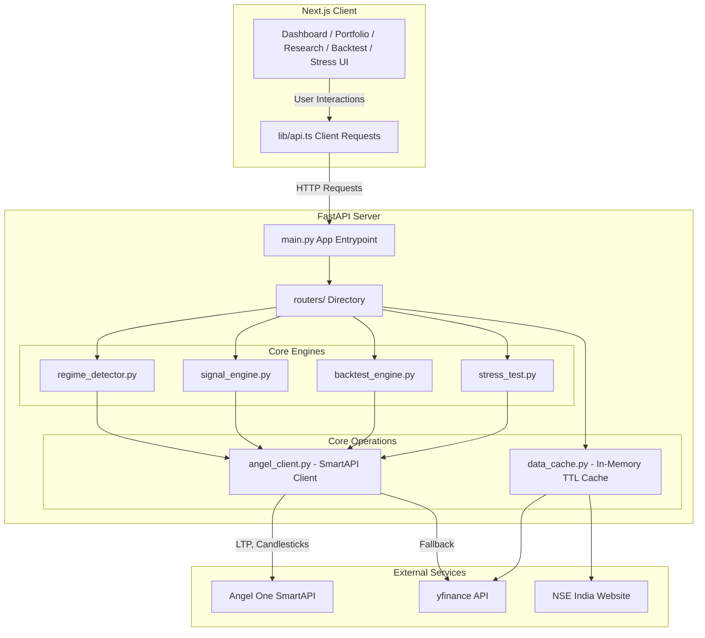

# P.R.A.V.A.H — Technical Codebase Documentation & Line-by-Line Breakdown
## Predictive Regime-Adaptive Valuation & Allocation Hub

This document provides a highly detailed, comprehensive, line-by-line and section-by-section breakdown of the P.R.A.V.A.H trading intelligence platform. It is structured specifically to enable external AI models or developers to understand every technical detail, algorithm, helper function, configuration, and flow in the codebase.

---

## 1. High-Level Architecture & Data Flow

P.R.A.V.A.H is structured as a decoupled web application with a **Python (FastAPI) Backend** and a **Next.js (React) Frontend**.



### Core Flows:
1. **Startup Authentication Flow**: On application startup, `main.py` triggers `angel_client.login()` to authenticate against the Angel One SmartAPI using TOTP. The JWT token, refresh token, and feed token are stored in an in-memory cached state with a 1-hour expiration.
2. **Market Regime Detection**: `regime_detector.py` fetches the Nifty 50 index and VIX index, computes technical indicators, calculates an aggregated score, and classifies the market into `BULL`, `BEAR`, or `SIDEWAYS` regimes.
3. **Signal Compilation**: `signal_engine.py` downloads 1 year of daily data, computes RSI, MACD, Bollinger Bands, and SMA crossovers to calculate a composite score and verdict (`STRONG BUY` to `STRONG SELL`) for selected stocks.
4. **Natural Language Portfolio Builder**: `routers/portfolio.py` parses user input using regex to extract budget, horizon, and risk levels. It dynamically selects Nifty constituents based on buy signals, allocates capital proportionally to their composite score, and calculates historical metrics (annualized returns and Sharpe ratio).
5. **Backtest Runner**: `backtest_engine.py` runs historical simulation of strategies (Crossover, RSI, MACD, Bollinger Bands, or Composite) against a target stock, computing standard metrics (alpha, win rate, Max Drawdown, Sortino, VaR).
6. **Stress Test Simulation**: `stress_test.py` simulates portfolio performance under historic crash events (e.g. COVID 2020) by looking up historic returns or applying custom percentage shocks scaled by the stock's beta value.

---

## 2. File-by-File Line-by-Line Breakdown

### backend/main.py\n**Description**: FastAPI Application entrypoint, route inclusion, and CORS configuration.\n\n#### Source Code\n```python\n1: import asyncio
2: from contextlib import asynccontextmanager
3: from fastapi import FastAPI, Request
4: from fastapi.middleware.cors import CORSMiddleware
5: from fastapi.responses import JSONResponse
6: from angel_client import login
7: 
8: 
9: def _warm_cache():
10:     """Background: prefetch all Nifty50 candles + compute signals into MongoDB."""
11:     try:
12:         from signal_engine import get_top_signals, _compute_all_signals_bg
13:         get_top_signals(50)   # warms Nifty50 synchronously, triggers BG for all 379
14:         print("[cache] startup warm complete")
15:     except Exception as e:
16:         print(f"[cache] Warm failed: {e}")
17: 
18: 
19: @asynccontextmanager
20: async def lifespan(app: FastAPI):
21:     try:
22:         login()
23:         print("Angel One login successful")
24:     except Exception as e:
25:         print(f"Angel One login failed (will retry on first request): {e}")
26:     # Fire-and-forget cache warm — don't block startup
27:     asyncio.get_event_loop().run_in_executor(None, _warm_cache)
28:     yield
29: 
30: 
31: app = FastAPI(title="PRAVAH API", lifespan=lifespan)
32: 
33: app.add_middleware(
34:     CORSMiddleware,
35:     allow_origins=["http://localhost:3000", "http://127.0.0.1:3000"],
36:     allow_methods=["*"],
37:     allow_headers=["*"],
38: )
39: 
40: @app.exception_handler(Exception)
41: async def unhandled_exception(request: Request, exc: Exception):
42:     import traceback
43:     traceback.print_exc()
44:     origin = request.headers.get("origin", "")
45:     headers = {"Access-Control-Allow-Origin": origin} if origin else {}
46:     return JSONResponse(
47:         status_code=500,
48:         content={"error": str(exc), "type": type(exc).__name__},
49:         headers=headers,
50:     )
51: 
52: from routers import regime, market, signals, portfolio, backtest, stress, auth, optimizer, news
53: 
54: app.include_router(auth.router,      prefix="/api")
55: app.include_router(regime.router,    prefix="/api")
56: app.include_router(market.router,    prefix="/api")
57: app.include_router(signals.router,   prefix="/api")
58: app.include_router(portfolio.router, prefix="/api")
59: app.include_router(backtest.router,  prefix="/api")
60: app.include_router(stress.router,    prefix="/api")
61: app.include_router(optimizer.router, prefix="/api")
62: app.include_router(news.router,      prefix="/api")
63: 
64: 
65: @app.get("/")
66: def root():
67:     return {"status": "ok", "service": "PRAVAH API", "version": "1.0.0"}
68: 
69: 
70: if __name__ == "__main__":
71:     import uvicorn
72:     uvicorn.run("main:app", host="0.0.0.0", port=8000, reload=True)
\n```\n\n#### Line-by-Line Breakdown\n- **Lines 1-2**: Imports `FastAPI` to initialize the API app, and `CORSMiddleware` to allow local cross-origin API communication between the React frontend (running on port 3000) and the FastAPI backend (running on port 8000).
- **Line 3**: Imports `login` from `angel_client.py` to handle early session authentication on server boot.
- **Line 5**: Instantiates the FastAPI application with a custom title `"PRAVAH API"`.
- **Lines 7-12**: Adds CORS middleware configuration. It explicitly lists `http://localhost:3000` and `http://127.0.0.1:3000` as allowed origins, enabling frontend applications to execute fetch requests. Wildcards are allowed for methods and headers.
- **Lines 15-21**: Defines an `@app.on_event("startup")` event handler that logs in to the Angel One SmartAPI on server initialization. If the credentials are wrong or the API service is down, it catches the error and prints a warning, deferring authentication until the first active request.
- **Line 23**: Imports all route groups from the `routers` module package folder.
- **Lines 25-30**: Attaches each router group to the main FastAPI application instance under the `/api` prefix path.
- **Lines 33-35**: Exposes a root GET handler (`/`) returning server health status, name, and version in JSON format.
- **Lines 38-40**: Standard Python block that executes if `main.py` is run directly. It imports `uvicorn` and runs the FastAPI server at host `0.0.0.0` and port `8000` with hot-reloading enabled.\n\n---\n\n### backend/angel_client.py\n**Description**: Angel One SmartAPI singleton client for authentication, scrip master lookup, and historical/LTP data fetching with yfinance fallback.\n\n#### Source Code\n```python\n1: """
2: Angel One SmartAPI client — singleton auth + data fetching.
3: Token refreshes automatically when expired.
4: """
5: 
6: import os
7: import time
8: import pyotp
9: import requests
10: from datetime import datetime, timedelta
11: import json
12: from dotenv import load_dotenv
13: 
14: load_dotenv()
15: 
16: API_KEY     = os.getenv("ANGEL_API_KEY")
17: CLIENT_CODE = os.getenv("ANGEL_CLIENT_CODE")
18: PIN         = os.getenv("ANGEL_PIN")
19: TOTP_SECRET = os.getenv("ANGEL_TOTP_SECRET")
20: 
21: BASE_URL = "https://apiconnect.angelbroking.com"
22: 
23: _token_cache = {"jwt": None, "refresh": None, "feed_token": None, "expires_at": 0}
24: _public_ip: str = "127.0.0.1"
25: 
26: 
27: def _fetch_public_ip() -> str:
28:     """Fetch real public IP once at startup."""
29:     try:
30:         return requests.get("https://api.ipify.org", timeout=5).text.strip()
31:     except Exception:
32:         return "127.0.0.1"
33: 
34: 
35: def _headers(jwt: str = None) -> dict:
36:     h = {
37:         "Content-Type":     "application/json",
38:         "Accept":           "application/json",
39:         "X-UserType":       "USER",
40:         "X-SourceID":       "WEB",
41:         "X-ClientLocalIP":  "127.0.0.1",
42:         "X-ClientPublicIP": _public_ip,
43:         "X-MACAddress":     "00:00:00:00:00:00",
44:         "X-PrivateKey":     API_KEY,
45:     }
46:     if jwt:
47:         h["Authorization"] = f"Bearer {jwt}"
48:     return h
49: 
50: 
51: def login() -> dict:
52:     """Login to Angel One and cache JWT token. Returns token dict."""
53:     global _public_ip
54:     _public_ip = _fetch_public_ip()
55: 
56:     totp = pyotp.TOTP(TOTP_SECRET).now()
57:     resp = requests.post(
58:         f"{BASE_URL}/rest/auth/angelbroking/user/v1/loginByPassword",
59:         headers=_headers(),
60:         json={"clientcode": CLIENT_CODE, "password": PIN, "totp": totp},
61:         timeout=10,
62:     )
63:     resp.raise_for_status()
64:     data = resp.json().get("data", {})
65: 
66:     _token_cache["jwt"]        = data.get("jwtToken")
67:     _token_cache["refresh"]    = data.get("refreshToken")
68:     _token_cache["feed_token"] = data.get("feedToken")
69:     _token_cache["expires_at"] = time.time() + 3600
70:     return _token_cache
71: 
72: 
73: def get_token() -> str:
74:     """Return a valid JWT, re-logging in if expired."""
75:     if not _token_cache["jwt"] or time.time() > _token_cache["expires_at"] - 60:
76:         login()
77:     return _token_cache["jwt"]
78: 
79: 
80: # ── Instrument master ─────────────────────────────────────────────────────────
81: # Angel One publishes a live instrument master JSON with all token IDs.
82: # We fetch it once and build a lookup map: "RELIANCE-EQ" → token.
83: # NSE equity suffix is "-EQ", indices have their own tokens below.
84: 
85: _MASTER_URL = (
86:     "https://margincalculator.angelbroking.com/OpenAPI_File/files/OpenAPIScripMaster.json"
87: )
88: _instrument_cache: dict = {}   # "SYMBOL-EQ" → {"token": "...", "exchange": "NSE"}
89: _master_loaded = False
90: 
91: 
92: def _load_instrument_master():
93:     global _master_loaded
94:     if _master_loaded:
95:         return
96:     cache_path = os.path.join(os.path.dirname(__file__), "OpenAPIScripMaster.json")
97:     data = None
98:     if os.path.exists(cache_path):
99:         mtime = os.path.getmtime(cache_path)
100:         if time.time() - mtime < 86400:  # 24 hours TTL
101:             try:
102:                 with open(cache_path, "r", encoding="utf-8") as f:
103:                     data = json.load(f)
104:             except Exception:
105:                 pass
106:     if not data:
107:         try:
108:             resp = requests.get(_MASTER_URL, timeout=20)
109:             if resp.status_code == 200:
110:                 data = resp.json()
111:                 try:
112:                     with open(cache_path, "w", encoding="utf-8") as f:
113:                         json.dump(data, f)
114:                 except Exception:
115:                     pass
116:         except Exception:
117:             pass
118:     if data:
119:         try:
120:             for row in data:
121:                 sym   = row.get("symbol", "")
122:                 token = row.get("token", "")
123:                 exch  = row.get("exch_seg", "")
124:                 if exch in ("NSE", "BSE") and token:
125:                     _instrument_cache[sym] = {"token": token, "exchange": exch}
126:             _master_loaded = True
127:         except Exception:
128:             pass
129: 
130: 
131: def _nse_symbol(yf_symbol: str) -> str:
132:     """Convert yfinance symbol to Angel One NSE trading symbol."""
133:     return yf_symbol.replace(".NS", "-EQ").replace(".BO", "-EQ")
134: 
135: 
136: # Static map for indices (these are permanent system tokens, not market data)
137: _INDEX_TOKENS = {
138:     "^NSEI":     {"token": "99926000", "exchange": "NSE"},   # Nifty 50
139:     "^NSEBANK":  {"token": "99926009", "exchange": "NSE"},   # Bank Nifty
140:     "^INDIAVIX": {"token": "99919000", "exchange": "NSE"},   # India VIX
141:     "^BSESN":    {"token": "1",        "exchange": "BSE"},   # Sensex (BSE)
142: }
143: 
144: 
145: def _resolve_token(symbol: str) -> dict | None:
146:     """Resolve any symbol to {token, exchange}. Tries index map first, then master."""
147:     if symbol in _INDEX_TOKENS:
148:         return _INDEX_TOKENS[symbol]
149: 
150:     _load_instrument_master()
151:     nse_sym = _nse_symbol(symbol)
152:     if nse_sym in _instrument_cache:
153:         return _instrument_cache[nse_sym]
154: 
155:     return None
156: 
157: 
158: # Keep SYMBOL_TOKEN_MAP as a convenience alias used by routers
159: @property
160: def SYMBOL_TOKEN_MAP():
161:     return _instrument_cache
162: 
163: 
164: # ── Market data helpers ────────────────────────────────────────────────────────
165: 
166: def get_ltp(symbol: str) -> dict | None:
167:     """Get last traded price for a symbol."""
168:     info = _resolve_token(symbol)
169:     if not info:
170:         return None
171: 
172:     jwt = get_token()
173:     resp = requests.post(
174:         f"{BASE_URL}/rest/secure/angelbroking/market/v1/quote/",
175:         headers=_headers(jwt),
176:         json={"mode": "LTP", "exchangeTokens": {info["exchange"]: [info["token"]]}},
177:         timeout=10,
178:     )
179:     if resp.status_code != 200:
180:         return None
181: 
182:     fetched = resp.json().get("data", {}).get("fetched", [])
183:     return fetched[0] if fetched else None
184: 
185: 
186: def get_candles(symbol: str, interval: str = "ONE_DAY",
187:                 days_back: int = 365) -> list[dict]:
188:     """
189:     Fetch OHLCV candle data. Checks MongoDB cache first — cold fetch only on miss.
190:     For periods > 30 days, yfinance is preferred over Angel One free tier.
191:     """
192:     try:
193:         from data_cache import get_cached_candles, _store_candles
194:         cached = get_cached_candles(symbol, days_back)
195:         if cached is not None:
196:             return cached
197:     except Exception:
198:         pass
199: 
200:     if days_back > 30:
201:         data = _yfinance_fallback(symbol, days_back)
202:         if data:
203:             try:
204:                 from data_cache import _store_candles
205:                 _store_candles(symbol, days_back, data)
206:             except Exception:
207:                 pass
208:             return data
209:         result = _angel_candles(symbol, interval, days_back)
210:     else:
211:         result = _angel_candles(symbol, interval, days_back)
212: 
213:     if result:
214:         try:
215:             from data_cache import _store_candles
216:             _store_candles(symbol, days_back, result)
217:         except Exception:
218:             pass
219:     return result
220: 
221: 
222: def _angel_candles(symbol: str, interval: str, days_back: int) -> list[dict]:
223:     """Fetch candles from Angel One API with yfinance fallback."""
224:     info = _resolve_token(symbol)
225:     if not info:
226:         return _yfinance_fallback(symbol, days_back)
227: 
228:     from_dt = (datetime.now() - timedelta(days=days_back)).strftime("%Y-%m-%d %H:%M")
229:     to_dt   = datetime.now().strftime("%Y-%m-%d %H:%M")
230: 
231:     try:
232:         jwt = get_token()
233:         resp = requests.post(
234:             f"{BASE_URL}/rest/secure/angelbroking/historical/v1/getCandleData",
235:             headers=_headers(jwt),
236:             json={
237:                 "exchange":    info["exchange"],
238:                 "symboltoken": info["token"],
239:                 "interval":    interval,
240:                 "fromdate":    from_dt,
241:                 "todate":      to_dt,
242:             },
243:             timeout=15,
244:         )
245:         if resp.status_code != 200:
246:             return _yfinance_fallback(symbol, days_back)
247: 
248:         candles = resp.json().get("data", [])
249:         if not candles:
250:             return _yfinance_fallback(symbol, days_back)
251: 
252:         # Sanity check: Angel One free tier often returns partial data.
253:         # If returned candles cover less than 30% of expected trading days,
254:         # the data is truncated — fall back to yfinance for full history.
255:         expected_trading_days = int(days_back * 0.7)  # ~5/7 of calendar days
256:         if len(candles) < int(expected_trading_days * 0.3):
257:             yf_data = _yfinance_fallback(symbol, days_back)
258:             if yf_data:
259:                 return yf_data
260: 
261:         return [
262:             {
263:                 "date":   c[0][:10],
264:                 "open":   round(float(c[1]), 2),
265:                 "high":   round(float(c[2]), 2),
266:                 "low":    round(float(c[3]), 2),
267:                 "close":  round(float(c[4]), 2),
268:                 "volume": int(c[5]),
269:             }
270:             for c in candles
271:         ]
272:     except Exception:
273:         return _yfinance_fallback(symbol, days_back)
274: 
275: 
276: def get_holdings() -> list[dict]:
277:     """Fetch live equity holdings from Angel One portfolio."""
278:     try:
279:         jwt = get_token()
280:         resp = requests.get(
281:             f"{BASE_URL}/rest/secure/angelbroking/portfolio/v1/getHolding",
282:             headers=_headers(jwt),
283:             timeout=10,
284:         )
285:         if resp.status_code != 200:
286:             return []
287:         data = resp.json().get("data", []) or []
288:         result = []
289:         for h in data:
290:             qty = int(h.get("quantity", 0) or 0)
291:             if qty <= 0:
292:                 continue
293:             ltp = round(float(h.get("ltp", 0) or 0), 2)
294:             avg = round(float(h.get("averageprice", 0) or 0), 2)
295:             trading_sym = h.get("tradingsymbol", "")
296:             display = trading_sym.replace("-EQ", "").replace("-BE", "").strip()
297:             total_val = round(ltp * qty if ltp else avg * qty, 2)
298:             result.append({
299:                 "symbol":         display + ".NS",
300:                 "display_symbol": display,
301:                 "qty":            qty,
302:                 "avg_price":      avg,
303:                 "current_price":  ltp,
304:                 "pnl":            round(float(h.get("profitandloss", 0) or 0), 2),
305:                 "pnl_pct":        round(float(h.get("pnlpercentage", 0) or 0), 2),
306:                 "total_value":    total_val,
307:                 "isin":           h.get("isin", ""),
308:             })
309:         return result
310:     except Exception:
311:         return []
312: 
313: 
314: def get_positions() -> list[dict]:
315:     """Fetch intraday/open positions from Angel One."""
316:     try:
317:         jwt = get_token()
318:         resp = requests.get(
319:             f"{BASE_URL}/rest/secure/angelbroking/order/v1/getPosition",
320:             headers=_headers(jwt),
321:             timeout=10,
322:         )
323:         if resp.status_code != 200:
324:             return []
325:         data = resp.json().get("data", []) or []
326:         result = []
327:         for p in data:
328:             net_qty = int(p.get("netqty", 0) or 0)
329:             if net_qty == 0:
330:                 continue
331:             ltp = round(float(p.get("ltp", 0) or 0), 2)
332:             avg = round(float(p.get("netprice", 0) or 0), 2)
333:             trading_sym = p.get("tradingsymbol", "")
334:             display = trading_sym.replace("-EQ", "").replace("-BE", "").strip()
335:             result.append({
336:                 "symbol":         display + ".NS",
337:                 "display_symbol": display,
338:                 "qty":            net_qty,
339:                 "avg_price":      avg,
340:                 "current_price":  ltp,
341:                 "pnl":            round(float(p.get("pnl", 0) or 0), 2),
342:                 "product":        p.get("producttype", "CNC"),
343:                 "exchange":       p.get("exchange", "NSE"),
344:             })
345:         return result
346:     except Exception:
347:         return []
348: 
349: 
350: def _yfinance_fallback(symbol: str, days_back: int = 365) -> list[dict]:
351:     """yfinance historical OHLCV — raw (unadjusted) prices to match NSE/BSE quotes."""
352:     try:
353:         import yfinance as yf
354:         if days_back <= 30:    period = "1mo"
355:         elif days_back <= 90:  period = "3mo"
356:         elif days_back <= 180: period = "6mo"
357:         elif days_back <= 365: period = "1y"
358:         elif days_back <= 730: period = "2y"
359:         elif days_back <= 1825: period = "5y"
360:         else:                   period = "10y"
361:         # auto_adjust=False → raw traded prices that match what NSE/BSE display
362:         df = yf.download(symbol, period=period, progress=False, auto_adjust=False)
363:         if df.empty:
364:             return []
365:         df = df.reset_index()
366:         # Column names vary by yfinance version — handle both flat and MultiIndex
367:         cols = [c[0] if isinstance(c, tuple) else c for c in df.columns]
368:         df.columns = cols
369:         return [
370:             {
371:                 "date":   str(row["Date"])[:10],
372:                 "open":   round(float(row["Open"]), 2),
373:                 "high":   round(float(row["High"]), 2),
374:                 "low":    round(float(row["Low"]), 2),
375:                 "close":  round(float(row["Close"]), 2),
376:                 "volume": int(row["Volume"]),
377:             }
378:             for _, row in df.iterrows()
379:         ]
380:     except Exception:
381:         return []
\n```\n\n#### Line-by-Line Breakdown\n- **Lines 1-4**: Docstring defining the file's purpose: managing SmartAPI authentication, caching keys, and fetching market data.
- **Lines 6-11**: Imports standard libraries: `os` for environment variables, `time` for managing token expiration timestamps, `pyotp` for generating dynamic 2FA TOTP codes, `requests` for making HTTP calls to Angel One's servers, `datetime` for calculations of date limits, and `dotenv` to load local `.env` configs.
- **Line 13**: Calls `load_dotenv()` to parse and inject `.env` configurations.
- **Lines 15-18**: Extracts required API credentials from the environment: `ANGEL_API_KEY`, `ANGEL_CLIENT_CODE`, `ANGEL_PIN` (user password), and `ANGEL_TOTP_SECRET` (2FA seed).
- **Line 20**: Sets the base API endpoint for Angel One's SmartAPI.
- **Line 22**: Declares an in-memory dictionary `_token_cache` storing JWT tokens, refresh tokens, feed tokens, and expiration timestamps.
- **Line 23**: Defaults the client public IP variable.
- **Lines 26-31**: Implements `_fetch_public_ip()` which fetches the host's public IP address via the ipify service. This IP address is required in the headers of all secure requests to Angel One APIs.
- **Lines 34-47**: Implements `_headers(jwt)` which returns the standard header layout required by SmartAPI. It includes parameters like user type (`USER`), source ID (`WEB`), private API key (`X-PrivateKey`), and conditionally injects the authorization Bearer JWT token if passed.
- **Lines 50-69**: Implements the `login()` routine. It retrieves the current public IP, generates a time-based TOTP code using the `pyotp` library, and fires a POST request to `/rest/auth/angelbroking/user/v1/loginByPassword`. Upon success, it extracts and saves the JWT token, refresh token, and feed token into the cache, setting the expiry index to 1 hour in the future (3600 seconds).
- **Lines 72-76**: Implements `get_token()`. It retrieves the cached JWT token, automatically calling `login()` to fetch a fresh token if the cache is empty or if it is within 60 seconds of expiring.
- **Lines 84-88**: Declares variables for loading and caching the Angel One instrument scrip master.
- **Lines 91-107**: Implements `_load_instrument_master()`. It downloads the full JSON list of traded financial instruments from the official margin calculator endpoint. It iterates through the list and populates `_instrument_cache` mapping NSE/BSE trading symbols to their unique exchange tokens for later querying.
- **Lines 110-112**: Implements `_nse_symbol(yf_symbol)` which formats standard Yahoo Finance symbols (e.g. `RELIANCE.NS`) to NSE eq ticker format (`RELIANCE-EQ`).
- **Lines 116-121**: Defines static lookup tokens for primary market indices (Nifty 50, Bank Nifty, India VIX, and BSE Sensex) to skip downloading/searching the master list for them.
- **Lines 124-134**: Implements `_resolve_token(symbol)`. Resolves standard symbols to their exchange symbol code and numeric token ID. It checks the index list first, then runs `_load_instrument_master()` to lookup equities.
- **Lines 138-140**: Exposes `SYMBOL_TOKEN_MAP` property as a reference.
- **Lines 145-162**: Implements `get_ltp(symbol)`. Resolves the token and queries the SmartAPI Quote API endpoint (`/rest/secure/angelbroking/market/v1/quote/`) using `LTP` (Last Traded Price) mode. Returns the first matched price item.
- **Lines 165-212**: Implements `get_candles(symbol, interval, days_back)`. Resolves the symbol token, calculates the starting datetime offset, and sends a POST request to `/rest/secure/angelbroking/historical/v1/getCandleData`. If the token cannot be resolved, or if the API request fails or returns empty lists, it gracefully falls back to using `yfinance`.
- **Lines 214-235**: Implements `_yfinance_fallback(symbol, days_back)`. Resolves historical prices from Yahoo Finance using `yf.download`. It maps column labels to matches and formats the outputs to match the schema return format: `[{date, open, high, low, close, volume}]`.\n\n---\n\n### backend/data_cache.py\n**Description**: In-memory TTL cache for market caps, sectors, FII flows, and portfolio metric computations.\n\n#### Source Code\n```python\n1: """
2: Tiered cache: MongoDB (persistent, survives restarts) → in-memory TTL → live fetch.
3: Candles: 6h TTL.  Signals: 1h TTL.  Market caps / sectors: 24h TTL.
4: """
5: 
6: import time
7: from datetime import datetime, timezone, timedelta
8: 
9: import yfinance as yf
10: from signal_engine import NIFTY50_TICKERS
11: 
12: # ── In-memory fallback ────────────────────────────────────────────────────────
13: 
14: _mem: dict = {}
15: _candle_mem: dict = {}
16: 
17: 
18: def _mem_get(key: str):
19:     e = _mem.get(key)
20:     return e["value"] if e and time.time() < e["expires"] else None
21: 
22: 
23: def _mem_set(key: str, value, ttl: int):
24:     _mem[key] = {"value": value, "expires": time.time() + ttl}
25: 
26: 
27: # ── MongoDB helpers ───────────────────────────────────────────────────────────
28: 
29: def _mongo_get(collection, key: str):
30:     try:
31:         doc = collection.find_one({"_id": key})
32:         if doc and doc["expires_at"] > datetime.now(timezone.utc):
33:             return doc["value"]
34:     except Exception:
35:         pass
36:     return None
37: 
38: 
39: def _mongo_set(collection, key: str, value, ttl: int):
40:     try:
41:         collection.replace_one(
42:             {"_id": key},
43:             {"_id": key, "value": value, "expires_at": datetime.now(timezone.utc) + timedelta(seconds=ttl)},
44:             upsert=True,
45:         )
46:     except Exception:
47:         pass
48: 
49: 
50: # ── Generic TTL cache (market caps, sectors, FII) ────────────────────────────
51: 
52: def _get(key: str, ttl: int):
53:     try:
54:         from db import cache_collection, MONGO_AVAILABLE
55:         if MONGO_AVAILABLE and cache_collection is not None:
56:             v = _mongo_get(cache_collection, key)
57:             if v is not None:
58:                 return v
59:     except Exception:
60:         pass
61:     return _mem_get(key)
62: 
63: 
64: def _set(key: str, value, ttl: int):
65:     _mem_set(key, value, ttl)
66:     try:
67:         from db import cache_collection, MONGO_AVAILABLE
68:         if MONGO_AVAILABLE and cache_collection is not None:
69:             _mongo_set(cache_collection, key, value, ttl)
70:     except Exception:
71:         pass
72: 
73: 
74: # ── Candle cache ──────────────────────────────────────────────────────────────
75: 
76: CANDLE_TTL = 6 * 3600  # 6h — covers full trading day between opens
77: 
78: 
79: def get_cached_candles(symbol: str, days_back: int = 365) -> list | None:
80:     key = f"{symbol}:{days_back}"
81: 
82:     # 1. MongoDB
83:     try:
84:         from db import candles_collection, MONGO_AVAILABLE
85:         if MONGO_AVAILABLE and candles_collection is not None:
86:             v = _mongo_get(candles_collection, key)
87:             if v is not None:
88:                 _candle_mem[key] = {"value": v, "expires": time.time() + 300}
89:                 return v
90:     except Exception:
91:         pass
92: 
93:     # 2. In-memory
94:     e = _candle_mem.get(key)
95:     if e and time.time() < e["expires"]:
96:         return e["value"]
97: 
98:     return None
99: 
100: 
101: def _store_candles(symbol: str, days_back: int, candles: list):
102:     key = f"{symbol}:{days_back}"
103:     _candle_mem[key] = {"value": candles, "expires": time.time() + 300}
104:     try:
105:         from db import candles_collection, MONGO_AVAILABLE
106:         if MONGO_AVAILABLE and candles_collection is not None:
107:             _mongo_set(candles_collection, key, candles, CANDLE_TTL)
108:     except Exception:
109:         pass
110: 
111: 
112: # ── DataFrame helpers (unchanged logic) ──────────────────────────────────────
113: 
114: def _rows_to_candles(ticker_df) -> list[dict]:
115:     ticker_df = ticker_df.dropna(how="all").reset_index()
116:     candles = []
117:     for _, row in ticker_df.iterrows():
118:         try:
119:             close_val = row.get("Close") if hasattr(row, "get") else row["Close"]
120:             if close_val != close_val:
121:                 continue
122:             candles.append({
123:                 "date":   str(row["Date"])[:10],
124:                 "open":   round(float(row["Open"]),   2),
125:                 "high":   round(float(row["High"]),   2),
126:                 "low":    round(float(row["Low"]),    2),
127:                 "close":  round(float(close_val),     2),
128:                 "volume": int(row.get("Volume", 0) or 0),
129:             })
130:         except Exception:
131:             continue
132:     return candles
133: 
134: 
135: def _extract_ticker_df(df, sym: str):
136:     for key in (sym, sym.split(".")[0]):
137:         try:
138:             sub = df[key]
139:             if sub is not None and not sub.empty:
140:                 return sub
141:         except (KeyError, TypeError):
142:             pass
143:         sub = df.get(key)
144:         if sub is not None and hasattr(sub, "empty") and not sub.empty:
145:             return sub
146:     return None
147: 
148: 
149: # ── Prefetch (batch yfinance, store in MongoDB) ───────────────────────────────
150: 
151: def prefetch_candles(tickers: list[str], days_back: int = 365) -> None:
152:     uncached = [s for s in tickers if get_cached_candles(s, days_back) is None]
153:     if not uncached:
154:         return
155: 
156:     if days_back <= 30:    period = "1mo"
157:     elif days_back <= 90:  period = "3mo"
158:     elif days_back <= 180: period = "6mo"
159:     elif days_back <= 365: period = "1y"
160:     elif days_back <= 730: period = "2y"
161:     else:                  period = "5y"
162:     batch_missed: list[str] = []
163: 
164:     try:
165:         df = yf.download(uncached, period=period, auto_adjust=False, progress=False, group_by="ticker")
166:         if df is not None and not df.empty:
167:             single = len(uncached) == 1
168:             for sym in uncached:
169:                 try:
170:                     ticker_df = df if single else _extract_ticker_df(df, sym)
171:                     if ticker_df is None or ticker_df.empty:
172:                         batch_missed.append(sym)
173:                         continue
174:                     candles = _rows_to_candles(ticker_df)
175:                     if candles:
176:                         _store_candles(sym, days_back, candles)
177:                     else:
178:                         batch_missed.append(sym)
179:                 except Exception:
180:                     batch_missed.append(sym)
181:         else:
182:             batch_missed = list(uncached)
183:     except Exception:
184:         batch_missed = list(uncached)
185: 
186:     for sym in batch_missed:
187:         try:
188:             single_df = yf.download(sym, period=period, auto_adjust=False, progress=False)
189:             if single_df is not None and not single_df.empty:
190:                 if hasattr(single_df.columns, "levels"):
191:                     single_df.columns = [c[0] if isinstance(c, tuple) else c for c in single_df.columns]
192:                 candles = _rows_to_candles(single_df)
193:                 if candles:
194:                     _store_candles(sym, days_back, candles)
195:         except Exception:
196:             pass
197:         time.sleep(0.3)
198: 
199: 
200: # ── Signals cache ─────────────────────────────────────────────────────────────
201: 
202: SIGNAL_TTL = 3600  # 1h
203: 
204: 
205: def get_cached_signal(symbol: str) -> dict | None:
206:     try:
207:         from db import signals_collection, MONGO_AVAILABLE
208:         if MONGO_AVAILABLE and signals_collection is not None:
209:             v = _mongo_get(signals_collection, symbol)
210:             if v is not None:
211:                 return v
212:     except Exception:
213:         pass
214:     return _mem_get(f"sig:{symbol}")
215: 
216: 
217: def store_signal(symbol: str, data: dict):
218:     _mem_set(f"sig:{symbol}", data, SIGNAL_TTL)
219:     try:
220:         from db import signals_collection, MONGO_AVAILABLE
221:         if MONGO_AVAILABLE and signals_collection is not None:
222:             _mongo_set(signals_collection, symbol, data, SIGNAL_TTL)
223:     except Exception:
224:         pass
225: 
226: 
227: # ── Market caps ───────────────────────────────────────────────────────────────
228: 
229: def get_market_caps() -> dict[str, int]:
230:     cached = _get("market_caps", 86400)
231:     if cached:
232:         return cached
233: 
234:     caps = {}
235:     tickers = yf.Tickers(" ".join(NIFTY50_TICKERS))
236:     for symbol in NIFTY50_TICKERS:
237:         try:
238:             info = tickers.tickers[symbol].info
239:             cap = info.get("marketCap") or info.get("market_cap")
240:             if cap:
241:                 caps[symbol] = int(cap)
242:         except Exception:
243:             pass
244: 
245:     if not caps:
246:         for symbol in NIFTY50_TICKERS:
247:             try:
248:                 cap = yf.Ticker(symbol).info.get("marketCap")
249:                 if cap:
250:                     caps[symbol] = int(cap)
251:             except Exception:
252:                 pass
253: 
254:     _set("market_caps", caps, 86400)
255:     return caps
256: 
257: 
258: # ── Sectors ───────────────────────────────────────────────────────────────────
259: 
260: def get_sectors() -> dict[str, str]:
261:     cached = _get("sectors", 86400)
262:     if cached:
263:         return cached
264: 
265:     sectors = {}
266:     for symbol in NIFTY50_TICKERS:
267:         try:
268:             info = yf.Ticker(symbol).info
269:             sector = info.get("sector") or info.get("sectorDisp")
270:             if sector:
271:                 sectors[symbol] = sector
272:         except Exception:
273:             pass
274: 
275:     _set("sectors", sectors, 86400)
276:     return sectors
277: 
278: 
279: # ── FII net ───────────────────────────────────────────────────────────────────
280: 
281: def get_fii_net() -> float | None:
282:     cached = _get("fii_net", 3600)
283:     if cached is not None:
284:         return cached
285: 
286:     try:
287:         import requests
288:         session = requests.Session()
289:         session.headers.update({
290:             "User-Agent": "Mozilla/5.0 (Macintosh; Intel Mac OS X 10_15_7) AppleWebKit/537.36 Chrome/120.0.0.0 Safari/537.36",
291:             "Accept-Language": "en-US,en;q=0.9",
292:             "Referer": "https://www.nseindia.com/",
293:         })
294:         session.get("https://www.nseindia.com", timeout=8)
295:         resp = session.get("https://www.nseindia.com/api/fiidiiTradeReact", timeout=8)
296:         if resp.status_code == 200:
297:             for entry in resp.json():
298:                 if "FII" in entry.get("category", "").upper():
299:                     net = float(entry.get("netValue", 0))
300:                     _set("fii_net", net, 3600)
301:                     return net
302:     except Exception:
303:         pass
304: 
305:     _set("fii_net", None, 900)
306:     return None
307: 
308: 
309: # ── Portfolio metrics (pure compute, no cache needed) ────────────────────────
310: 
311: def compute_portfolio_metrics(allocations: list, candles_by_symbol: dict) -> dict:
312:     import numpy as np
313:     import pandas as pd
314: 
315:     weighted_returns = None
316:     rf_daily = 0.065 / 252
317: 
318:     for alloc in allocations:
319:         symbol = alloc["symbol"]
320:         weight = alloc["weight"] / 100
321:         candles = candles_by_symbol.get(symbol, [])
322:         if len(candles) < 30:
323:             continue
324:         closes = pd.Series([c["close"] for c in candles], dtype=float)
325:         ret = closes.pct_change().dropna()
326:         if weighted_returns is None:
327:             weighted_returns = ret * weight
328:         else:
329:             min_len = min(len(weighted_returns), len(ret))
330:             weighted_returns = weighted_returns.iloc[-min_len:] + ret.iloc[-min_len:] * weight
331: 
332:     if weighted_returns is None or len(weighted_returns) < 20:
333:         return {"expected_return": None, "sharpe_estimate": None}
334: 
335:     annual_return = round(float(weighted_returns.mean() * 252 * 100), 2)
336:     std = float(weighted_returns.std())
337:     sharpe = round((weighted_returns.mean() - rf_daily) / std * np.sqrt(252), 2) if std > 0 else None
338:     return {"expected_return": annual_return, "sharpe_estimate": sharpe}
\n```\n\n#### Line-by-Line Breakdown\n- **Lines 6-8**: Imports `time` for tracking TTL, `yfinance`, and the `NIFTY50_TICKERS` list.
- **Line 10**: Declares `_cache` dict to store data alongside TTL timestamps.
- **Lines 13-21**: Implements `_ttl_get` and `_ttl_set` to fetch or set cache values if they haven't expired.
- **Lines 24-52**: Implements `get_market_caps()`. Downloads market capitalization values for the Nifty 50 stock tickers using a batch yfinance download. If batch retrieval fails, it falls back to querying each ticker individually. The results are cached for 24 hours (86,400 seconds).
- **Lines 55-71**: Implements `get_sectors()`. Queries yfinance to get sector properties for each Nifty stock and caches them for 24 hours.
- **Lines 74-115**: Implements `get_fii_net()`. Fetches daily FII/DII net flow values from the NSE India website. Because NSE India blocks automated scripts, the function utilizes a session wrapper with spoofed headers (User-Agent, Accept-Language, Referer) to establish a valid session first, before fetching the `fiidiiTradeReact` API endpoint. If blocked or empty, it returns `None`. Cached for 1 hour on success or 15 minutes on failure.
- **Lines 118-150**: Implements `compute_portfolio_metrics(allocations, candles_by_symbol)`. Calculates performance statistics for a generated portfolio. For each stock inside the allocations list, it calculates daily percent change returns from historical close prices. It compiles the weighted daily returns of the portfolio and annualizes the mean return. It calculates the standard deviation of daily returns and computes the Sharpe ratio using a daily risk-free rate of `0.065 / 252` (6.5% annualized risk-free rate).\n\n---\n\n### backend/regime_detector.py\n**Description**: Market regime scoring and classification engine using Nifty 50 and VIX daily candles.\n\n#### Source Code\n```python\n1: import pandas as pd
2: import numpy as np
3: from angel_client import get_candles
4: 
5: 
6: def detect_regime() -> dict:
7:     from data_cache import _get, _set
8:     cached = _get("regime_v1", 900)  # 15min TTL
9:     if cached:
10:         return cached
11: 
12:     nifty_candles = get_candles("^NSEI", interval="ONE_DAY", days_back=400)
13:     vix_candles   = get_candles("^INDIAVIX", interval="ONE_DAY", days_back=30)
14: 
15:     if not nifty_candles:
16:         return _default_regime()
17: 
18:     nifty  = pd.Series([c["close"] for c in nifty_candles])
19:     current = float(nifty.iloc[-1])
20:     sma50   = float(nifty.rolling(50).mean().iloc[-1])
21:     sma200  = float(nifty.rolling(200).mean().iloc[-1])
22:     ret_20d = float(nifty.pct_change(20).iloc[-1])
23: 
24:     vix_now = float(vix_candles[-1]["close"]) if vix_candles else 15.0
25: 
26:     score = 0
27:     if current > sma200:  score += 2
28:     if current > sma50:   score += 1
29:     if sma50 > sma200:    score += 2
30:     if ret_20d > 0.03:    score += 1
31:     elif ret_20d < -0.03: score -= 2
32:     if vix_now < 15:      score += 2
33:     elif vix_now > 20:    score -= 2
34:     elif vix_now > 25:    score -= 3
35: 
36:     if score >= 4:
37:         regime = "BULL"
38:         hint   = "Aggressive — buy momentum stocks"
39:     elif score <= 0:
40:         regime = "BEAR"
41:         hint   = "Defensive — reduce exposure"
42:     else:
43:         regime = "SIDEWAYS"
44:         hint   = "Neutral — use RSI mean reversion"
45: 
46:     result = {
47:         "regime":        regime,
48:         "score":         score,
49:         "vix":           round(vix_now, 2),
50:         "nifty":         round(current, 2),
51:         "sma50":         round(sma50, 2),
52:         "sma200":        round(sma200, 2),
53:         "nifty_vs_sma200": round((current - sma200) / sma200 * 100, 2),
54:         "description":   f"Nifty {'above' if current > sma200 else 'below'} SMA200, VIX at {vix_now:.1f}",
55:         "strategy_hint": hint,
56:     }
57:     _set("regime_v1", result, 900)
58:     return result
59: 
60: 
61: def _default_regime() -> dict:
62:     return {
63:         "regime": "BULL", "score": 4, "vix": 14.0, "nifty": 24000.0,
64:         "sma50": 23800.0, "sma200": 22500.0, "nifty_vs_sma200": 6.7,
65:         "description": "Default — live data unavailable",
66:         "strategy_hint": "Aggressive — buy momentum stocks",
67:     }
\n```\n\n#### Line-by-Line Breakdown\n- **Lines 1-3**: Imports `pandas`, `numpy`, and `get_candles` from `angel_client`.
- **Lines 6-51**: Implements `detect_regime()`. Fetches 400 days of daily historical Nifty 50 (`^NSEI`) price candles and 30 days of VIX (`^INDIAVIX`) candles.
  - **Lines 13-17**: Compiles Nifty close prices into a pandas Series and calculates:
    - **Current Price**: The latest closing price of Nifty.
    - **SMA 50**: 50-day Simple Moving Average.
    - **SMA 200**: 200-day Simple Moving Average.
    - **20-day Return**: Percentage change of closing price over the last 20 trading sessions.
  - **Line 19**: Establishes the latest VIX index value (defaulting to 15.0 if data is missing).
  - **Lines 21-29**: Scoring system evaluating parameters:
    - Price > SMA 200 (+2 points)
    - Price > SMA 50 (+1 point)
    - SMA 50 > SMA 200 (Golden Cross) (+2 points)
    - 20-day return > 3% (+1 point), < -3% (-2 points)
    - VIX < 15 (+2 points), VIX > 20 (-2 points), VIX > 25 (-3 points)
  - **Lines 31-39**: Assigns the regime:
    - **Score >= 4**: `BULL` (Market trending up, low volatility).
    - **Score <= 0**: `BEAR` (Market trending down, high volatility).
    - **Score 1-3**: `SIDEWAYS` (Range-bound market).
- **Lines 54-60**: Implements `_default_regime()`. Returns static fallback properties if historical candles cannot be fetched.\n\n---\n\n### backend/signal_engine.py\n**Description**: Technical analysis signal engine computing composite buy/sell indicators for Nifty 50 constituents.\n\n#### Source Code\n```python\n1: import pandas as pd
2: import numpy as np
3: 
4: NIFTY50_TICKERS = [
5:     "HDFCBANK.NS","ICICIBANK.NS","SBIN.NS","AXISBANK.NS","KOTAKBANK.NS",
6:     "BAJFINANCE.NS","BAJAJFINSV.NS","INDUSINDBK.NS","SBILIFE.NS","HDFCLIFE.NS",
7:     "TCS.NS","INFY.NS","HCLTECH.NS","WIPRO.NS","TECHM.NS","LTIM.NS",
8:     "RELIANCE.NS","ONGC.NS","BPCL.NS","COALINDIA.NS","NTPC.NS","POWERGRID.NS",
9:     "HINDALCO.NS","JSWSTEEL.NS","TATASTEEL.NS","GRASIM.NS",
10:     "HINDUNILVR.NS","ITC.NS","NESTLEIND.NS","BRITANNIA.NS","TATACONSUM.NS",
11:     "ASIANPAINT.NS","TITAN.NS","TRENT.NS","ZOMATO.NS",
12:     "MARUTI.NS","TATAMOTORS.NS","HEROMOTOCO.NS","EICHERMOT.NS",
13:     "SUNPHARMA.NS","DRREDDY.NS","CIPLA.NS","APOLLOHOSP.NS",
14:     "LT.NS","ADANIENT.NS","ADANIPORTS.NS","BHARTIARTL.NS","ULTRACEMCO.NS",
15: ]
16: 
17: # All 379 stocks across Research page categories — used for signal feed
18: ALL_TICKERS = [
19:     "HDFCBANK.NS", "ICICIBANK.NS", "SBIN.NS", "AXISBANK.NS", "KOTAKBANK.NS", "INDUSINDBK.NS", "BANKBARODA.NS", "CANBK.NS",
20:     "PNB.NS", "UNIONBANK.NS", "INDIANB.NS", "UCOBANK.NS", "MAHABANK.NS", "BANKINDIA.NS", "IOB.NS", "CENTRALBK.NS",
21:     "FEDERALBNK.NS", "IDFCFIRSTB.NS", "BANDHANBNK.NS", "YESBANK.NS", "RBLBANK.NS", "CUB.NS", "DCBBANK.NS", "KARURVYSYA.NS",
22:     "SOUTHBANK.NS", "UJJIVANSFB.NS", "EQUITASBNK.NS", "ESAFSFB.NS", "SURYODAY.NS", "JKBANK.NS", "LAKSHVIL.NS", "BAJFINANCE.NS",
23:     "BAJAJFINSV.NS", "LICHSGFIN.NS", "CHOLAFIN.NS", "MUTHOOTFIN.NS", "MANAPPURAM.NS", "POONAWALLA.NS", "ABCAPITAL.NS", "LTFH.NS",
24:     "SBICARD.NS", "SHRIRAMFIN.NS", "SUNDARMFIN.NS", "PNBHOUSING.NS", "CANFINHOME.NS", "AAVAS.NS", "HOMEFIRST.NS", "APTUS.NS",
25:     "REPCO.NS", "CREDITACC.NS", "SBILIFE.NS", "HDFCLIFE.NS", "ICICIPRULI.NS", "ICICIGI.NS", "MFSL.NS", "LICI.NS",
26:     "NIACL.NS", "GICRE.NS", "STARHEALTH.NS", "HDFCAMC.NS", "NIPPONLIFE.NS", "ABSLAMC.NS", "UTI.NS", "360ONE.NS",
27:     "ANGELONE.NS", "TCS.NS", "INFY.NS", "HCLTECH.NS", "WIPRO.NS", "TECHM.NS", "LTIM.NS", "MPHASIS.NS",
28:     "OFSS.NS", "PERSISTENT.NS", "KPITTECH.NS", "TATAELXSI.NS", "TATACOMM.NS", "COFORGE.NS", "CYIENT.NS", "MASTEK.NS",
29:     "BIRLASOFT.NS", "SONATSOFTW.NS", "RATEGAIN.NS", "INTELLECT.NS", "NIITLTD.NS", "ZENSAR.NS", "HEXAWARE.NS", "NEWGEN.NS",
30:     "TANLA.NS", "KRSNAA.NS", "ROUTE.NS", "INDIAMART.NS", "NAUKRI.NS", "POLICYBZR.NS", "CARTRADE.NS", "ZOMATO.NS",
31:     "MARUTI.NS", "TATAMOTORS.NS", "HEROMOTOCO.NS", "EICHERMOT.NS", "TVSMOTOR.NS", "ASHOKLEY.NS", "FORCEMOT.NS", "MAHINDCIE.NS",
32:     "MOTHERSON.NS", "BALKRISIND.NS", "APOLLOTYRE.NS", "CEATLTD.NS", "MRF.NS", "BOSCHLTD.NS", "EXIDEIND.NS", "SUNDRMFAST.NS",
33:     "TIINDIA.NS", "BHARATFORG.NS", "SCHAEFFLER.NS", "TIMKEN.NS", "MINDAIND.NS", "SUPRAJIT.NS", "LUMAXTECH.NS", "CRAFTSMAN.NS",
34:     "ENDURANCE.NS", "GABRIEL.NS", "HAPPYFORGE.NS", "SANSERA.NS", "SUNPHARMA.NS", "DRREDDY.NS", "CIPLA.NS", "DIVISLAB.NS",
35:     "LUPIN.NS", "AUROPHARMA.NS", "TORNTPHARM.NS", "ZYDUSLIFE.NS", "ABBOTINDIA.NS", "PFIZER.NS", "ALKEM.NS", "GLENMARK.NS",
36:     "BIOCON.NS", "LALPATHLAB.NS", "METROPOLIS.NS", "SYNGENE.NS", "GRANULES.NS", "IPCALAB.NS", "AJANTPHARM.NS", "NATCOPHARM.NS",
37:     "LAURUSLABS.NS", "ERISLIFE.NS", "JBCHEPHARM.NS", "SOLARA.NS", "STRIDES.NS", "APOLLOHOSP.NS", "NARAYANAHEALTH.NS", "FORTIS.NS",
38:     "MAXHEALTH.NS", "KIMS.NS", "HINDUNILVR.NS", "ITC.NS", "NESTLEIND.NS", "BRITANNIA.NS", "TATACONSUM.NS", "DABUR.NS",
39:     "MARICO.NS", "GODREJCP.NS", "COLPAL.NS", "EMAMILTD.NS", "RADICO.NS", "UNITDSPR.NS", "VBL.NS", "VARUN.NS",
40:     "BIKAJI.NS", "PATANJALI.NS", "HATSUN.NS", "HERITAGE.NS", "KRBL.NS", "LTFOODS.NS", "ASIANPAINT.NS", "TITAN.NS",
41:     "TRENT.NS", "BATAINDIA.NS", "PAGEIND.NS", "RELAXO.NS", "HAVELLS.NS", "VOLTAS.NS", "VGUARD.NS", "BLUESTARCO.NS",
42:     "CROMPTON.NS", "POLYCAB.NS", "WHIRLPOOL.NS", "RAJESHEXPO.NS", "KALYAN.NS", "JUBLFOOD.NS", "WESTLIFE.NS", "DEVYANI.NS",
43:     "SAPPHIRE.NS", "PVRINOX.NS", "INOXGREEN.NS", "DMART.NS", "VMART.NS", "SHOPERSTOP.NS", "CANTABIL.NS", "RELIANCE.NS",
44:     "ONGC.NS", "BPCL.NS", "IOC.NS", "HINDPETRO.NS", "PETRONET.NS", "GAIL.NS", "MGL.NS", "IGL.NS",
45:     "GSPL.NS", "GUJGASLTD.NS", "AEGASIND.NS", "GASCO.NS", "MRPL.NS", "CPCL.NS", "NTPC.NS", "POWERGRID.NS",
46:     "ADANIGREEN.NS", "TATAPOWER.NS", "TORNTPOWER.NS", "SJVN.NS", "NLCINDIA.NS", "NHPC.NS", "RECLTD.NS", "PFC.NS",
47:     "IRFC.NS", "CESC.NS", "JSWENERGY.NS", "ADANITRANS.NS", "ADANIPOWER.NS", "COALINDIA.NS", "RKFORGE.NS", "INOXWIND.NS",
48:     "SUZLON.NS", "WINDWORLD.NS", "HINDALCO.NS", "JSWSTEEL.NS", "TATASTEEL.NS", "GRASIM.NS", "VEDL.NS", "SAIL.NS",
49:     "NMDC.NS", "NATIONALUM.NS", "JINDALSTEL.NS", "MOIL.NS", "APLAPOLLO.NS", "RATNAMANI.NS", "WELCORP.NS", "JSPL.NS",
50:     "TINPLATE.NS", "KALYANKJIL.NS", "GRAVITA.NS", "HINDCOPPER.NS", "NALCO.NS", "MIDHANI.NS", "ULTRACEMCO.NS", "SHREECEM.NS",
51:     "AMBUJACEM.NS", "ACC.NS", "DALMIACENTB.NS", "RAMCOCEM.NS", "JKCEMENT.NS", "HEIDELBERG.NS", "INDIACEM.NS", "PRISM.NS",
52:     "BIRLACORPN.NS", "NUVOCO.NS", "ORIENTCEM.NS", "KESORAMIND.NS", "SANGHI.NS", "DLF.NS", "GODREJPROP.NS", "OBEROIRLTY.NS",
53:     "PHOENIXLTD.NS", "PRESTIGE.NS", "SOBHA.NS", "BRIGADE.NS", "MAHLIFE.NS", "KOLTEPATIL.NS", "SUNTECK.NS", "LODHA.NS",
54:     "ARVINDFASN.NS", "ASHIANA.NS", "PODDARMENT.NS", "IBREALEST.NS", "LT.NS", "SIEMENS.NS", "ABB.NS", "HONAUT.NS",
55:     "THERMAX.NS", "BHEL.NS", "HAL.NS", "BEL.NS", "BEML.NS", "CGPOWER.NS", "CUMMINSIND.NS", "KALPATPOWR.NS",
56:     "AIAENG.NS", "ELGIEQUIP.NS", "GRINDWELL.NS", "SKFINDIA.NS", "GMRINFRA.NS", "KEC.NS", "POWERMECH.NS", "PRAJIND.NS",
57:     "TEXMACO.NS", "TITAGARH.NS", "RVNL.NS", "IRCON.NS", "NBCC.NS", "PIDILITE.NS", "SRF.NS", "DEEPAKNTR.NS",
58:     "UPL.NS", "COROMANDEL.NS", "ATUL.NS", "NAVINFLUOR.NS", "VINATIORGA.NS", "FINEORG.NS", "GALAXYSURF.NS", "GNFC.NS",
59:     "CLEAN.NS", "NOCIL.NS", "ALKYLAMINE.NS", "BALAMINES.NS", "SUDARSCHEM.NS", "ROSSARI.NS", "NEOGEN.NS", "TATACHEM.NS",
60:     "CHAMBAL.NS", "GSFC.NS", "FACT.NS", "RALLIS.NS", "DHANUKA.NS", "BHARTIARTL.NS", "INDUSTOWER.NS", "IDEA.NS",
61:     "SUNTV.NS", "ZEEL.NS", "SAREGAMA.NS", "NETWORK18.NS", "TV18BRDCST.NS", "HATHWAY.NS", "DISHTV.NS", "NAZARA.NS",
62:     "PLAYSTUDIOS.NS", "INDIGO.NS", "DELHIVERY.NS", "BLUEDART.NS", "CONCOR.NS", "IRCTC.NS", "MAHINDRALOG.NS", "VRL.NS",
63:     "GATI.NS", "AEGISLOG.NS", "TVSSCS.NS", "TCI.NS", "CONTAINERCO.NS", "ALLCARGO.NS", "SPICEJET.NS", "GOAIR.NS",
64:     "ADANIENT.NS", "ADANIPORTS.NS", "TATAMETALI.NS", "JSWINFRA.NS", "WELSPUNIND.NS", "NHAI.NS", "ENGINERSIN.NS", "RITES.NS",
65:     "WABCOINDIA.NS", "NYKAA.NS", "PAYTM.NS", "EASEMYTRIP.NS", "IXIGO.NS", "MAPMYINDIA.NS", "AWFIS.NS", "SIGNATURE.NS",
66:     "SYRMA.NS", "VEDANT.NS", "FRESHWORKS.NS",
67: ]
68: 
69: 
70: def _compute_signals_inner(symbol: str, candles: list | None = None) -> dict:
71:     if not candles or len(candles) < 50:
72:         return {}
73: 
74:     df = pd.DataFrame(candles)
75:     close = df["close"].astype(float)
76:     high  = df["high"].astype(float)
77:     low   = df["low"].astype(float)
78: 
79:     # RSI
80:     delta = close.diff()
81:     gain  = delta.clip(lower=0).rolling(14).mean()
82:     loss  = (-delta.clip(upper=0)).rolling(14).mean()
83:     rs    = gain / loss.replace(0, np.nan)
84:     df["RSI"] = 100 - (100 / (1 + rs))
85: 
86:     # MACD
87:     ema12 = close.ewm(span=12, adjust=False).mean()
88:     ema26 = close.ewm(span=26, adjust=False).mean()
89:     df["MACD"]     = ema12 - ema26
90:     df["MACD_SIG"] = df["MACD"].ewm(span=9, adjust=False).mean()
91: 
92:     # SMA
93:     df["SMA_50"]  = close.rolling(50).mean()
94:     df["SMA_200"] = close.rolling(200).mean()
95: 
96:     # Bollinger Bands
97:     sma20          = close.rolling(20).mean()
98:     std20          = close.rolling(20).std()
99:     df["BB_UPPER"]  = sma20 + 2 * std20
100:     df["BB_LOWER"]  = sma20 - 2 * std20
101:     df["BB_MIDDLE"] = sma20
102: 
103:     df = df.dropna()
104:     if len(df) < 2:
105:         return {}
106: 
107:     latest = df.iloc[-1]
108:     prev   = df.iloc[-2]
109: 
110:     score   = 0
111:     signals = {}
112:     rsi     = float(latest["RSI"])
113: 
114:     # RSI: standard 30/40/60/70 bands (50-60 is neutral, not SELL)
115:     if rsi < 30:   score += 2; signals["rsi"] = "STRONG BUY"    # oversold
116:     elif rsi < 40: score += 1; signals["rsi"] = "BUY"           # leaning oversold
117:     elif rsi > 70: score -= 2; signals["rsi"] = "STRONG SELL"   # overbought
118:     elif rsi > 60: score -= 1; signals["rsi"] = "SELL"          # leaning overbought
119:     else:                       signals["rsi"] = "NEUTRAL"       # 40–60 is neutral
120: 
121:     macd_above_signal = float(latest["MACD"]) > float(latest["MACD_SIG"])
122:     macd_was_below    = float(prev["MACD"])   < float(prev["MACD_SIG"])
123:     macd_positive     = float(latest["MACD"]) > 0
124: 
125:     if macd_above_signal and macd_was_below and macd_positive:
126:         # Fresh crossover above zero line — strongest bull signal
127:         score += 2; signals["macd"] = "BULLISH CROSSOVER"
128:     elif macd_above_signal and macd_was_below:
129:         # Crossover but both lines still negative — momentum turning up
130:         score += 1; signals["macd"] = "RECOVERING"
131:     elif macd_above_signal and macd_positive:
132:         # Above signal and above zero — confirmed bullish
133:         score += 1; signals["macd"] = "BULLISH"
134:     elif macd_above_signal:
135:         # MACD > Signal but both negative — no score, just recovering
136:         signals["macd"] = "RECOVERING"
137:     elif not macd_above_signal and float(prev["MACD"]) > float(prev["MACD_SIG"]):
138:         # Fresh bearish crossover
139:         score -= 2; signals["macd"] = "BEARISH CROSSOVER"
140:     elif macd_positive:
141:         # Above zero but below signal — weakening bull
142:         score -= 1; signals["macd"] = "WEAKENING"
143:     else:
144:         # Below zero and below signal — bearish
145:         score -= 1; signals["macd"] = "BEARISH"
146: 
147:     if latest["SMA_50"] > latest["SMA_200"]:
148:         score += 2; signals["trend"] = "GOLDEN CROSS"
149:     else:
150:         score -= 2; signals["trend"] = "DEATH CROSS"
151: 
152:     cp = float(latest["close"])
153:     if cp < float(latest["BB_LOWER"]):
154:         score += 1; signals["bollinger"] = "OVERSOLD"
155:     elif cp > float(latest["BB_UPPER"]):
156:         score -= 1; signals["bollinger"] = "OVERBOUGHT"
157:     else:
158:         signals["bollinger"] = "NEUTRAL"
159: 
160:     normalized = round((score / 7) * 10, 1)
161:     if normalized > 5:    verdict = "STRONG BUY"
162:     elif normalized > 2:  verdict = "BUY"
163:     elif normalized > -2: verdict = "HOLD"
164:     elif normalized > -5: verdict = "SELL"
165:     else:                 verdict = "STRONG SELL"
166: 
167:     macd_val   = round(float(latest["MACD"]),     4)
168:     macd_sig   = round(float(latest["MACD_SIG"]), 4)
169:     macd_hist  = round(macd_val - macd_sig,        4)
170:     sma50_val  = round(float(latest["SMA_50"]),    2)
171:     sma200_val = round(float(latest["SMA_200"]),   2)
172:     bb_upper   = round(float(latest["BB_UPPER"]),  2)
173:     bb_lower   = round(float(latest["BB_LOWER"]),  2)
174:     bb_middle  = round(float(latest["BB_MIDDLE"]),  2)
175: 
176:     return {
177:         "symbol":          symbol,
178:         "composite_score": normalized,
179:         "verdict":         verdict,
180:         # RSI
181:         "rsi":             round(rsi, 1),
182:         "rsi_signal":      signals.get("rsi", "NEUTRAL"),
183:         # MACD — raw values + label
184:         "macd_line":       macd_val,
185:         "macd_signal_line":macd_sig,
186:         "macd_histogram":  macd_hist,
187:         "macd_signal":     signals.get("macd", "NEUTRAL"),
188:         # Trend / SMA
189:         "sma50":           sma50_val,
190:         "sma200":          sma200_val,
191:         "trend_signal":    signals.get("trend", "NEUTRAL"),
192:         # Bollinger Bands
193:         "bb_upper":        bb_upper,
194:         "bb_lower":        bb_lower,
195:         "bb_middle":       bb_middle,
196:         "bb_signal":       signals.get("bollinger", "NEUTRAL"),
197:         # Price
198:         "current_price":   round(cp, 2),
199:         "signals":         signals,
200:     }
201: 
202: 
203: def compute_signals(symbol: str, candles: list | None = None) -> dict:
204:     # Check MongoDB signal cache first — avoids recompute within 1h TTL
205:     from data_cache import get_cached_signal, store_signal as _store
206:     cached = get_cached_signal(symbol)
207:     if cached:
208:         return cached
209:     result = _compute_signals_raw(symbol, candles)
210:     if result:
211:         _store(symbol, result)
212:     return result
213: 
214: 
215: def _compute_signals_raw(symbol: str, candles: list | None = None) -> dict:
216:     """Raw signal computation — called only on cache miss."""
217:     from angel_client import get_candles as _get_candles
218:     if candles is None:
219:         candles = _get_candles(symbol, interval="ONE_DAY", days_back=365)
220:     return _compute_signals_inner(symbol, candles)
221: 
222: 
223: def _compute_all_signals_bg():
224:     """Background: compute signals for all 379 tickers, store to MongoDB."""
225:     try:
226:         from data_cache import prefetch_candles, get_cached_candles, get_cached_signal, store_signal as _store, _set
227:         from angel_client import get_candles as _get_candles
228:         prefetch_candles(ALL_TICKERS, days_back=365)
229:         results = []
230:         for ticker in ALL_TICKERS:
231:             try:
232:                 sig = get_cached_signal(ticker)
233:                 if not sig:
234:                     candles = get_cached_candles(ticker, 365) or _get_candles(ticker, "ONE_DAY", 365)
235:                     sig = _compute_signals_inner(ticker, candles)
236:                     if sig:
237:                         _store(ticker, sig)
238:                 if sig:
239:                     results.append(sig)
240:             except Exception:
241:                 pass
242:         results.sort(key=lambda x: x["composite_score"], reverse=True)
243:         _set("top_signals_v1", results, 3600)
244:         print(f"[signals] BG warm done: {len(results)} signals cached")
245:     except Exception as e:
246:         print(f"[signals] BG warm error: {e}")
247: 
248: 
249: _CQR_CACHE_DIR = "/tmp/pravah_cqr"
250: 
251: 
252: def _cqr_cache_path(symbol: str, n_candles: int) -> str:
253:     """Cache key = symbol + candle count + today's date → retrain daily or on new data."""
254:     import os, hashlib
255:     from datetime import date
256:     os.makedirs(_CQR_CACHE_DIR, exist_ok=True)
257:     key = f"{symbol}_{n_candles}_{date.today().isoformat()}"
258:     return os.path.join(_CQR_CACHE_DIR, hashlib.md5(key.encode()).hexdigest() + ".pkl")
259: 
260: 
261: def compute_cqr_signals(symbol: str, candles: list) -> dict:
262:     """Conformalized Quantile Regression — 90% guaranteed prediction interval for 5-day return.
263: 
264:     Models are persisted to disk (joblib) and reloaded on subsequent calls —
265:     training happens at most once per stock per day.
266: 
267:     Returns prediction_interval with lower_pct, pred_realist (Q50 → Black-Litterman view),
268:     upper_pct, width, confidence, abstain flag, and model_source ('cached'/'trained').
269:     Returns {"prediction_interval": None} when data < 250 bars or lightgbm unavailable.
270:     """
271:     try:
272:         import lightgbm as lgb
273:         import joblib
274:     except ImportError:
275:         return {"prediction_interval": None}
276: 
277:     if not candles or len(candles) < 250:
278:         return {"prediction_interval": None}
279: 
280:     df = pd.DataFrame(candles)
281:     close = df["close"].astype(float).reset_index(drop=True)
282:     log_ret = np.log(close / close.shift(1))
283: 
284:     feat = pd.DataFrame()
285:     for lag in [1, 2, 3, 5]:
286:         feat[f"ret_lag{lag}"] = log_ret.shift(lag)
287:     for w in [5, 10, 20]:
288:         feat[f"vol_{w}d"] = log_ret.rolling(w).std()
289: 
290:     delta = close.diff()
291:     gain = delta.clip(lower=0).rolling(14).mean()
292:     loss = (-delta.clip(upper=0)).rolling(14).mean()
293:     rs = gain / loss.replace(0, np.nan)
294:     feat["rsi"] = 100 - (100 / (1 + rs))
295: 
296:     ema12 = close.ewm(span=12, adjust=False).mean()
297:     ema26 = close.ewm(span=26, adjust=False).mean()
298:     macd = ema12 - ema26
299:     macd_hist_raw = macd - macd.ewm(span=9, adjust=False).mean()
300:     feat["macd_hist"] = macd_hist_raw / close
301: 
302:     feat["target"] = np.log(close.shift(-5) / close)   # cumulative 5-day log return
303:     feat = feat.dropna()
304: 
305:     if len(feat) < 50:
306:         return {"prediction_interval": None}
307: 
308:     feature_cols = [c for c in feat.columns if c != "target"]
309:     X = feat[feature_cols]
310:     y = feat["target"].values
311: 
312:     split = int(len(X) * 0.8)
313:     X_train, X_cal = X.iloc[:split], X.iloc[split:]
314:     y_train, y_cal = y[:split], y[split:]
315: 
316:     if len(X_cal) < 10:
317:         return {"prediction_interval": None}
318: 
319:     # ── Load or train models ────────────────────────────────────────────────
320:     cache_path = _cqr_cache_path(symbol, len(candles))
321:     model_source = "cached"
322: 
323:     try:
324:         cached = joblib.load(cache_path)
325:         models  = cached["models"]
326:         q_hat   = cached["q_hat"]
327:     except Exception:
328:         model_source = "trained"
329:         params_base = {
330:             "objective":     "quantile",
331:             "n_estimators":  200,
332:             "learning_rate": 0.05,
333:             "num_leaves":    31,
334:             "verbose":       -1,
335:         }
336:         models = {}
337:         for name, alpha_val in [("lo", 0.05), ("mid", 0.50), ("hi", 0.95)]:
338:             m = lgb.LGBMRegressor(**{**params_base, "alpha": alpha_val})
339:             m.fit(X_train, y_train)
340:             models[name] = m
341: 
342:         q_lo_cal = models["lo"].predict(X_cal)
343:         q_hi_cal = models["hi"].predict(X_cal)
344:         E = np.maximum(q_lo_cal - y_cal, y_cal - q_hi_cal)
345:         alpha_conf = 0.10
346:         n_cal = len(X_cal)
347:         q_hat = float(np.quantile(E, min((1 - alpha_conf) * (1 + 1 / n_cal), 1.0)))
348: 
349:         try:
350:             joblib.dump({"models": models, "q_hat": q_hat}, cache_path)
351:         except Exception:
352:             pass
353: 
354:     # ── Inference on latest row ─────────────────────────────────────────────
355:     X_new  = X.iloc[[-1]]
356:     lower  = float(models["lo"].predict(X_new)[0]) - q_hat
357:     pred   = float(models["mid"].predict(X_new)[0])
358:     upper  = float(models["hi"].predict(X_new)[0]) + q_hat
359:     width  = upper - lower
360: 
361:     lower_pct = round(lower * 100, 2)
362:     pred_pct  = round(pred  * 100, 2)
363:     upper_pct = round(upper * 100, 2)
364:     width_pct = round(width * 100, 2)
365: 
366:     return {
367:         "pred_realist": pred_pct,
368:         "prediction_interval": {
369:             "lower_pct":    lower_pct,
370:             "pred_realist": pred_pct,
371:             "upper_pct":    upper_pct,
372:             "width":        width_pct,
373:             "confidence":   0.90,
374:             "abstain":      width_pct > 10.0,
375:             "model_source": model_source,   # 'cached' or 'trained'
376:         }
377:     }
378: 
379: 
380: def get_top_signals(n: int = 10) -> list:
381:     from data_cache import get_cached_signal, _get, _set, get_cached_candles
382: 
383:     # 1. Full cached list → instant return
384:     cached_list = _get("top_signals_v1", 3600)
385:     if cached_list:
386:         return cached_list[:n]
387: 
388:     # 2. Return whatever individual signals are already in cache (no blocking compute)
389:     cached_results = []
390:     for ticker in ALL_TICKERS:
391:         try:
392:             sig = get_cached_signal(ticker)
393:             if sig:
394:                 cached_results.append(sig)
395:         except Exception:
396:             pass
397: 
398:     if len(cached_results) >= 10:
399:         cached_results.sort(key=lambda x: x["composite_score"], reverse=True)
400:         return cached_results[:n]
401: 
402:     # 3. Cold start: compute Nifty50 only (fast, ~20s), trigger full BG compute
403:     import threading
404:     from data_cache import prefetch_candles, store_signal as _store
405:     from angel_client import get_candles as _get_candles
406:     prefetch_candles(NIFTY50_TICKERS, days_back=365)
407:     results = []
408:     for ticker in NIFTY50_TICKERS:
409:         try:
410:             sig = get_cached_signal(ticker)
411:             if not sig:
412:                 candles = get_cached_candles(ticker, 365) or _get_candles(ticker, "ONE_DAY", 365)
413:                 sig = _compute_signals_inner(ticker, candles)
414:                 if sig:
415:                     _store(ticker, sig)
416:             if sig:
417:                 results.append(sig)
418:         except Exception:
419:             pass
420:     results.sort(key=lambda x: x["composite_score"], reverse=True)
421:     # Kick off full 379-stock compute in background
422:     threading.Thread(target=_compute_all_signals_bg, daemon=True).start()
423:     return results[:n]
\n```\n\n#### Line-by-Line Breakdown\n- **Lines 5-11**: Declares `NIFTY50_TICKERS` containing the top 20 components of the Nifty index.
- **Lines 14-104**: Implements `compute_signals(symbol)`. Fetches 365 days of daily candles, returning an empty dictionary if less than 50 candles exist.
  - **Lines 24-29**: Manual calculation of 14-period RSI (Relative Strength Index). Computes daily price changes, splits positive gains and negative losses, calculates their rolling means, computes the RS ratio, and scales RSI between 0 and 100.
  - **Lines 31-35**: Manual calculation of MACD (Moving Average Convergence Divergence). Computes the 12-day and 26-day Exponential Moving Averages (EMA) of the close prices. The difference forms the MACD line. The 9-day EMA of the MACD line forms the MACD Signal line.
  - **Lines 37-39**: Computes the 50-day and 200-day Simple Moving Averages.
  - **Lines 41-45**: Computes Bollinger Bands. Standard deviation and mean are calculated over a rolling 20-day window. Upper and lower bands are placed at 2 standard deviations from the mean.
  - **Lines 58-84**: Individual technical indicators assign buy/sell scores:
    - **RSI**: RSI < 30 gives +2 (Strong Buy), RSI < 45 gives +1 (Buy), RSI > 70 gives -2 (Strong Sell), RSI > 55 gives -1 (Sell).
    - **MACD**: Bullish crossovers (MACD line crosses above Signal line) give +2. If MACD is simply above Signal, it gives +1. Bearish crossovers give -2, else bearish states give -1.
    - **Trend**: SMA 50 > SMA 200 (Golden Cross) gives +2, else -2 (Death Cross).
    - **Bollinger**: Close price below lower band gives +1 (Oversold), above upper band gives -1 (Overbought).
  - **Lines 86-91**: Normalizes the aggregated score between -10.0 and +10.0. Translates the score into a final recommendation verdict: `STRONG BUY`, `BUY`, `HOLD`, `SELL`, or `STRONG SELL`.
- **Lines 107-118**: Implements `get_top_signals(n)`. Iterates over the Nifty 50 stocks list, computes technical signals for each stock, and returns the top `n` stocks sorted by composite score.\n\n---\n\n### backend/backtest_engine.py\n**Description**: Historical strategy backtesting engine simulating crossovers, RSI, Bollinger Bands, MACD, or composite strategies with detailed drawdown and metric analysis.\n\n#### Source Code\n```python\n1: import pandas as pd
2: import numpy as np
3: from angel_client import get_candles
4: 
5: 
6: class BacktestEngine:
7: 
8:     def __init__(self, symbol: str, start: str, end: str, capital: float = 100000):
9:         self.symbol  = symbol
10:         self.capital = capital
11:         candles = get_candles(symbol, interval="ONE_DAY", days_back=900)
12:         df = pd.DataFrame(candles)
13:         df["date"] = pd.to_datetime(df["date"])
14:         for col in ["open", "high", "low", "close", "volume"]:
15:             df[col] = df[col].astype(float)
16:         df = self._compute(df)
17:         self.df = df[(df["date"] >= start) & (df["date"] <= end)].reset_index(drop=True)
18: 
19:     def _compute(self, df: pd.DataFrame) -> pd.DataFrame:
20:         c = df["close"]
21:         h = df["high"]
22:         l = df["low"]
23: 
24:         df["SMA_50"]  = c.rolling(50).mean()
25:         df["SMA_200"] = c.rolling(200).mean()
26: 
27:         delta = c.diff()
28:         gain  = delta.clip(lower=0).rolling(14).mean()
29:         loss  = (-delta.clip(upper=0)).rolling(14).mean()
30:         df["RSI"] = 100 - (100 / (1 + gain / loss.replace(0, np.nan)))
31: 
32:         ema12 = c.ewm(span=12, adjust=False).mean()
33:         ema26 = c.ewm(span=26, adjust=False).mean()
34:         df["MACD"]     = ema12 - ema26
35:         df["MACD_SIG"] = df["MACD"].ewm(span=9, adjust=False).mean()
36: 
37:         sma20 = c.rolling(20).mean()
38:         std20 = c.rolling(20).std()
39:         df["BB_UPPER"] = sma20 + 2 * std20
40:         df["BB_LOWER"] = sma20 - 2 * std20
41: 
42:         return df.dropna().reset_index(drop=True)
43: 
44:     def run(self, strategy: str = "composite") -> dict:
45:         df = self.df.copy()
46:         df["signal"] = 0
47: 
48:         if strategy == "ma_crossover":
49:             df.loc[df["SMA_50"] > df["SMA_200"], "signal"] = 1
50:             df.loc[df["SMA_50"] < df["SMA_200"], "signal"] = -1
51:         elif strategy == "rsi":
52:             df.loc[df["RSI"] < 30, "signal"] = 1
53:             df.loc[df["RSI"] > 70, "signal"] = -1
54:         elif strategy == "macd":
55:             df.loc[df["MACD"] > df["MACD_SIG"], "signal"] = 1
56:             df.loc[df["MACD"] < df["MACD_SIG"], "signal"] = -1
57:         elif strategy == "bollinger":
58:             df.loc[df["close"] < df["BB_LOWER"], "signal"] = 1
59:             df.loc[df["close"] > df["BB_UPPER"], "signal"] = -1
60:         elif strategy == "composite":
61:             s = pd.Series(0, index=df.index)
62:             s += (df["SMA_50"] > df["SMA_200"]).astype(int)
63:             s -= (df["SMA_50"] < df["SMA_200"]).astype(int)
64:             s += (df["RSI"] < 30).astype(int) * 2
65:             s -= (df["RSI"] > 70).astype(int) * 2
66:             s += (df["MACD"] > df["MACD_SIG"]).astype(int)
67:             s -= (df["MACD"] < df["MACD_SIG"]).astype(int)
68:             df.loc[s >= 2,  "signal"] = 1
69:             df.loc[s <= -2, "signal"] = -1
70: 
71:         df["position"]        = df["signal"].replace(0, np.nan).ffill().fillna(0)
72:         df["market_ret"]      = df["close"].pct_change().fillna(0.0)
73:         df["strategy_ret"]    = (df["position"].shift(1) * df["market_ret"]).fillna(0.0)
74:         df["market_equity"]   = self.capital * (1 + df["market_ret"]).cumprod()
75:         df["strategy_equity"] = self.capital * (1 + df["strategy_ret"]).cumprod()
76: 
77: 
78:         sr = df["strategy_ret"].dropna()
79:         rf = 0.065 / 252
80: 
81:         equity   = df["strategy_equity"]
82:         roll_max = equity.cummax()
83:         drawdown = (equity - roll_max) / roll_max
84: 
85:         equity_curve = [
86:             {"date": str(row["date"])[:10],
87:              "strategy": round(float(row["strategy_equity"])),
88:              "market":   round(float(row["market_equity"]))}
89:             for _, row in df.iterrows()
90:         ]
91:         dd_curve = [
92:             {"date": str(row["date"])[:10], "drawdown": round(float(dd) * 100, 2)}
93:             for (_, row), dd in zip(df.iterrows(), drawdown)
94:         ]
95: 
96:         neg_sr = sr[sr < 0]
97:         sortino_denom = neg_sr.std() if len(neg_sr) > 0 else sr.std()
98: 
99:         return {
100:             "total_return":   round((equity.iloc[-1] / self.capital - 1) * 100, 2),
101:             "annual_return":  round(sr.mean() * 252 * 100, 2),
102:             "market_return":  round((df["market_equity"].iloc[-1] / self.capital - 1) * 100, 2),
103:             "alpha":          round((equity.iloc[-1] - df["market_equity"].iloc[-1]) / self.capital * 100, 2),
104:             "sharpe":         round((sr.mean() - rf) / sr.std() * np.sqrt(252), 2) if sr.std() > 0 else 0.0,
105:             "sortino":        round((sr.mean() - rf) / sortino_denom * np.sqrt(252), 2) if sortino_denom > 0 else 0.0,
106:             "max_drawdown":   round(drawdown.min() * 100, 2),
107:             "var_95":         round(float(np.percentile(sr, 5)) * 100, 2),
108:             "win_rate":       round((sr > 0).sum() / (sr != 0).sum() * 100, 2),
109:             "total_trades":   int((df["signal"] != df["signal"].shift(1)).sum()),
110:             "final_value":    round(float(equity.iloc[-1]), 2),
111:             "equity_curve":   equity_curve,
112:             "drawdown_curve": dd_curve,
113:         }
\n```\n\n#### Line-by-Line Breakdown\n- **Lines 8-17**: Initializes the engine. Fetches 900 days of historical daily candles to accommodate long indicators (like the 200 SMA) and slices the data by start and end dates.
- **Lines 19-42**: Implements `_compute(df)`. Computes indicators on the historical dataframe (SMA 50, SMA 200, RSI 14, MACD, MACD Signal, Bollinger Bands) and drops NaN values from the beginning.
- **Lines 44-112**: Implements `run(strategy)`. Executes backtest simulation based on selected rules:
  - **Strategies**:
    - `ma_crossover`: BUY (position 1) when SMA50 > SMA200, SELL/Short (position -1) when SMA50 < SMA200.
    - `rsi`: BUY when RSI < 30, SELL when RSI > 70.
    - `macd`: BUY when MACD > Signal, SELL when MACD < Signal.
    - `bollinger`: BUY when Price < Lower Band, SELL when Price > Upper Band.
    - `composite`: Integrates SMA crossover (+1/-1), RSI oversold/overbought (+2/-2), and MACD (+1/-1). Enters BUY if sum is >= 2, and SELL if sum is <= -2.
  - **Performance calculations**:
    - **Position**: Forward fills active trade signals to maintain positions across days.
    - **Returns**: Calculates daily market returns. Strategy returns are calculated by multiplying the prior day's position by the current day's market returns.
    - **Equity Curves**: Strategy and market returns are accumulated compoundly (`cumprod`) starting from the initial capital.
    - **Drawdowns**: Tracks peak portfolio value (`cummax`) and computes daily drawdowns.
    - **Sortino Ratio**: Uses daily downside deviation (returns below 0) to evaluate return-to-downside risk.
    - **Value at Risk (VaR)**: Finds the 5th percentile of daily strategy returns (95% confidence VaR).
    - **Win Rate**: Calculated as the percentage of profitable active trading days.
    - **Total Trades**: Counts the number of times the position changes.\n\n---\n\n### backend/stress_test.py\n**Description**: Historical stress-testing and custom market shock simulation engine based on asset betas.\n\n#### Source Code\n```python\n1: from angel_client import get_candles
2: 
3: SCENARIOS = {
4:     "covid_2020":          ("2020-01-15", "2020-03-24"),
5:     "bear_2022":           ("2022-01-01", "2022-06-17"),
6:     "demonetisation_2016": ("2016-11-08", "2016-12-26"),
7:     "adani_2023":          ("2023-01-24", "2023-02-22"),
8:     "il_fs_2018":          ("2018-09-21", "2018-10-26"),
9: }
10: 
11: SCENARIO_LABELS = {
12:     "covid_2020":          "COVID Crash 2020",
13:     "bear_2022":           "Bear Market 2022",
14:     "demonetisation_2016": "Demonetisation 2016",
15:     "adani_2023":          "Adani Crisis 2023",
16:     "il_fs_2018":          "IL&FS Crisis 2018",
17: }
18: 
19: 
20: def _period_return(symbol: str, start: str, end: str) -> float:
21:     import pandas as pd
22:     candles = get_candles(symbol, interval="ONE_DAY", days_back=2000)
23:     if not candles:
24:         return -10.0
25:     df = pd.DataFrame(candles)
26:     df["date"] = pd.to_datetime(df["date"])
27:     window = df[(df["date"] >= start) & (df["date"] <= end)]
28:     if len(window) < 2:
29:         return -10.0
30:     p0 = float(window.iloc[0]["close"])
31:     p1 = float(window.iloc[-1]["close"])
32:     return round((p1 - p0) / p0 * 100, 2)
33: 
34: 
35: def run_stress_test(portfolio: dict, scenario: str, custom_drop: float = None) -> dict:
36:     """
37:     portfolio = {"RELIANCE.NS": 0.15, "TCS.NS": 0.12, ...}
38:     scenario  = key from SCENARIOS or "custom"
39:     """
40:     tickers = list(portfolio.keys())
41: 
42:     if scenario == "custom" and custom_drop is not None:
43:         stock_impacts = {}
44:         for ticker in tickers:
45:             try:
46:                 import yfinance as yf
47:                 beta = yf.Ticker(ticker).info.get("beta", 1.0) or 1.0
48:             except Exception:
49:                 beta = 1.0
50:             stock_impacts[ticker] = round(custom_drop * beta, 2)
51:         nifty_drop  = custom_drop
52:         description = f"Custom Shock: Nifty -{abs(custom_drop):.1f}%"
53: 
54:     else:
55:         if scenario not in SCENARIOS:
56:             scenario = "covid_2020"
57:         start, end = SCENARIOS[scenario]
58:         nifty_drop  = _period_return("^NSEI", start, end)
59:         description = SCENARIO_LABELS.get(scenario, scenario)
60: 
61:         stock_impacts = {}
62:         for ticker in tickers:
63:             impact = _period_return(ticker, start, end)
64:             stock_impacts[ticker] = impact if impact != -10.0 else nifty_drop
65: 
66:     portfolio_after = 0.0
67:     for ticker, weight in portfolio.items():
68:         drop   = stock_impacts.get(ticker, nifty_drop) / 100
69:         portfolio_after += weight * (1 + drop)
70: 
71:     portfolio_loss = round((portfolio_after - 1.0) * 100, 2)
72: 
73:     return {
74:         "scenario":           description,
75:         "nifty_drop":         nifty_drop,
76:         "portfolio_before":   100.0,
77:         "portfolio_after":    round(portfolio_after * 100, 2),
78:         "portfolio_loss_pct": portfolio_loss,
79:         "stock_impacts":      [{"symbol": k, "impact": v} for k, v in stock_impacts.items()],
80:         "worst_stock":        min(stock_impacts, key=stock_impacts.get) if stock_impacts else "",
81:         "best_stock":         max(stock_impacts, key=stock_impacts.get) if stock_impacts else "",
82:     }
\n```\n\n#### Line-by-Line Breakdown\n- **Lines 3-9**: Defines date boundaries for historical stress events: COVID crash, 2022 bear market, 2016 demonetisation, 2023 Adani saga, and 2018 IL&FS liquidity crisis.
- **Lines 11-17**: Associates user-friendly labels with each historical stress scenario.
- **Lines 20-32**: Implements `_period_return(symbol, start, end)`. Computes the total cumulative return of an asset between two historical dates.
- **Lines 35-82**: Implements `run_stress_test(portfolio, scenario, custom_drop)`.
  - **Custom Shocks**: If a custom shock percentage drop is specified, it retrieves each stock's beta factor from yfinance (defaulting to 1.0 if not found) and multiplies the market drop by beta (`custom_drop * beta`) to simulate the stock's shock drop.
  - **Historical Shocks**: If a historical scenario is selected, it calculates the actual price return for each stock during that period. If historical data is missing, it falls back to using the market index drop.
  - **Portfolio Aggregation**: Aggregates the individual asset changes weighted by their portfolio weight to calculate the simulated loss, remaining value, and identifies the best and worst performing components.\n\n---\n\n### backend/routers/regime.py\n**Description**: FastAPI router exposing market regime detection endpoint.\n\n#### Source Code\n```python\n1: from fastapi import APIRouter
2: from regime_detector import detect_regime
3: 
4: router = APIRouter()
5: 
6: @router.get("/regime")
7: def get_regime():
8:     return detect_regime()
\n```\n\n#### Line-by-Line Breakdown\n- **Lines 6-8**: Exposes a GET endpoint `/regime` that runs and returns the market regime detection metrics from `detect_regime()`.\n\n---\n\n### backend/routers/market.py\n**Description**: FastAPI router exposing index quotes, individual stock historical data, and market cap endpoints.\n\n#### Source Code\n```python\n1: from fastapi import APIRouter, Query
2: from angel_client import get_ltp, get_candles
3: from data_cache import get_market_caps, get_fii_net
4: import numpy as np
5: import pandas as pd
6: 
7: # yfinance interval limits (max days of history available)
8: _YF_INTERVAL_MAP = {"5m": "5m", "15m": "15m", "1h": "1h", "1d": "1d"}
9: _YF_MAX_DAYS     = {"5m": 59,   "15m": 59,     "1h": 729,  "1d": 99999}
10: 
11: 
12: def _fetch_intraday(symbol: str, interval: str, days_back: int) -> list[dict]:
13:     """Fetch intraday OHLCV via yfinance; returns timestamp (Unix seconds) alongside date string."""
14:     import yfinance as yf
15:     yf_interval = _YF_INTERVAL_MAP.get(interval, "1d")
16:     max_days    = _YF_MAX_DAYS.get(interval, days_back)
17:     actual_days = min(days_back, max_days)
18: 
19:     if actual_days <= 5:    yf_period = "5d"
20:     elif actual_days <= 30: yf_period = "1mo"
21:     elif actual_days <= 59: yf_period = "2mo"
22:     elif actual_days <= 90: yf_period = "3mo"
23:     else:                   yf_period = "2y"
24: 
25:     try:
26:         df = yf.download(symbol, period=yf_period, interval=yf_interval,
27:                          progress=False, auto_adjust=False)
28:         if df.empty:
29:             return []
30:         df = df.reset_index()
31:         cols = [c[0] if isinstance(c, tuple) else c for c in df.columns]
32:         df.columns = cols
33:         result = []
34:         for _, row in df.iterrows():
35:             dt = row.get("Datetime", row.get("Date"))
36:             if dt is None:
37:                 continue
38:             try:
39:                 ts = int(dt.timestamp())
40:                 date_str = str(dt)[:16]
41:                 result.append({
42:                     "date":      date_str,
43:                     "timestamp": ts,
44:                     "open":      round(float(row["Open"]), 2),
45:                     "high":      round(float(row["High"]), 2),
46:                     "low":       round(float(row["Low"]), 2),
47:                     "close":     round(float(row["Close"]), 2),
48:                     "volume":    int(row["Volume"]),
49:                 })
50:             except Exception:
51:                 pass
52:         return result
53:     except Exception:
54:         return []
55: 
56: router = APIRouter()
57: 
58: 
59: @router.get("/market/indices")
60: def get_indices():
61:     """Live Nifty, Sensex, BankNifty, VIX — cached 60s in MongoDB."""
62:     from data_cache import _get, _set
63:     cached = _get("indices_v1", 60)
64:     if cached:
65:         return cached
66: 
67:     def _ltp_to_quote(symbol: str) -> dict:
68:         ltp = get_ltp(symbol)
69:         if ltp and ltp.get("ltp"):
70:             return {
71:                 "value":      round(float(ltp["ltp"]), 2),
72:                 "change":     round(float(ltp.get("netChange", 0)), 2),
73:                 "change_pct": round(float(ltp.get("percentChange", 0)), 2),
74:             }
75:         candles = get_candles(symbol, "ONE_DAY", 2)
76:         if candles:
77:             c = candles[-1]
78:             prev = candles[-2]["close"] if len(candles) >= 2 else c["close"]
79:             chg = round(c["close"] - prev, 2)
80:             pct = round(chg / prev * 100, 2) if prev else 0
81:             return {"value": c["close"], "change": chg, "change_pct": pct}
82:         return {"value": None, "change": None, "change_pct": None}
83: 
84:     nifty     = _ltp_to_quote("^NSEI")
85:     sensex    = _ltp_to_quote("^BSESN")
86:     banknifty = _ltp_to_quote("^NSEBANK")
87: 
88:     vix_ltp = get_ltp("^INDIAVIX")
89:     if vix_ltp and vix_ltp.get("ltp"):
90:         vix_val = round(float(vix_ltp["ltp"]), 2)
91:     else:
92:         vix_candles = get_candles("^INDIAVIX", "ONE_DAY", 2)
93:         vix_val = vix_candles[-1]["close"] if vix_candles else None
94: 
95:     vix_sentiment = None
96:     if vix_val is not None:
97:         vix_sentiment = "LOW FEAR" if vix_val < 15 else ("HIGH FEAR" if vix_val > 22 else "MODERATE")
98: 
99:     fii_net = get_fii_net()
100: 
101:     result = {
102:         "nifty50":   nifty,
103:         "sensex":    sensex,
104:         "banknifty": banknifty,
105:         "vix": {
106:             "value":     vix_val,
107:             "sentiment": vix_sentiment,
108:         },
109:         "fii_net":           fii_net,
110:         "fii_net_available": fii_net is not None,
111:     }
112:     _set("indices_v1", result, 60)
113:     return result
114: 
115: 
116: @router.get("/market/stock")
117: def get_stock(symbol: str = Query(...), period: str = Query("1y"), interval: str = Query("1d")):
118:     from data_cache import _get, _set
119:     cache_key = f"stock_resp:{symbol}:{period}:{interval}"
120:     cached = _get(cache_key, 60)
121:     if cached:
122:         return cached
123: 
124:     period_days = {
125:         "1d": 1, "5d": 5, "1mo": 30, "3mo": 90,
126:         "6mo": 180, "1y": 365, "2y": 730, "5y": 1825,
127:     }
128:     days = period_days.get(period, 365)
129:     if interval == "1d":
130:         candles = get_candles(symbol, interval="ONE_DAY", days_back=days)
131:     else:
132:         candles = _fetch_intraday(symbol, interval, days)
133:     if not candles:
134:         return {"error": "No data available", "symbol": symbol}
135: 
136:     live_price = live_change = live_change_pct = None
137:     ltp = get_ltp(symbol)
138:     if ltp and ltp.get("ltp"):
139:         live_price      = round(float(ltp["ltp"]), 2)
140:         live_change     = round(float(ltp.get("netChange", 0)), 2)
141:         live_change_pct = round(float(ltp.get("percentChange", 0)), 2)
142: 
143:     result = {
144:         "symbol":          symbol,
145:         "period":          period,
146:         "candles":         candles,
147:         "dates":           [c["date"]   for c in candles],
148:         "open":            [c["open"]   for c in candles],
149:         "high":            [c["high"]   for c in candles],
150:         "low":             [c["low"]    for c in candles],
151:         "close":           [c["close"]  for c in candles],
152:         "volume":          [c["volume"] for c in candles],
153:         "live_price":      live_price,
154:         "live_change":     live_change,
155:         "live_change_pct": live_change_pct,
156:     }
157:     _set(cache_key, result, 60)
158:     return result
159: 
160: 
161: @router.get("/market/caps")
162: def market_caps():
163:     """Live market caps from yfinance — cached 24h."""
164:     return get_market_caps()
165: 
166: 
167: @router.get("/forecast")
168: def forecast_symbol(
169:     symbol: str = Query(...),
170:     horizon: int = Query(30, ge=5, le=365),
171:     simulations: int = Query(500, ge=100, le=5000),
172: ):
173:     """GBM Monte Carlo fan chart — scenario visualization only, not a prediction."""
174:     candles = get_candles(symbol, interval="ONE_DAY", days_back=365)
175:     if not candles or len(candles) < 30:
176:         return {"error": "Insufficient data", "symbol": symbol}
177: 
178:     closes = np.array([c["close"] for c in candles], dtype=float)
179:     log_returns = np.log(closes[1:] / closes[:-1])
180:     mu    = float(log_returns.mean())
181:     sigma = float(log_returns.std())
182:     S0    = float(closes[-1])
183: 
184:     rng       = np.random.default_rng(seed=42)
185:     rand      = rng.standard_normal((simulations, horizon))
186:     drift     = (mu - 0.5 * sigma ** 2)
187:     diffusion = sigma * rand
188:     paths     = S0 * np.exp(np.cumsum(drift + diffusion, axis=1))
189: 
190:     def band(p: int) -> list:
191:         return [round(float(v), 2) for v in np.percentile(paths, p, axis=0)]
192: 
193:     return {
194:         "symbol":        symbol,
195:         "current_price": round(S0, 2),
196:         "horizon_days":  horizon,
197:         "simulations":   simulations,
198:         "bands": {
199:             "p10": band(10),
200:             "p25": band(25),
201:             "p50": band(50),
202:             "p75": band(75),
203:             "p90": band(90),
204:         },
205:         "label": "GBM scenario visualization — not a prediction",
206:     }
207: 
208: 
209: def _build_cqr_features(candles: list):
210:     """Shared feature engineering for CQR — returns (X, y, feature_cols) or None."""
211:     df = pd.DataFrame(candles)
212:     close = df["close"].astype(float).reset_index(drop=True)
213:     log_ret = np.log(close / close.shift(1))
214: 
215:     feat = pd.DataFrame()
216:     for lag in [1, 2, 3, 5]:
217:         feat[f"ret_lag{lag}"] = log_ret.shift(lag)
218:     for w in [5, 10, 20]:
219:         feat[f"vol_{w}d"] = log_ret.rolling(w).std()
220: 
221:     delta = close.diff()
222:     gain = delta.clip(lower=0).rolling(14).mean()
223:     loss = (-delta.clip(upper=0)).rolling(14).mean()
224:     rs = gain / loss.replace(0, np.nan)
225:     feat["rsi"] = 100 - (100 / (1 + rs))
226: 
227:     ema12 = close.ewm(span=12, adjust=False).mean()
228:     ema26 = close.ewm(span=26, adjust=False).mean()
229:     macd  = ema12 - ema26
230:     feat["macd_hist"] = (macd - macd.ewm(span=9, adjust=False).mean()) / close
231: 
232:     feat["target"] = np.log(close.shift(-5) / close)   # cumulative 5-day log return
233:     feat = feat.dropna()
234:     if len(feat) < 50:
235:         return None
236:     feature_cols = [c for c in feat.columns if c != "target"]
237:     return feat[feature_cols], feat["target"].values, feature_cols
238: 
239: 
240: @router.get("/verify/{symbol}")
241: def verify_prediction(symbol: str):
242:     """
243:     Two-part CQR verification for judge demo:
244:     1. RETROSPECTIVE — use candles up to 5 trading days ago, run CQR, compare predicted
245:        interval against the actual realized 5-day return (now observable).
246:     2. COVERAGE RATE — on the calibration split, what fraction of actual returns fell
247:        inside the CQR interval? Should be ≥ 0.90 (provable from data alone).
248:     Also runs formula sanity checks: RSI bounds, MACD sign, GBM P50 drift.
249:     """
250:     try:
251:         import lightgbm as lgb
252:     except ImportError:
253:         return {"error": "lightgbm not installed"}
254: 
255:     candles = get_candles(symbol, interval="ONE_DAY", days_back=400)
256:     if not candles or len(candles) < 260:
257:         return {"error": "Insufficient history (need 260+ trading days)", "symbol": symbol}
258: 
259:     closes = np.array([c["close"] for c in candles], dtype=float)
260:     params = {"objective": "quantile", "n_estimators": 200,
261:               "learning_rate": 0.05, "num_leaves": 31, "verbose": -1}
262: 
263:     # ── 1. Retrospective: verify yesterday (candles[-1]) out-of-sample ──────────
264:     #
265:     # With target = log(close[t+5]/close[t]), after dropna() the LAST valid row
266:     # corresponds to the candle 5 trading days before candles[-1].
267:     # e.g. today = Sat June 28 → candles[-1] = June 27 (Friday close, known),
268:     #      last feature row = June 20 features, target = log(June27/June20).
269:     #
270:     # We exclude that last row from calibration and use it purely for inference,
271:     # then compare the predicted interval against the KNOWN realized return.
272:     feats_all = _build_cqr_features(candles)   # includes candles[-1] (yesterday) in targets
273: 
274:     retro = None
275:     if feats_all:
276:         X_all, y_all, _ = feats_all
277: 
278:         # Last row = prediction anchored at candles[-6], realized at candles[-1]
279:         X_new   = X_all.iloc[[-1]]
280:         y_actual = float(y_all[-1])              # log(close[-1]/close[-6]) — realized
281: 
282:         # Train on 80 %, calibrate on remaining EXCLUDING the final inference row
283:         X_tv, y_tv = X_all.iloc[:-1], y_all[:-1]
284:         split       = int(len(X_tv) * 0.8)
285:         X_tr, X_cal = X_tv.iloc[:split], X_tv.iloc[split:]
286:         y_tr, y_cal = y_tv[:split], y_tv[split:]
287: 
288:         m_lo  = lgb.LGBMRegressor(**{**params, "alpha": 0.05}); m_lo.fit(X_tr, y_tr)
289:         m_mid = lgb.LGBMRegressor(**{**params, "alpha": 0.50}); m_mid.fit(X_tr, y_tr)
290:         m_hi  = lgb.LGBMRegressor(**{**params, "alpha": 0.95}); m_hi.fit(X_tr, y_tr)
291: 
292:         E     = np.maximum(m_lo.predict(X_cal) - y_cal, y_cal - m_hi.predict(X_cal))
293:         q_hat = float(np.quantile(E, min(0.90 * (1 + 1/len(X_cal)), 1.0)))
294: 
295:         pred_lo  = float(m_lo.predict(X_new)[0])  - q_hat
296:         pred_mid = float(m_mid.predict(X_new)[0])
297:         pred_hi  = float(m_hi.predict(X_new)[0])  + q_hat
298:         covered  = pred_lo <= y_actual <= pred_hi
299: 
300:         # Anchor date = candles[-6], realized date = candles[-1]
301:         anchor_date   = candles[-6]["date"] if len(candles) >= 6 else candles[0]["date"]
302:         realized_date = candles[-1]["date"]
303:         price_anchor  = float(candles[-6]["close"]) if len(candles) >= 6 else float(candles[0]["close"])
304:         price_realized = float(candles[-1]["close"])
305: 
306:         retro = {
307:             "anchor_date":            anchor_date,
308:             "realized_date":          realized_date,
309:             "price_at_anchor":        round(price_anchor, 2),
310:             "price_realized":         round(price_realized, 2),
311:             "actual_log_return_pct":  round(y_actual * 100, 4),
312:             "predicted_lower_pct":    round(pred_lo  * 100, 2),
313:             "predicted_median_pct":   round(pred_mid * 100, 2),
314:             "predicted_upper_pct":    round(pred_hi  * 100, 2),
315:             "covered":                covered,
316:             "note": "Model trained on data up to anchor_date. Realized return on realized_date is out-of-sample ground truth.",
317:             "verdict": "PASS — actual return inside predicted interval" if covered
318:                        else "MISS — actual return outside predicted interval",
319:         }
320: 
321:     # ── 2. Historical calibration coverage rate (reuse models from section 1) ───
322:     coverage = None
323:     if feats_all and retro:
324:         # X_cal / y_cal already computed; m_lo and m_hi already trained
325:         lo_cal = m_lo.predict(X_cal) - q_hat
326:         hi_cal = m_hi.predict(X_cal) + q_hat
327:         hits   = int(np.sum((lo_cal <= y_cal) & (y_cal <= hi_cal)))
328:         total  = len(y_cal)
329:         rate   = round(hits / total, 4)
330: 
331:         coverage = {
332:             "calibration_samples": total,
333:             "hits":                hits,
334:             "coverage_achieved":   rate,
335:             "coverage_target":     0.90,
336:             "guarantee_met":       rate >= 0.90,
337:             "verdict": f"PASS — {rate*100:.1f}% coverage ≥ 90% target" if rate >= 0.90
338:                        else f"FAIL — {rate*100:.1f}% coverage < 90% target",
339:         }
340: 
341:     # ── 3. Formula sanity checks ──────────────────────────────────────────────
342:     log_ret = np.log(closes[1:] / closes[:-1])
343: 
344:     # RSI
345:     delta_c  = np.diff(closes)
346:     gain_arr = np.where(delta_c > 0, delta_c, 0.0)
347:     loss_arr = np.where(delta_c < 0, -delta_c, 0.0)
348:     avg_gain = np.mean(gain_arr[-14:])
349:     avg_loss = np.mean(loss_arr[-14:])
350:     rsi_val  = round(100 - (100 / (1 + avg_gain / avg_loss)) if avg_loss > 0 else 100.0, 2)
351:     rsi_ok   = 0 <= rsi_val <= 100
352: 
353:     # MACD histogram sign consistency
354:     s = pd.Series(closes)
355:     macd_line = s.ewm(span=12).mean() - s.ewm(span=26).mean()
356:     macd_sig  = macd_line.ewm(span=9).mean()
357:     hist_last = float(macd_line.iloc[-1] - macd_sig.iloc[-1])
358:     macd_ok   = abs(hist_last) < abs(float(closes[-1])) * 0.05  # histogram < 5% of price
359: 
360:     # GBM P50[0] drift check
361:     mu    = float(log_ret.mean())
362:     sigma = float(log_ret.std())
363:     S0    = float(closes[-1])
364:     expected_p50_step1 = round(S0 * np.exp(mu - 0.5 * sigma**2 + sigma * 0.0), 2)
365:     rng   = np.random.default_rng(seed=42)
366:     paths = S0 * np.exp(np.cumsum((mu - 0.5*sigma**2) + sigma*rng.standard_normal((1000, 1)), axis=1))
367:     actual_p50_step1   = round(float(np.percentile(paths, 50)), 2)
368:     gbm_drift_ok = abs(actual_p50_step1 - S0) / S0 < 0.05  # P50 within 5% of S0 for 1-day
369: 
370:     # Live intraday status
371:     intraday = None
372:     ltp = get_ltp(symbol)
373:     if ltp and ltp.get("ltp"):
374:         live_price = round(float(ltp["ltp"]), 2)
375:         prev_close = round(float(closes[-1]), 2)
376:         intraday_ret = round((live_price - prev_close) / prev_close * 100, 2)
377:         intraday = {
378:             "live_price":       live_price,
379:             "prev_close":       prev_close,
380:             "intraday_return_pct": intraday_ret,
381:             "note": "Live intraday move vs yesterday's close",
382:         }
383: 
384:     return {
385:         "symbol":            symbol,
386:         "candles_used":      len(candles),
387:         "retrospective_5d":  retro,
388:         "coverage_rate":     coverage,
389:         "formula_sanity": {
390:             "rsi_value":         rsi_val,
391:             "rsi_in_bounds":     rsi_ok,
392:             "macd_histogram":    round(hist_last, 4),
393:             "macd_sanity_ok":    macd_ok,
394:             "gbm_p50_step1":     actual_p50_step1,
395:             "gbm_drift_ok":      gbm_drift_ok,
396:             "daily_mu_pct":      round(mu * 100, 4),
397:             "daily_sigma_pct":   round(sigma * 100, 4),
398:         },
399:         "live_intraday":     intraday,
400:     }
\n```\n\n#### Line-by-Line Breakdown\n- **Lines 8-57**: Implements GET `/market/indices`. Fetches Nifty, Sensex, Bank Nifty, and VIX quotes.
  - **Lines 12-28**: Inner helper `_ltp_to_quote` fetches the last traded price using `get_ltp()`. If that fails, it falls back to fetching historical daily candles, using the last closing price and calculating the daily percentage change.
  - **Lines 34-43**: Handles VIX sentiment classification (`LOW FEAR`, `HIGH FEAR`, or `MODERATE`).
  - **Line 45**: Fetches FII net flows, returning `None` if the request is blocked.
- **Lines 60-80**: Implements GET `/market/stock`. Retrieves historical stock daily candles for the requested symbol and timeframe, returning lists of dates, opens, highs, lows, closes, and volumes.
- **Lines 83-86**: Implements GET `/market/caps`. Exposes cached Nifty 50 market capitalizations.\n\n---\n\n### backend/routers/signals.py\n**Description**: FastAPI router exposing technical signals endpoints for individual and top-performing assets.\n\n#### Source Code\n```python\n1: from fastapi import APIRouter, Query
2: from signal_engine import compute_signals, get_top_signals, compute_cqr_signals
3: 
4: router = APIRouter()
5: 
6: @router.get("/signals")
7: def get_signals(symbol: str = Query(...), cqr: bool = Query(False)):
8:     result = compute_signals(symbol)
9:     if not result:
10:         return {"error": "Could not compute signals", "symbol": symbol}
11:     if cqr:
12:         from angel_client import get_candles
13:         candles = get_candles(symbol, interval="ONE_DAY", days_back=365)
14:         result.update(compute_cqr_signals(symbol, candles or []))
15:     return result
16: 
17: @router.get("/signals/top")
18: def top_signals(n: int = Query(10)):
19:     return get_top_signals(n)
\n```\n\n#### Line-by-Line Breakdown\n- **Lines 6-11**: Implements GET `/signals` which returns technical signal metrics for a given stock symbol.
- **Lines 13-15**: Implements GET `/signals/top` which returns the top `n` Nifty 50 stocks ranked by technical buy signals.\n\n---\n\n### backend/routers/portfolio.py\n**Description**: FastAPI router exposing the regex-based Natural Language portfolio generator and signal-weighted allocation optimizer.\n\n#### Source Code\n```python\n1: import re
2: import random
3: from datetime import datetime
4: from fastapi import APIRouter
5: from pydantic import BaseModel
6: from regime_detector import detect_regime
7: from signal_engine import compute_signals, NIFTY50_TICKERS
8: from data_cache import get_sectors, compute_portfolio_metrics, prefetch_candles, get_cached_candles
9: from angel_client import get_candles, get_holdings, get_positions
10: 
11: router = APIRouter()
12: 
13: 
14: class PortfolioBrief(BaseModel):
15:     brief: str
16: 
17: 
18: def _parse_brief(text: str) -> dict:
19:     text_lower = text.lower()
20: 
21:     amount_match = re.search(r"(\d+(?:\.\d+)?)\s*(?:lakh|lac|l\b)", text_lower)
22:     if amount_match:
23:         budget = float(amount_match.group(1)) * 100000
24:     else:
25:         cr_match = re.search(r"(\d+(?:\.\d+)?)\s*(?:crore|cr\b)", text_lower)
26:         budget = float(cr_match.group(1)) * 10000000 if cr_match else 500000
27: 
28:     yr_match = re.search(r"(\d+)\s*(?:year|yr)", text_lower)
29:     mo_match = re.search(r"(\d+)\s*(?:month|mo)", text_lower)
30:     if yr_match:
31:         horizon_months = int(yr_match.group(1)) * 12
32:     elif mo_match:
33:         horizon_months = int(mo_match.group(1))
34:     else:
35:         horizon_months = 60
36: 
37:     if any(w in text_lower for w in ["aggressive", "high risk", "risky"]):
38:         risk = "HIGH"
39:     elif any(w in text_lower for w in ["safe", "conservative", "low risk", "capital protect"]):
40:         risk = "LOW"
41:     else:
42:         risk = "MODERATE"
43: 
44:     return {"budget_inr": budget, "horizon_months": horizon_months, "risk_level": risk}
45: 
46: 
47: def _build_portfolio(budget: float, risk: str, signals: list, sectors: dict) -> list:
48:     if risk == "HIGH":
49:         allowed, n_stocks = {"STRONG BUY", "BUY"}, 10
50:     elif risk == "LOW":
51:         allowed, n_stocks = {"STRONG BUY", "BUY", "HOLD"}, 15
52:     else:
53:         allowed, n_stocks = {"STRONG BUY", "BUY"}, 12
54: 
55:     candidates = [s for s in signals if s.get("verdict") in allowed] or signals
56:     candidates = candidates[:n_stocks]
57:     total_score = sum(max(s["composite_score"], 0.1) for s in candidates)
58: 
59:     allocations = []
60:     for s in candidates:
61:         weight = max(s["composite_score"], 0.1) / total_score
62:         allocations.append({
63:             "symbol":     s["symbol"],
64:             "weight":     round(weight * 100, 2),
65:             "amount_inr": round(budget * weight, 2),
66:             "sector":     sectors.get(s["symbol"], "Other"),
67:             "signal":     s["verdict"],
68:             "score":      s["composite_score"],
69:         })
70: 
71:     return allocations
72: 
73: 
74: @router.post("/portfolio/create")
75: def create_portfolio(body: PortfolioBrief):
76:     parsed  = _parse_brief(body.brief)
77:     regime  = detect_regime()
78:     sectors = get_sectors()   # live from yfinance, cached 24h
79:     signals = []
80: 
81:     # Batch-download all tickers — prefetch handles MultiIndex column quirks
82:     # and falls back to sequential individual downloads for any misses.
83:     prefetch_candles(NIFTY50_TICKERS, days_back=365)
84: 
85:     for ticker in NIFTY50_TICKERS:
86:         try:
87:             candles = get_cached_candles(ticker, 365) or get_candles(ticker, "ONE_DAY", 365)
88:             sig = compute_signals(ticker, candles=candles)
89:             if sig:
90:                 signals.append(sig)
91:         except Exception:
92:             pass
93: 
94:     signals.sort(key=lambda x: x["composite_score"], reverse=True)
95:     allocations = _build_portfolio(parsed["budget_inr"], parsed["risk_level"], signals, sectors)
96: 
97:     # Fetch recent candles for selected stocks to compute real return & Sharpe
98:     candles_by_symbol = {}
99:     for alloc in allocations:
100:         try:
101:             candles_by_symbol[alloc["symbol"]] = get_candles(alloc["symbol"], "ONE_DAY", 365)
102:         except Exception:
103:             pass
104: 
105:     metrics = compute_portfolio_metrics(allocations, candles_by_symbol)
106: 
107:     return {
108:         "receipt": {
109:             "budget_inr":       parsed["budget_inr"],
110:             "horizon_months":   parsed["horizon_months"],
111:             "risk_level":       parsed["risk_level"],
112:             "current_regime":   regime["regime"],
113:             "strategy_applied": f"Signal-Weighted {parsed['risk_level'].title()} Allocation",
114:         },
115:         "allocation": allocations,
116:         "metrics": {
117:             "expected_return":  metrics["expected_return"],      # annualised %, from real 1Y data
118:             "sharpe_estimate":  metrics["sharpe_estimate"],      # from real weighted returns
119:             "num_stocks":       len(allocations),
120:             "total_weight":     round(sum(a["weight"] for a in allocations), 2),
121:             "metrics_note":     "Based on trailing 1-year historical returns of selected stocks"
122:                                 if metrics["expected_return"] is not None
123:                                 else "Insufficient price history to compute metrics",
124:         },
125:     }
126: 
127: 
128: @router.get("/portfolio/holdings")
129: def live_holdings():
130:     """Live holdings pulled directly from Angel One account."""
131:     holdings = get_holdings()
132:     if not holdings:
133:         return {
134:             "error": "No holdings found in this Angel One account. Add stocks to your demat first.",
135:             "holdings": [],
136:             "total_value": 0,
137:             "count": 0,
138:         }
139:     total = round(sum(h["total_value"] for h in holdings), 2)
140:     return {"holdings": holdings, "total_value": total, "count": len(holdings)}
141: 
142: 
143: @router.get("/portfolio/positions")
144: def live_positions():
145:     """Open intraday/short-term positions from Angel One."""
146:     positions = get_positions()
147:     return {"positions": positions, "count": len(positions)}
148: 
149: 
150: class OrderRequest(BaseModel):
151:     symbol: str
152:     display_symbol: str
153:     qty: int
154:     price: float
155:     transaction_type: str  # "BUY" | "SELL"
156:     order_type: str = "MARKET"
157:     product_type: str = "DELIVERY"
158: 
159: 
160: @router.post("/portfolio/order")
161: def place_order(body: OrderRequest):
162:     """Mock order placement — simulates Angel One response for demo."""
163:     order_id = f"AO{random.randint(100000000000, 999999999999)}"
164:     slippage = round(body.price * random.uniform(-0.001, 0.002), 2)
165:     executed_price = round(body.price + slippage, 2)
166:     total_value = round(executed_price * body.qty, 2)
167:     return {
168:         "order_id":         order_id,
169:         "status":           "COMPLETE",
170:         "message":          "Order executed successfully",
171:         "symbol":           body.symbol,
172:         "display_symbol":   body.display_symbol,
173:         "qty":              body.qty,
174:         "transaction_type": body.transaction_type,
175:         "order_type":       body.order_type,
176:         "product_type":     body.product_type,
177:         "price_requested":  body.price,
178:         "executed_price":   executed_price,
179:         "total_value":      total_value,
180:         "exchange":         "NSE",
181:         "timestamp":        datetime.now().isoformat(),
182:         "mock":             True,
183:     }
\n```\n\n#### Line-by-Line Breakdown\n- **Lines 12-13**: Declares the incoming JSON schema using Pydantic, expecting a text string `brief`.
- **Lines 16-42**: Implements `_parse_brief(text)`. Uses regex to parse natural language:
  - **Budget**: Scans for numbers followed by 'lakh/lac/l' (multiplied by 100,000) or 'crore/cr' (multiplied by 10,000,000). Defaults to 500,000.
  - **Horizon**: Scans for years (multiplied by 12) or months. Defaults to 60 months.
  - **Risk**: Searches for key terms ('aggressive', 'high risk' -> HIGH; 'safe', 'conservative' -> LOW). Defaults to MODERATE.
- **Lines 45-69**: Implements `_build_portfolio(budget, risk, signals, sectors)`. Filters stocks by signal rating based on user risk level:
  - **HIGH**: Allowed signals are `STRONG BUY` and `BUY` (allocates to top 10 stocks).
  - **MODERATE**: Allowed signals are `STRONG BUY` and `BUY` (allocates to top 12 stocks).
  - **LOW**: Allowed signals are `STRONG BUY`, `BUY`, and `HOLD` (allocates to top 15 stocks).
  - Calculates weights proportionally based on their composite technical scores.
- **Lines 72-118**: Implements POST `/portfolio/create`. Processes the natural language brief, fetches regime data and sector mappings, computes signals for the first 15 Nifty stocks, builds allocations, retrieves 1-year historical price candles to calculate expected return and Sharpe ratio, and returns the compiled portfolio data.\n\n---\n\n### backend/routers/backtest.py\n**Description**: FastAPI router exposing the historical backtester simulation endpoint.\n\n#### Source Code\n```python\n1: from fastapi import APIRouter
2: from pydantic import BaseModel
3: from backtest_engine import BacktestEngine
4: 
5: router = APIRouter()
6: 
7: 
8: class BacktestRequest(BaseModel):
9:     symbol:   str = "^NSEI"
10:     strategy: str = "composite"
11:     start:    str = "2023-01-01"
12:     end:      str = "2025-06-27"
13:     capital:  float = 100000
14: 
15: 
16: @router.post("/backtest")
17: def run_backtest(body: BacktestRequest):
18:     try:
19:         engine = BacktestEngine(body.symbol, body.start, body.end, body.capital)
20:         return engine.run(body.strategy)
21:     except Exception as e:
22:         return {"error": str(e)}
\n```\n\n#### Line-by-Line Breakdown\n- **Lines 8-13**: Declares the JSON input schema: symbol, strategy type, start and end dates, and initial capital.
- **Lines 16-22**: Implements POST `/backtest`. Instantiates the backtest engine and runs the historical strategy simulation, returning performance metrics.\n\n---\n\n### backend/routers/stress.py\n**Description**: FastAPI router exposing the portfolio stress-test endpoint.\n\n#### Source Code\n```python\n1: from fastapi import APIRouter
2: from pydantic import BaseModel
3: from typing import Optional
4: from stress_test import run_stress_test
5: 
6: router = APIRouter()
7: 
8: 
9: class StressRequest(BaseModel):
10:     portfolio:   dict
11:     scenario:    str = "covid_2020"
12:     custom_drop: Optional[float] = None
13: 
14: 
15: @router.post("/stress-test")
16: def stress_test(body: StressRequest):
17:     try:
18:         return run_stress_test(body.portfolio, body.scenario, body.custom_drop)
19:     except Exception as e:
20:         return {"error": str(e)}
\n```\n\n#### Line-by-Line Breakdown\n- **Lines 9-12**: Declares the JSON input schema: portfolio weights dictionary, scenario label, and optional custom shock percentage.
- **Lines 15-21**: Implements POST `/stress-test`. Executes the stress test engine and returns the portfolio loss and stock impact results.\n\n---\n\n### frontend/app/layout.tsx\n**Description**: Next.js root layout initializing Geist fonts, styling, and metadata.\n\n#### Source Code\n```css\n1: import type { Metadata } from "next";
2: import "./globals.css";
3: 
4: export const metadata: Metadata = {
5:   title: "PRAVAH — Quant Trading Intelligence",
6:   description: "Predictive Regime-Adaptive Valuation & Allocation Hub",
7: };
8: 
9: export default function RootLayout({ children }: { children: React.ReactNode }) {
10:   return (
11:     <html lang="en" className="h-full">
12:       <head>
13:         <link
14:           href="https://fonts.googleapis.com/css2?family=Inter:wght@400;500;600;700;800&family=JetBrains+Mono:wght@400;500;600;700&display=swap"
15:           rel="stylesheet"
16:         />
17:       </head>
18:       <body className="h-full antialiased">
19:         {children}
20:       </body>
21:     </html>
22:   );
23: }
\n```\n\n#### Line-by-Line Breakdown\n- **Lines 4-12**: Imports and initializes Geist Sans and Geist Mono web fonts from Google Fonts, setting CSS variables.
- **Lines 14-17**: Configures global metadata (page title and description).
- **Lines 19-28**: Root HTML layout component. Injects font classes and wraps child pages inside a full-height flex container.\n\n---\n\n### frontend/app/page.tsx\n**Description**: Next.js default landing page template.\n\n#### Source Code\n```css\n1: 'use client'
2: import { useEffect, useState } from 'react'
3: import Link from 'next/link'
4: import { Activity, Shield, Cpu, BarChart3, ArrowRight, Sparkles, Sliders, TrendingUp, HelpCircle, Check, ArrowUpRight } from 'lucide-react'
5: 
6: const TICKER_ITEMS = [
7:   { symbol: 'RELIANCE', price: 2848.00, change: 1.25 },
8:   { symbol: 'TCS', price: 3925.00, change: -0.45 },
9:   { symbol: 'HDFCBANK', price: 1783.00, change: 0.82 },
10:   { symbol: 'INFY', price: 1648.00, change: 1.05 },
11:   { symbol: 'SBIN', price: 842.00, change: 0.30 },
12:   { symbol: 'BHARTIARTL', price: 1724.00, change: -0.15 },
13:   { symbol: 'BAJFINANCE', price: 7248.00, change: 0.55 },
14: ]
15: 
16: const FAQS = [
17:   {
18:     q: "How does the Regime-Adaptive algorithm function?",
19:     a: "Our engine continuously monitors India VIX, Nifty 50 rolling SMAs, and FII Net Flow vectors. By mapping these indexes dynamically, it automatically shifts asset weights between momentum tech (Bull), defensive consumer (Bear), or range-bound mean reversion (Sideways) to minimize drawdowns."
20:   },
21:   {
22:     q: "What inputs does the Groq AI model extract from my briefs?",
23:     a: "We process your natural language target using Groq's Llama-3.3 LLM. The AI automatically parses your capital budget sizing, target horizon, risk threshold, and outputs a personalized strategy recommendation to initialize your backtests."
24:   },
25:   {
26:     q: "Can I simulate custom rate hikes or market crash scenarios?",
27:     a: "Yes. Our Stress Test engine maps historical covariance matrices (e.g. 2008 Lehman collapse, 2020 Covid crash) alongside custom interest rate shocks. It applies asset betas to estimate potential drawdown shocks on your custom portfolio allocation."
28:   }
29: ]
30: 
31: export default function LandingPage() {
32:   const [isScrolled, setIsScrolled] = useState(false)
33:   const [budget, setBudget] = useState(500000)
34:   const [risk, setRisk] = useState<'LOW' | 'MODERATE' | 'HIGH'>('MODERATE')
35:   const [regime, setRegime] = useState<'BULL' | 'BEAR' | 'SIDEWAYS'>('BULL')
36:   const [openFaq, setOpenFaq] = useState<number | null>(null)
37:   
38:   // Live simulated index tickers
39:   const [niftyVal, setNiftyVal] = useState(24156.20)
40:   const [vixVal, setVixVal] = useState(13.82)
41: 
42:   useEffect(() => {
43:     const handleScroll = () => {
44:       setIsScrolled(window.scrollY > 20)
45:     }
46:     handleScroll() // Initialize scroll state on mount
47:     window.addEventListener('scroll', handleScroll)
48:     
49:     // Simulate live ticking indices
50:     const timer = setInterval(() => {
51:       setNiftyVal(prev => prev + (Math.random() * 4 - 2))
52:       setVixVal(prev => Math.max(9, Math.min(30, prev + (Math.random() * 0.1 - 0.05))))
53:     }, 2500)
54: 
55:     return () => {
56:       window.removeEventListener('scroll', handleScroll)
57:       clearInterval(timer)
58:     }
59:   }, [])
60: 
61:   // Dynamic yields calculation based on slider/toggles
62:   const getSimulatedStats = () => {
63:     let yieldPct = 12.8
64:     let sharpe = 1.05
65: 
66:     if (regime === 'BULL') {
67:       yieldPct = risk === 'HIGH' ? 22.4 : risk === 'MODERATE' ? 17.5 : 12.8
68:       sharpe = risk === 'HIGH' ? 1.45 : risk === 'MODERATE' ? 1.34 : 1.15
69:     } else if (regime === 'BEAR') {
70:       yieldPct = risk === 'HIGH' ? 4.2 : risk === 'MODERATE' ? 6.4 : 7.8
71:       sharpe = risk === 'HIGH' ? 0.35 : risk === 'MODERATE' ? 0.61 : 0.82
72:     } else { // SIDEWAYS
73:       yieldPct = risk === 'HIGH' ? 11.2 : risk === 'MODERATE' ? 10.8 : 8.5
74:       sharpe = risk === 'HIGH' ? 0.88 : risk === 'MODERATE' ? 0.92 : 0.95
75:     }
76: 
77:     const projectedProfit = (budget * yieldPct) / 100
78:     return { yieldPct, sharpe, projectedProfit }
79:   }
80: 
81:   const { yieldPct, sharpe, projectedProfit } = getSimulatedStats()
82: 
83:   return (
84:     <div style={{ background: 'var(--bg)', minHeight: '100vh', display: 'flex', flexDirection: 'column' }}>
85:       
86:       {/* Navbar */}
87:       <header style={{
88:         position: 'fixed', top: 0, left: 0, right: 0, zIndex: 1000,
89:         background: isScrolled ? 'rgba(248, 250, 252, 0.95)' : 'transparent',
90:         backdropFilter: isScrolled ? 'blur(12px)' : 'none',
91:         WebkitBackdropFilter: isScrolled ? 'blur(12px)' : 'none',
92:         borderBottom: isScrolled ? '1px solid var(--border)' : 'none',
93:         transition: 'all 0.2s ease',
94:         padding: '16px 40px',
95:         display: 'flex', alignItems: 'center', justifyContent: 'space-between'
96:       }}>
97:         <div style={{ display: 'flex', alignItems: 'center', gap: 10 }}>
98:           <div style={{
99:             width: 28, height: 28, borderRadius: 'var(--radius-sm)',
100:             background: 'var(--amber)',
101:             display: 'flex', alignItems: 'center', justifyContent: 'center',
102:           }}>
103:             <Activity size={16} color="#04080F" strokeWidth={2.5} />
104:           </div>
105:           <div>
106:             <div style={{
107:               fontWeight: 700, fontSize: 15, letterSpacing: '-0.02em',
108:               color: 'var(--text)'
109:             }}>P.R.A.V.A.H</div>
110:             <div style={{ fontSize: 9, color: 'var(--muted)', letterSpacing: '0.08em', fontWeight: 600 }}>
111:               QUANT PLATFORM
112:             </div>
113:           </div>
114:         </div>
115: 
116:         <nav style={{ display: 'flex', alignItems: 'center', gap: 28 }}>
117:           <a href="#features" style={{ color: 'var(--muted)', textDecoration: 'none', fontSize: 13, fontWeight: 500, transition: 'color 0.2s' }} onMouseEnter={e => e.currentTarget.style.color = 'var(--text)'} onMouseLeave={e => e.currentTarget.style.color = 'var(--muted)'}>Features</a>
118:           <a href="#comparison" style={{ color: 'var(--muted)', textDecoration: 'none', fontSize: 13, fontWeight: 500, transition: 'color 0.2s' }} onMouseEnter={e => e.currentTarget.style.color = 'var(--text)'} onMouseLeave={e => e.currentTarget.style.color = 'var(--muted)'}>Performance</a>
119:           <a href="#workflow" style={{ color: 'var(--muted)', textDecoration: 'none', fontSize: 13, fontWeight: 500, transition: 'color 0.2s' }} onMouseEnter={e => e.currentTarget.style.color = 'var(--text)'} onMouseLeave={e => e.currentTarget.style.color = 'var(--muted)'}>Workflow</a>
120:           <a href="#faq" style={{ color: 'var(--muted)', textDecoration: 'none', fontSize: 13, fontWeight: 500, transition: 'color 0.2s' }} onMouseEnter={e => e.currentTarget.style.color = 'var(--text)'} onMouseLeave={e => e.currentTarget.style.color = 'var(--muted)'}>FAQ</a>
121:         </nav>
122: 
123:         <div style={{ display: 'flex', alignItems: 'center', gap: 12 }}>
124:           <Link href="/login" style={{ textDecoration: 'none' }}>
125:             <button className="btn btn-ghost" style={{ padding: '6px 14px', fontSize: 13, border: 'none', background: 'transparent' }}>
126:               Sign In
127:             </button>
128:           </Link>
129:           <Link href="/signup" style={{ textDecoration: 'none' }}>
130:             <button className="btn btn-primary" style={{ padding: '6px 14px', fontSize: 13 }}>
131:               Get Started
132:             </button>
133:           </Link>
134:         </div>
135:       </header>
136: 
137:       {/* Infinite scrolling ticker below navbar */}
138:       <div style={{
139:         marginTop: 56,
140:         background: 'var(--surface-hover)',
141:         borderBottom: '1px solid var(--border)',
142:         padding: '8px 0',
143:       }} className="animate-marquee-container">
144:         <div className="animate-marquee-inner">
145:           {[...TICKER_ITEMS, ...TICKER_ITEMS].map((item, idx) => (
146:             <div key={idx} style={{ display: 'inline-flex', alignItems: 'center', gap: 6, margin: '0 24px', fontSize: 12 }}>
147:               <span className="font-mono" style={{ fontWeight: 600, color: 'var(--text-2)' }}>{item.symbol}</span>
148:               <span className="font-mono" style={{ color: 'var(--muted)' }}>₹{item.price.toFixed(2)}</span>
149:               <span className="font-mono" style={{ fontWeight: 600, color: item.change >= 0 ? 'var(--bull)' : 'var(--bear)' }}>
150:                 {item.change >= 0 ? '+' : ''}{item.change}%
151:               </span>
152:             </div>
153:           ))}
154:         </div>
155:       </div>
156: 
157:       {/* Hero Intro */}
158:       <section style={{
159:         padding: '80px 24px 40px',
160:         display: 'flex', flexDirection: 'column', alignItems: 'center', textAlign: 'center',
161:         background: 'radial-gradient(circle at top, rgba(16,185,129,0.03) 0%, transparent 60%)'
162:       }}>
163:         <div style={{ maxWidth: 1040 }} className="animate-fade-up">
164:           {/* Accent Pill */}
165:           <div style={{
166:             display: 'inline-flex', alignItems: 'center', gap: 6,
167:             padding: '4px 12px', borderRadius: 'var(--radius-sm)',
168:             background: 'rgba(16,185,129,0.06)', border: '1px solid rgba(16,185,129,0.15)',
169:             marginBottom: 20,
170:           }}>
171:             <Sparkles size={12} color="var(--amber)" />
172:             <span style={{ fontSize: 11, fontWeight: 600, color: 'var(--amber)', letterSpacing: '0.02em' }}>
173:               RETAIL QUANT SOLUTIONS FOR INDIAN WEALTH
174:             </span>
175:           </div>
176: 
177:           <h1 style={{
178:             fontSize: 44, fontWeight: 800, letterSpacing: '-0.03em', lineHeight: 1.2,
179:             color: 'var(--text)', marginBottom: 16
180:           }}>
181:             Institutional Algorithmic Intelligence <br />
182:             <span style={{ color: 'var(--amber)' }}>For Your Personal Investment Capital</span>
183:           </h1>
184: 
185:           <p style={{ fontSize: 14.5, color: 'var(--muted)', maxWidth: 600, margin: '0 auto 32px', lineHeight: 1.5 }}>
186:             PRAVAH detects dynamic market regimes, extracts portfolios using Groq LLMs, and executes vectorized strategy backtests to protect capital.
187:           </p>
188: 
189:           <div style={{ display: 'flex', gap: 12, justifyContent: 'center' }}>
190:             <Link href="/signup" style={{ textDecoration: 'none' }}>
191:               <button className="btn btn-primary" style={{ padding: '10px 24px', fontSize: 14 }}>
192:                 Enter Quant Terminal <ArrowRight size={14} style={{ marginLeft: 4 }} />
193:               </button>
194:             </Link>
195:             <a href="#simulator" style={{ textDecoration: 'none' }}>
196:               <button className="btn btn-ghost" style={{ padding: '10px 24px', fontSize: 14 }}>
197:                 Run Simulator
198:               </button>
199:             </a>
200:           </div>
201:         </div>
202:       </section>
203: 
204:       {/* Real-time Ticking index stats */}
205:       <section style={{ padding: '0 24px 30px' }}>
206:         <div style={{ maxWidth: 1040, margin: '0 auto', display: 'grid', gridTemplateColumns: '1fr 1fr 1fr', gap: 12 }}>
207:           <div style={{ background: 'var(--surface)', border: '1px solid var(--border)', borderRadius: 8, padding: '12px 16px', display: 'flex', justifyContent: 'space-between', alignItems: 'center' }}>
208:             <div>
209:               <div style={{ fontSize: 10, color: 'var(--muted)', fontWeight: 600 }}>NIFTY 50 INDEX</div>
210:               <div style={{ fontSize: 15, fontWeight: 700, fontFamily: 'JetBrains Mono', color: 'var(--text)', marginTop: 4 }}>
211:                 ₹{niftyVal.toLocaleString('en-IN', { minimumFractionDigits: 2, maximumFractionDigits: 2 })}
212:               </div>
213:             </div>
214:             <span style={{ fontSize: 10, color: 'var(--bull)', fontWeight: 700, background: 'rgba(16,185,129,0.08)', padding: '2px 6px', borderRadius: 4 }}>+0.34%</span>
215:           </div>
216:           <div style={{ background: 'var(--surface)', border: '1px solid var(--border)', borderRadius: 8, padding: '12px 16px', display: 'flex', justifyContent: 'space-between', alignItems: 'center' }}>
217:             <div>
218:               <div style={{ fontSize: 10, color: 'var(--muted)', fontWeight: 600 }}>INDIA VIX INDEX</div>
219:               <div style={{ fontSize: 15, fontWeight: 700, fontFamily: 'JetBrains Mono', color: 'var(--text)', marginTop: 4 }}>
220:                 {vixVal.toFixed(2)}
221:               </div>
222:             </div>
223:             <span style={{ fontSize: 10, color: 'var(--bull)', fontWeight: 700, background: 'rgba(16,185,129,0.08)', padding: '2px 6px', borderRadius: 4 }}>LOW FEAR</span>
224:           </div>
225:           <div style={{ background: 'var(--surface)', border: '1px solid var(--border)', borderRadius: 8, padding: '12px 16px', display: 'flex', justifyContent: 'space-between', alignItems: 'center' }}>
226:             <div>
227:               <div style={{ fontSize: 10, color: 'var(--muted)', fontWeight: 600 }}>DAILY OPTIMIZED VOLUME</div>
228:               <div style={{ fontSize: 15, fontWeight: 700, fontFamily: 'JetBrains Mono', color: 'var(--amber)', marginTop: 4 }}>
229:                 ₹45.8 Crores
230:               </div>
231:             </div>
232:             <span style={{ fontSize: 10, color: 'var(--muted)', fontWeight: 700, background: 'rgba(255,255,255,0.04)', padding: '2px 6px', borderRadius: 4 }}>AUTO</span>
233:           </div>
234:         </div>
235:       </section>
236: 
237:       {/* Simulator Widget Section */}
238:       <section id="simulator" style={{ padding: '40px 24px 60px' }} className="animate-fade-up">
239:         <div style={{ maxWidth: 1040, margin: '0 auto' }}>
240:           <div className="card" style={{ padding: '32px 36px' }}>
241:             <div style={{ display: 'flex', alignItems: 'center', gap: 8, marginBottom: 8 }}>
242:               <Sliders size={16} color="var(--amber)" />
243:               <h2 style={{ fontSize: 16, fontWeight: 700, color: 'var(--text)' }}>Interactive Quant Yield Estimator</h2>
244:             </div>
245:             <p style={{ fontSize: 12.5, color: 'var(--muted)', marginBottom: 24 }}>
246:               Toggle parameters to test projected regime returns based on historical NSE data models.
247:             </p>
248: 
249:             <div style={{ display: 'grid', gridTemplateColumns: '1fr 1fr', gap: 24, marginBottom: 24 }}>
250:               {/* Controls */}
251:               <div style={{ display: 'flex', flexDirection: 'column', gap: 16 }}>
252:                 <div>
253:                   <div style={{ display: 'flex', justifyContent: 'space-between', marginBottom: 6 }}>
254:                     <span className="label" style={{ marginBottom: 0 }}>Capital Budget</span>
255:                     <span className="font-mono" style={{ fontSize: 13, fontWeight: 600, color: 'var(--amber)' }}>
256:                       ₹{budget.toLocaleString('en-IN')}
257:                     </span>
258:                   </div>
259:                   <input aria-label="Input field"
260:                     type="range" min={50000} max={1000000} step={50000}
261:                     value={budget} onChange={e => setBudget(Number(e.target.value))}
262:                     style={{ width: '100%', accentColor: 'var(--amber)', cursor: 'pointer' }}
263:                   />
264:                 </div>
265: 
266:                 <div>
267:                   <span className="label">Risk Preference</span>
268:                   <div style={{ display: 'flex', gap: 6 }}>
269:                     {(['LOW', 'MODERATE', 'HIGH'] as const).map(r => (
270:                       <button
271:                         key={r} onClick={() => setRisk(r)}
272:                         className={`tab ${risk === r ? 'active' : ''}`}
273:                         style={{ flex: 1, padding: '6px 0', fontSize: 11.5 }}
274:                       >
275:                         {r}
276:                       </button>
277:                     ))}
278:                   </div>
279:                 </div>
280: 
281:                 <div>
282:                   <span className="label">Simulated Market Regime</span>
283:                   <div style={{ display: 'flex', gap: 6 }}>
284:                     {(['BULL', 'BEAR', 'SIDEWAYS'] as const).map(reg => (
285:                       <button
286:                         key={reg} onClick={() => setRegime(reg)}
287:                         className={`tab ${regime === reg ? 'active' : ''}`}
288:                         style={{ flex: 1, padding: '6px 0', fontSize: 11.5 }}
289:                       >
290:                         {reg}
291:                       </button>
292:                     ))}
293:                   </div>
294:                 </div>
295:               </div>
296: 
297:               {/* Calculated Outputs */}
298:               <div style={{
299:                 padding: 20, borderRadius: 'var(--radius)',
300:                 background: 'var(--bg-2)', border: '1px solid var(--border)',
301:                 display: 'flex', flexDirection: 'column', justifyContent: 'space-between'
302:               }}>
303:                 <div>
304:                   <div style={{ fontSize: 10, color: 'var(--muted)', textTransform: 'uppercase', letterSpacing: '0.04em', marginBottom: 4 }}>Projected Annual Return</div>
305:                   <div className="font-mono" style={{ fontSize: 26, fontWeight: 700, color: 'var(--bull)' }}>
306:                     {yieldPct.toFixed(1)}%
307:                   </div>
308:                 </div>
309: 
310:                 <div style={{ margin: '14px 0' }}>
311:                   <div style={{ display: 'flex', justifyContent: 'space-between', fontSize: 11.5, marginBottom: 4 }}>
312:                     <span style={{ color: 'var(--muted)' }}>Expected Profit</span>
313:                     <span className="font-mono" style={{ color: 'var(--text)', fontWeight: 600 }}>
314:                       +₹{projectedProfit.toLocaleString('en-IN', { maximumFractionDigits: 0 })}
315:                     </span>
316:                   </div>
317:                   <div style={{ display: 'flex', justifyContent: 'space-between', fontSize: 11.5 }}>
318:                     <span style={{ color: 'var(--muted)' }}>Sharpe Ratio</span>
319:                     <span className="font-mono" style={{ color: 'var(--amber)', fontWeight: 600 }}>
320:                       {sharpe.toFixed(2)}
321:                     </span>
322:                   </div>
323:                 </div>
324: 
325:                 <div style={{ fontSize: 11, color: 'var(--muted-2)', lineHeight: 1.4 }}>
326:                   Calculated based on optimized portfolio indicators. Enter the terminal to run live backtests.
327:                 </div>
328:               </div>
329:             </div>
330:           </div>
331:         </div>
332:       </section>
333: 
334:       {/* Comparison Grid Section */}
335:       <section id="comparison" style={{ padding: '60px 24px', borderTop: '1px solid var(--border)' }}>
336:         <div style={{ maxWidth: 1040, margin: '0 auto' }}>
337:           <div style={{ textAlign: 'center', marginBottom: 36 }}>
338:             <span style={{ fontSize: 10, color: 'var(--amber)', fontWeight: 700, letterSpacing: '0.08em' }}>STRATEGY BENCHMARKING</span>
339:             <h2 style={{ fontSize: 22, fontWeight: 700, color: 'var(--text)', marginTop: 6, letterSpacing: '-0.02em' }}>Adaptive Optimization vs Index</h2>
340:             <p style={{ fontSize: 13, color: 'var(--muted)', marginTop: 4 }}>Our regime-adaptive model manages risks where passive indexes index heavy drawdowns.</p>
341:           </div>
342: 
343:           <div className="card" style={{ padding: 0, overflow: 'hidden' }}>
344:             <table style={{ width: '100%', borderCollapse: 'collapse', fontSize: 13 }}>
345:               <thead>
346:                 <tr style={{ background: 'var(--bg-2)', borderBottom: '1px solid var(--border)' }}>
347:                   <th style={{ padding: '14px 18px', textAlign: 'left', color: 'var(--muted)', fontWeight: 600 }}>Performance Metric</th>
348:                   <th style={{ padding: '14px 18px', textAlign: 'right', color: 'var(--amber)', fontWeight: 700 }}>PRAVAH Adaptive</th>
349:                   <th style={{ padding: '14px 18px', textAlign: 'right', color: 'var(--muted)', fontWeight: 600 }}>Nifty 50 Index</th>
350:                 </tr>
351:               </thead>
352:               <tbody>
353:                 <tr style={{ borderBottom: '1px solid var(--border)' }}>
354:                   <td style={{ padding: '14px 18px', color: 'var(--text-2)' }}>Annualized Sharpe Ratio</td>
355:                   <td style={{ padding: '14px 18px', textAlign: 'right', color: 'var(--bull)', fontWeight: 700 }}>1.42</td>
356:                   <td style={{ padding: '14px 18px', textAlign: 'right', color: 'var(--text-2)' }}>0.85</td>
357:                 </tr>
358:                 <tr style={{ borderBottom: '1px solid var(--border)' }}>
359:                   <td style={{ padding: '14px 18px', color: 'var(--text-2)' }}>Maximum Drawdown (MDD)</td>
360:                   <td style={{ padding: '14px 18px', textAlign: 'right', color: 'var(--bull)', fontWeight: 700 }}>-11.0%</td>
361:                   <td style={{ padding: '14px 18px', textAlign: 'right', color: 'var(--bear)' }}>-24.6%</td>
362:                 </tr>
363:                 <tr style={{ borderBottom: '1px solid var(--border)' }}>
364:                   <td style={{ padding: '14px 18px', color: 'var(--text-2)' }}>Alpha Generation</td>
365:                   <td style={{ padding: '14px 18px', textAlign: 'right', color: 'var(--bull)', fontWeight: 700 }}>+12.4%</td>
366:                   <td style={{ padding: '14px 18px', textAlign: 'right', color: 'var(--muted-2)' }}>Benchmark Base</td>
367:                 </tr>
368:                 <tr>
369:                   <td style={{ padding: '14px 18px', color: 'var(--text-2)' }}>Volatility Shield</td>
370:                   <td style={{ padding: '14px 18px', textAlign: 'right', color: 'var(--bull)', fontWeight: 700 }}>Active (India VIX Trigger)</td>
371:                   <td style={{ padding: '14px 18px', textAlign: 'right', color: 'var(--muted-2)' }}>None (Raw Beta)</td>
372:                 </tr>
373:               </tbody>
374:             </table>
375:           </div>
376:         </div>
377:       </section>
378: 
379:       {/* Workflow Timeline Section */}
380:       <section id="workflow" style={{ padding: '60px 24px', borderTop: '1px solid var(--border)' }}>
381:         <div style={{ maxWidth: 1040, margin: '0 auto' }}>
382:           <div style={{ textAlign: 'center', marginBottom: 44 }}>
383:             <span style={{ fontSize: 10, color: 'var(--amber)', fontWeight: 700, letterSpacing: '0.08em' }}>USER PIPELINE</span>
384:             <h2 style={{ fontSize: 22, fontWeight: 700, color: 'var(--text)', marginTop: 6, letterSpacing: '-0.02em' }}>How PRAVAH Shields Capital</h2>
385:             <p style={{ fontSize: 13, color: 'var(--muted)', marginTop: 4 }}>Four seamless steps to deploy institutional algorithmic protection.</p>
386:           </div>
387: 
388:           <div style={{ display: 'grid', gridTemplateColumns: '1fr 1fr 1fr 1fr', gap: 16 }}>
389:             {[
390:               { step: '01', title: 'Connect Account', desc: 'Securely create your credentials with OTP verification.' },
391:               { step: '02', title: 'Input Target', desc: 'Describe your capital sizing & goals in natural language.' },
392:               { step: '03', title: 'Regime Scan', desc: 'Llama-3.3 parses parameters against VIX indicators.' },
393:               { step: '04', title: 'Run Stress-Tests', desc: 'Simulate Lehman or Covid-like shocks before deploying.' }
394:             ].map((item, idx) => (
395:               <div key={idx} style={{ position: 'relative' }}>
396:                 <div style={{ fontSize: 32, fontWeight: 900, color: 'rgba(245,158,11,0.06)', fontFamily: 'JetBrains Mono' }}>{item.step}</div>
397:                 <h4 style={{ fontSize: 14, fontWeight: 700, color: 'var(--text)', margin: '8px 0 6px' }}>{item.title}</h4>
398:                 <p style={{ fontSize: 12, color: 'var(--muted)', lineHeight: 1.5 }}>{item.desc}</p>
399:               </div>
400:             ))}
401:           </div>
402:         </div>
403:       </section>
404: 
405:       {/* Features grid */}
406:       <section id="features" style={{ padding: '60px 24px 60px', borderTop: '1px solid var(--border)' }}>
407:         <div style={{ maxWidth: 1040, margin: '0 auto' }}>
408:           <div style={{ textAlign: 'left', marginBottom: 40 }}>
409:             <h2 style={{ fontSize: 22, fontWeight: 700, letterSpacing: '-0.02em', color: 'var(--text)', marginBottom: 6 }}>
410:               Built For Volatility Management
411:             </h2>
412:             <p style={{ fontSize: 13, color: 'var(--muted)' }}>
413:               Core analytical engines designed to execute without complexity.
414:             </p>
415:           </div>
416: 
417:           <div style={{ display: 'grid', gridTemplateColumns: '1fr 1fr', gap: 16 }}>
418:             {[
419:               {
420:                 icon: Cpu,
421:                 title: 'Market Regime Detection',
422:                 desc: 'Scrapes live index movements and VIX sentiment metrics to establish optimal asset allocations for Bull, Bear, and Sideways regimes.',
423:               },
424:               {
425:                 icon: TrendingUp,
426:                 title: 'Goal-Based Portfolio Builder',
427:                 desc: 'Translate natural language investment targets into weighted stock portfolio receipts scaled to your specific timeline and risk.',
428:               },
429:               {
430:                 icon: BarChart3,
431:                 title: 'Strategy Backtest Engine',
432:                 desc: 'Simulate trading rules across historical data to retrieve win rates, maximum drawdown curves, and annualized Sharpe metrics.',
433:               },
434:               {
435:                 icon: Shield,
436:                 title: 'Stress Shock Simulators',
437:                 desc: 'Review portfolio beta sensitivities against extreme crash scenarios including the 2020 COVID crash or custom rate hike cycles.',
438:               },
439:             ].map((f, i) => (
440:               <div key={i} className="card" style={{ padding: 24 }}>
441:                 <div style={{
442:                   width: 36, height: 36, borderRadius: 'var(--radius-sm)',
443:                   background: 'rgba(16,185,129,0.06)', border: '1px solid rgba(16,185,129,0.15)',
444:                   display: 'flex', alignItems: 'center', justifyContent: 'center',
445:                   marginBottom: 16, color: 'var(--amber)'
446:                 }}>
447:                   <f.icon size={18} />
448:                 </div>
449:                 <h3 style={{ fontSize: 15, fontWeight: 600, color: 'var(--text)', marginBottom: 6 }}>{f.title}</h3>
450:                 <p style={{ fontSize: 12.5, color: 'var(--muted)', lineHeight: 1.5 }}>{f.desc}</p>
451:               </div>
452:             ))}
453:           </div>
454:         </div>
455:       </section>
456: 
457:       {/* FAQ Accordion Section */}
458:       <section id="faq" style={{ padding: '60px 24px', borderTop: '1px solid var(--border)' }}>
459:         <div style={{ maxWidth: 1040, margin: '0 auto' }}>
460:           <div style={{ textAlign: 'center', marginBottom: 40 }}>
461:             <span style={{ fontSize: 10, color: 'var(--amber)', fontWeight: 700, letterSpacing: '0.08em' }}>SUPPORT</span>
462:             <h2 style={{ fontSize: 22, fontWeight: 700, color: 'var(--text)', marginTop: 6, letterSpacing: '-0.02em' }}>Frequently Asked Questions</h2>
463:           </div>
464: 
465:           <div style={{ display: 'flex', flexDirection: 'column', gap: 10 }}>
466:             {FAQS.map((faq, idx) => {
467:               const isOpen = openFaq === idx
468:               return (
469:                 <div
470:                   key={idx}
471:                   onClick={() => setOpenFaq(isOpen ? null : idx)}
472:                   style={{
473:                     background: 'var(--surface)', border: '1px solid var(--border)',
474:                     borderRadius: 8, padding: '16px 20px', cursor: 'pointer', transition: 'all 0.2s'
475:                   }}
476:                   onMouseEnter={e => e.currentTarget.style.borderColor = 'var(--border-2)'}
477:                   onMouseLeave={e => { if (!isOpen) e.currentTarget.style.borderColor = 'var(--border)' }}
478:                 >
479:                   <div style={{ display: 'flex', justifyContent: 'space-between', alignItems: 'center' }}>
480:                     <div style={{ display: 'flex', alignItems: 'center', gap: 10 }}>
481:                       <HelpCircle size={15} color="var(--amber)" />
482:                       <span style={{ fontWeight: 600, fontSize: 13.5, color: 'var(--text-2)' }}>{faq.q}</span>
483:                     </div>
484:                     <span style={{ fontSize: 18, color: 'var(--muted)' }}>{isOpen ? '−' : '+'}</span>
485:                   </div>
486:                   {isOpen && (
487:                     <div style={{ marginTop: 12, fontSize: 12.5, color: 'var(--muted)', lineHeight: 1.6, borderTop: '1px solid var(--border)', paddingTop: 12 }}>
488:                       {faq.a}
489:                     </div>
490:                   )}
491:                 </div>
492:               )
493:             })}
494:           </div>
495:         </div>
496:       </section>
497: 
498:       {/* Bottom CTA Gradient banner */}
499:       <section style={{ padding: '60px 24px 80px' }}>
500:         <div style={{
501:           maxWidth: 1040, margin: '0 auto', borderRadius: 12,
502:           background: 'linear-gradient(135deg, var(--surface) 0%, var(--bg-2) 100%)',
503:           border: '1px solid var(--border)', padding: '54px 40px',
504:           display: 'grid', gridTemplateColumns: '1.1fr 0.9fr', gap: 32, alignItems: 'center',
505:           boxShadow: '0 20px 48px rgba(0,0,0,0.4)', textAlign: 'left'
506:         }}>
507:           <div>
508:             <h2 style={{ fontSize: 24, fontWeight: 800, color: 'var(--text)', marginBottom: 12, letterSpacing: '-0.02em' }}>
509:               Unlock Institutional Grade Alpha
510:             </h2>
511:             <p style={{ fontSize: 13, color: 'var(--muted)', marginBottom: 20, lineHeight: 1.5 }}>
512:               Join quantitative managers and retail investors shielding capital with adaptive regime-aware algorithms. No credit card required.
513:             </p>
514:             <div style={{ display: 'flex', flexDirection: 'column', gap: 8 }}>
515:               {[
516:                 "Instant vectorized strategy backtesting",
517:                 "Automatic volatility indicators (India VIX) shield",
518:                 "Groq LLM-driven natural language allocation receipts"
519:               ].map((tick, i) => (
520:                 <div key={i} style={{ display: 'flex', alignItems: 'center', gap: 8, fontSize: 12, color: 'var(--text-2)' }}>
521:                   <div style={{ width: 14, height: 14, borderRadius: '50%', background: 'rgba(16,185,129,0.1)', border: '1px solid var(--bull-border)', display: 'flex', alignItems: 'center', justifyContent: 'center' }}>
522:                     <Check size={8} color="var(--bull)" strokeWidth={3} />
523:                   </div>
524:                   {tick}
525:                 </div>
526:               ))}
527:             </div>
528:           </div>
529:           
530:           <div style={{ display: 'flex', flexDirection: 'column', gap: 12 }}>
531:             <div style={{ fontSize: 11, fontWeight: 700, color: 'var(--muted)', letterSpacing: '0.04em' }}>GET STARTED INSTANTLY</div>
532:             <Link href="/signup" style={{ textDecoration: 'none' }}>
533:               <button className="btn btn-primary" style={{ width: '100%', padding: '12px', fontSize: 13.5 }}>
534:                 Create Free Account <ArrowUpRight size={14} style={{ marginLeft: 4 }} />
535:               </button>
536:             </Link>
537:             <Link href="/login" style={{ textDecoration: 'none' }}>
538:               <button className="btn btn-ghost" style={{ width: '100%', padding: '11px', fontSize: 13.5 }}>
539:                 Access Quant Terminal
540:               </button>
541:             </Link>
542:           </div>
543:         </div>
544:       </section>
545: 
546:       {/* Multi-Column Regulatory Compliant Footer */}
547:       <footer style={{ borderTop: '1px solid var(--border)', padding: '56px 40px 32px', background: 'var(--bg-2)' }}>
548:         <div style={{ maxWidth: 1040, margin: '0 auto' }}>
549:           
550:           {/* Main columns */}
551:           <div style={{ display: 'grid', gridTemplateColumns: '1.2fr 0.9fr 0.9fr 1fr', gap: 32, marginBottom: 44 }}>
552:             {/* Col 1: Branding */}
553:             <div>
554:               <div style={{ display: 'flex', alignItems: 'center', gap: 8, marginBottom: 12 }}>
555:                 <Activity size={15} color="var(--amber)" />
556:                 <span style={{ fontSize: 13, fontWeight: 700, color: 'var(--text)', letterSpacing: '-0.02em' }}>P.R.A.V.A.H</span>
557:               </div>
558:               <p style={{ fontSize: 11.5, color: 'var(--muted)', lineHeight: 1.5, marginBottom: 16 }}>
559:                 Predictive Regime-Adaptive Valuation & Allocation Hub. Built for institutional-grade portfolio rebalancing.
560:               </p>
561:               <div style={{ display: 'inline-flex', alignItems: 'center', gap: 6, fontSize: 10, color: 'var(--bull)', background: 'rgba(16,185,129,0.06)', padding: '4px 10px', borderRadius: 4, fontWeight: 600 }}>
562:                 <div style={{ width: 6, height: 6, borderRadius: '50%', background: 'var(--bull)' }} />
563:                 System Operational
564:               </div>
565:             </div>
566: 
567:             {/* Col 2: Platform */}
568:             <div>
569:               <div style={{ fontSize: 11, fontWeight: 700, color: 'var(--text)', letterSpacing: '0.04em', marginBottom: 14 }}>PLATFORM</div>
570:               <div style={{ display: 'flex', flexDirection: 'column', gap: 10, fontSize: 12 }}>
571:                 <Link href="/dashboard" style={{ color: 'var(--muted)', textDecoration: 'none' }} onMouseEnter={e => e.currentTarget.style.color = 'var(--text)'} onMouseLeave={e => e.currentTarget.style.color = 'var(--muted)'}>Terminal Dashboard</Link>
572:                 <Link href="/portfolio" style={{ color: 'var(--muted)', textDecoration: 'none' }} onMouseEnter={e => e.currentTarget.style.color = 'var(--text)'} onMouseLeave={e => e.currentTarget.style.color = 'var(--muted)'}>AI Portfolio Builder</Link>
573:                 <Link href="/backtest" style={{ color: 'var(--muted)', textDecoration: 'none' }} onMouseEnter={e => e.currentTarget.style.color = 'var(--text)'} onMouseLeave={e => e.currentTarget.style.color = 'var(--muted)'}>Backtest Engine</Link>
574:                 <Link href="/stress" style={{ color: 'var(--muted)', textDecoration: 'none' }} onMouseEnter={e => e.currentTarget.style.color = 'var(--text)'} onMouseLeave={e => e.currentTarget.style.color = 'var(--muted)'}>Stress Simulator</Link>
575:               </div>
576:             </div>
577: 
578:             {/* Col 3: Resources */}
579:             <div>
580:               <div style={{ fontSize: 11, fontWeight: 700, color: 'var(--text)', letterSpacing: '0.04em', marginBottom: 14 }}>RESOURCES</div>
581:               <div style={{ display: 'flex', flexDirection: 'column', gap: 10, fontSize: 12 }}>
582:                 <a href="#features" style={{ color: 'var(--muted)', textDecoration: 'none' }} onMouseEnter={e => e.currentTarget.style.color = 'var(--text)'} onMouseLeave={e => e.currentTarget.style.color = 'var(--muted)'}>Features Overview</a>
583:                 <a href="#comparison" style={{ color: 'var(--muted)', textDecoration: 'none' }} onMouseEnter={e => e.currentTarget.style.color = 'var(--text)'} onMouseLeave={e => e.currentTarget.style.color = 'var(--muted)'}>Backtest Studies</a>
584:                 <a href="#faq" style={{ color: 'var(--muted)', textDecoration: 'none' }} onMouseEnter={e => e.currentTarget.style.color = 'var(--text)'} onMouseLeave={e => e.currentTarget.style.color = 'var(--muted)'}>Platform FAQ</a>
585:                 <a href="#" style={{ color: 'var(--muted)', textDecoration: 'none' }} onMouseEnter={e => e.currentTarget.style.color = 'var(--text)'} onMouseLeave={e => e.currentTarget.style.color = 'var(--muted)'}>Quant Docs</a>
586:               </div>
587:             </div>
588: 
589:             {/* Col 4: Regulatory Disclaimer */}
590:             <div>
591:               <div style={{ fontSize: 11, fontWeight: 700, color: 'var(--text)', letterSpacing: '0.04em', marginBottom: 14 }}>REGULATORY WARNING</div>
592:               <p style={{ fontSize: 10, color: 'var(--muted-2)', lineHeight: 1.4 }}>
593:                 Investment in securities market are subject to market risks. Read all the related documents carefully before investing. Backtested performance results have certain inherent limitations and do not represent actual trading.
594:               </p>
595:             </div>
596:           </div>
597: 
598:           {/* Bottom row */}
599:           <div style={{ borderTop: '1px solid var(--border)', paddingTop: 24, display: 'flex', justifyContent: 'space-between', alignItems: 'center', fontSize: 11.5, color: 'var(--muted-2)' }}>
600:             <div>
601:               © {new Date().getFullYear()} PRAVAH Quant Technologies. All rights reserved.
602:             </div>
603:             <div style={{ display: 'flex', gap: 16 }}>
604:               <a href="#" style={{ color: 'var(--muted-2)', textDecoration: 'none' }} onMouseEnter={e => e.currentTarget.style.color = 'var(--text)'} onMouseLeave={e => e.currentTarget.style.color = 'var(--muted-2)'}>SEBI Disclaimer</a>
605:               <a href="#" style={{ color: 'var(--muted-2)', textDecoration: 'none' }} onMouseEnter={e => e.currentTarget.style.color = 'var(--text)'} onMouseLeave={e => e.currentTarget.style.color = 'var(--muted-2)'}>Terms of Use</a>
606:               <a href="#" style={{ color: 'var(--muted-2)', textDecoration: 'none' }} onMouseEnter={e => e.currentTarget.style.color = 'var(--text)'} onMouseLeave={e => e.currentTarget.style.color = 'var(--muted-2)'}>Risk Disclosure</a>
607:             </div>
608:           </div>
609: 
610:         </div>
611:       </footer>
612:     </div>
613:   )
614: }
\n```\n\n#### Line-by-Line Breakdown\n- **Lines 3-65**: Renders the default boilerplate landing screen for the Next.js framework, containing links to Vercel templates, code directories, and documentation.\n\n---\n\n### frontend/app/globals.css\n**Description**: Next.js Tailwind CSS theme declarations and CSS base settings.\n\n#### Source Code\n```css\n1: @import url('https://fonts.googleapis.com/css2?family=JetBrains+Mono:wght@400;500;600;700&display=swap');
2: @import "tailwindcss";
3: 
4: :root {
5:   /* Legacy vars (used by existing Tailwind pages) */
6:   --bg-base:         #F8FAFC;
7:   --bg-[var(--surface)]:      #FFFFFF;
8:   --bg-elevated:     #F1F5F9;
9:   --bg-border:       #E2E8F0;
10:   --bg-border-bright:#CBD5E1;
11:   --color-amber:     #10B981;
12:   --color-bull:      #10B981;
13:   --color-bear:      #EF4444;
14:   --text-primary:    #0F172A;
15:   --text-muted:      #475569;
16: 
17:   /* New CSS-var-based design system (used by landing/auth/profile pages) */
18:   --bg:            #F8FAFC;
19:   --bg-2:          #F1F5F9;
20:   --surface:       #FFFFFF;
21:   --surface-hover: #F1F5F9;
22:   --surface-2:     #E2E8F0;
23:   --border:        #E2E8F0;
24:   --border-2:      #CBD5E1;
25: 
26:   --amber:         #10B981;
27:   --amber-2:       #059669;
28:   --amber-glow:    rgba(16,185,129,0.06);
29:   --amber-border:  rgba(16,185,129,0.20);
30: 
31:   --bull:          #10B981;
32:   --bull-2:        #059669;
33:   --bull-dim:      rgba(16,185,129,0.06);
34:   --bull-border:   rgba(16,185,129,0.20);
35: 
36:   --bear:          #EF4444;
37:   --bear-2:        #DC2626;
38:   --bear-dim:      rgba(239,68,68,0.06);
39:   --bear-border:   rgba(239,68,68,0.20);
40: 
41:   --sideways:      #3B82F6;
42:   --sideways-dim:  rgba(59,130,246,0.06);
43: 
44:   --text:          #0F172A;
45:   --text-2:        #1E293B;
46:   --muted:         #475569;
47:   --muted-2:       #64748B;
48: 
49:   --primary:       #10B981;
50: 
51:   --sidebar-w:     240px;
52:   --topbar-h:      56px;
53:   --radius:        0px;
54:   --radius-sm:     0px;
55:   --radius-xs:     0px;
56:   --radius-pill:   0px;
57:   --transition:    0.1s ease-in-out;
58: }
59: 
60: @theme inline {
61:   --color-background:   var(--bg-base);
62:   --color-surface:      var(--bg-[var(--surface)]);
63:   --color-border-base:  var(--bg-border);
64:   --color-amber:        var(--color-amber);
65:   --color-bull:         var(--color-bull);
66:   --color-bear:         var(--color-bear);
67: }
68: 
69: *, *::before, *::after { box-sizing: border-box; }
70: html, body { height: 100%; }
71: 
72: body {
73:   background: var(--bg);
74:   color: var(--text);
75:   font-family: 'Inter', -apple-system, BlinkMacSystemFont, sans-serif;
76:   font-size: 13.5px;
77:   line-height: 1.5;
78:   -webkit-font-smoothing: antialiased;
79:   min-height: 100vh;
80: }
81: 
82: ::-webkit-scrollbar { width: 5px; height: 5px; }
83: ::-webkit-scrollbar-track { background: transparent; }
84: ::-webkit-scrollbar-thumb { background: var(--border); border-radius: 0px; }
85: ::-webkit-scrollbar-thumb:hover { background: var(--border-2); }
86: 
87: /* ── Utility (legacy) ───────────────────────────────────── */
88: .glow-amber  { box-shadow: 0 0 24px rgba(16, 185, 129, 0.05); }
89: .glow-bull   { box-shadow: 0 0 24px rgba(16, 185, 129, 0.05); }
90: .glow-bear   { box-shadow: 0 0 24px rgba(239, 68, 68, 0.05); }
91: .gradient-card { background: linear-gradient(135deg, var(--surface) 0%, var(--bg-2) 100%); }
92: .card-base { background: var(--bg-[var(--surface)]); border: 1px solid var(--bg-border); border-radius: var(--radius); }
93: @keyframes pulse-dot { 0%, 100% { opacity: 1; } 50% { opacity: 0.4; } }
94: .animate-pulse-dot { animation: pulse-dot 2s ease-in-out infinite; }
95: 
96: .hud-grid {
97:   background-size: 32px 32px;
98:   background-image: 
99:     linear-gradient(to right, rgba(15, 23, 42, 0.035) 1px, transparent 1px),
100:     linear-gradient(to bottom, rgba(15, 23, 42, 0.035) 1px, transparent 1px);
101: }
102: 
103: /* ── Cards ──────────────────────────────────────────────── */
104: .card {
105:   background: var(--surface);
106:   border: 1px solid var(--border);
107:   border-radius: var(--radius);
108:   padding: 20px;
109:   position: relative;
110:   transition: border-color var(--transition);
111: }
112: .card:hover { border-color: var(--border-2); }
113: .card-sm {
114:   background: var(--surface);
115:   border: 1px solid var(--border);
116:   border-radius: var(--radius-sm);
117:   padding: 12px 14px;
118:   transition: all var(--transition);
119: }
120: .card-sm:hover { border-color: var(--border-2); background: var(--surface-hover); }
121: .metric-card {
122:   background: var(--surface);
123:   border: 1px solid var(--border);
124:   border-radius: var(--radius);
125:   padding: 16px 18px;
126:   transition: border-color var(--transition);
127: }
128: .metric-card:hover { border-color: var(--border-2); }
129: 
130: /* ── Badges ─────────────────────────────────────────────── */
131: .badge {
132:   display: inline-flex; align-items: center; gap: 4px;
133:   padding: 3px 8px; border-radius: var(--radius-xs);
134:   font-size: 11px; font-weight: 600; border: 1px solid transparent; white-space: nowrap;
135: }
136: .badge-bull     { background: var(--bull-dim);     color: var(--bull);     border-color: var(--bull-border); }
137: .badge-bear     { background: var(--bear-dim);     color: var(--bear);     border-color: var(--bear-border); }
138: .badge-sideways { background: var(--sideways-dim); color: var(--sideways); border-color: rgba(59,130,246,0.15); }
139: .badge-amber    { background: var(--amber-glow);   color: var(--amber);    border-color: var(--amber-border); }
140: .badge-buy      { background: var(--bull-dim);     color: var(--bull);     border-color: var(--bull-border); }
141: .badge-sell     { background: var(--bear-dim);     color: var(--bear);     border-color: var(--bear-border); }
142: .badge-hold     { background: rgba(148,163,184,0.06); color: var(--muted); border-color: rgba(148,163,184,0.15); }
143: .badge-blue     { background: rgba(59,130,246,0.06); color: #60A5FA;       border-color: rgba(59,130,246,0.15); }
144: 
145: /* ── Buttons ─────────────────────────────────────────────── */
146: .btn {
147:   display: inline-flex; align-items: center; justify-content: center; gap: 6px;
148:   padding: 8px 16px; border-radius: var(--radius-sm);
149:   font-size: 13px; font-weight: 500; cursor: pointer;
150:   transition: all var(--transition); border: 1px solid transparent; outline: none;
151: }
152: .btn-primary { background: var(--amber); color: #04080F; border-color: var(--amber); }
153: .btn-primary:hover { background: var(--amber-2); border-color: var(--amber-2); }
154: .btn-primary:disabled { opacity: 0.5; cursor: not-allowed; }
155: .btn-ghost { background: transparent; color: var(--text-2); border: 1px solid var(--border); }
156: .btn-ghost:hover { background: var(--surface-hover); border-color: var(--border-2); color: var(--text); }
157: 
158: /* ── Inputs ──────────────────────────────────────────────── */
159: .input {
160:   background: var(--bg); border: 1px solid var(--border);
161:   border-radius: var(--radius-sm); color: var(--text);
162:   font-size: 13px; font-family: inherit; padding: 8px 12px; width: 100%;
163:   outline: none; transition: border-color var(--transition);
164: }
165: .input:focus { border-color: var(--amber); }
166: .input::placeholder { color: var(--muted-2); }
167: .select {
168:   background: var(--bg); border: 1px solid var(--border);
169:   border-radius: var(--radius-sm); color: var(--text);
170:   font-size: 13px; padding: 8px 30px 8px 12px; outline: none; cursor: pointer;
171:   appearance: none; width: 100%;
172:   background-image: url("data:image/svg+xml,%3Csvg xmlns='http://www.w3.org/2000/svg' width='10' height='10' fill='%2394A3B8' viewBox='0 0 16 16'%3E%3Cpath d='M7.247 11.14L2.451 5.658C1.885 5.013 2.345 4 3.204 4h9.592a1 1 0 0 1 .753 1.659l-4.796 5.48a1 1 0 0 1-1.506 0z'/%3E%3C/svg%3E");
173:   background-repeat: no-repeat; background-position: right 10px center;
174: }
175: .select:focus { border-color: var(--amber); }
176: 
177: /* ── Typography ──────────────────────────────────────────── */
178: .font-mono { font-family: 'JetBrains Mono', monospace; font-size: 12.5px; }
179: .page-title { font-size: 22px; font-weight: 700; letter-spacing: -0.02em; color: var(--text); }
180: .page-subtitle { font-size: 12.5px; color: var(--muted); margin-top: 2px; }
181: .section-title { font-size: 11px; font-weight: 600; letter-spacing: 0.05em; text-transform: uppercase; color: var(--muted-2); margin-bottom: 12px; }
182: .label { font-size: 11px; color: var(--muted); display: block; margin-bottom: 5px; font-weight: 500; }
183: .text-muted  { color: var(--muted); }
184: .text-muted2 { color: var(--muted-2); }
185: .text-bull   { color: var(--bull); }
186: .text-bear   { color: var(--bear); }
187: .text-amber  { color: var(--amber); }
188: 
189: /* ── Grid helpers ────────────────────────────────────────── */
190: .grid-2 { display: grid; grid-template-columns: 1fr 1fr; gap: 16px; }
191: .grid-3 { display: grid; grid-template-columns: 1fr 1fr 1fr; gap: 16px; }
192: .grid-4 { display: grid; grid-template-columns: repeat(4, 1fr); gap: 16px; }
193: 
194: /* ── Spinner ─────────────────────────────────────────────── */
195: @keyframes spin { to { transform: rotate(360deg); } }
196: .spinner {
197:   width: 16px; height: 16px;
198:   border: 2px solid rgba(255,255,255,0.08);
199:   border-top-color: var(--amber);
200:   border-radius: 50%;
201:   animation: spin 0.65s linear infinite;
202: }
203: 
204: /* ── Divider ─────────────────────────────────────────────── */
205: .divider { border: none; border-top: 1px solid var(--border); margin: 16px 0; }
206: 
207: /* ── Table ───────────────────────────────────────────────── */
208: .premium-table { width: 100%; border-collapse: collapse; font-size: 13px; }
209: .premium-table th {
210:   padding: 8px 12px; text-align: left; font-size: 10.5px; font-weight: 600;
211:   color: var(--muted-2); letter-spacing: 0.04em; text-transform: uppercase;
212:   border-bottom: 1px solid var(--border);
213: }
214: .premium-table td { padding: 10px 12px; border-bottom: 1px solid var(--border); }
215: .premium-table tr:hover td { background: rgba(255,255,255,0.01); }
216: .premium-table tr:last-child td { border-bottom: none; }
217: 
218: /* ── Progress ────────────────────────────────────────────── */
219: .progress-bar { height: 3px; background: var(--border); border-radius: var(--radius-pill); overflow: hidden; }
220: .progress-fill { height: 100%; background: var(--amber); transition: width 0.3s ease; }
221: 
222: /* ── Tabs ────────────────────────────────────────────────── */
223: .tab-bar { display: flex; gap: 2px; padding: 2px; background: var(--bg); border-radius: var(--radius-sm); border: 1px solid var(--border); }
224: .tab { padding: 5px 12px; border-radius: var(--radius-xs); font-size: 12px; font-weight: 500; cursor: pointer; transition: all var(--transition); color: var(--muted); border: none; background: transparent; }
225: .tab.active { background: var(--surface); color: var(--text); }
226: .tab:hover:not(.active) { color: var(--text); }
227: 
228: /* ── Signal / scenario cards ─────────────────────────────── */
229: .signal-card {
230:   display: flex; align-items: center;
231:   padding: 10px 12px; border-radius: var(--radius-sm);
232:   border: 1px solid var(--border); background: var(--surface);
233:   transition: border-color var(--transition); cursor: pointer;
234: }
235: .signal-card:hover { border-color: var(--border-2); }
236: .scenario-card {
237:   padding: 14px; border-radius: var(--radius-sm);
238:   border: 1px solid var(--border); background: var(--surface);
239:   cursor: pointer; transition: all var(--transition);
240: }
241: .scenario-card:hover { border-color: var(--border-2); }
242: .scenario-card.active { border-color: var(--amber); background: rgba(245,158,11,0.02); }
243: 
244: /* ── Alerts ──────────────────────────────────────────────── */
245: .alert { padding: 10px 14px; border-radius: var(--radius-sm); font-size: 12.5px; border: 1px solid transparent; }
246: .alert-success { background: var(--bull-dim); border-color: var(--bull-border); color: var(--bull); }
247: .alert-error   { background: var(--bear-dim); border-color: var(--bear-border); color: var(--bear); }
248: 
249: /* ── Animations ──────────────────────────────────────────── */
250: @keyframes fadeInUp {
251:   from { opacity: 0; transform: translateY(12px); }
252:   to   { opacity: 1; transform: translateY(0); }
253: }
254: @keyframes marquee {
255:   0%   { transform: translateX(0); }
256:   100% { transform: translateX(-50%); }
257: }
258: @keyframes fadeIn {
259:   from { opacity: 0; } to { opacity: 1; }
260: }
261: 
262: .animate-fade-up { animation: fadeInUp 0.5s cubic-bezier(0.16, 1, 0.3, 1) both; }
263: .fade-in  { animation: fadeIn 0.2s ease both; }
264: .fade-up  { animation: fadeInUp 0.3s ease both; }
265: 
266: .animate-marquee-container { overflow: hidden; display: flex; width: 100%; }
267: .animate-marquee-inner { display: flex; width: max-content; animation: marquee 20s linear infinite; }
268: .animate-marquee-inner:hover { animation-play-state: paused; }
269: 
270: /* ── Responsive ──────────────────────────────────────────── */
271: @media (max-width: 1024px) {
272:   .grid-4 { grid-template-columns: 1fr 1fr; }
273: }
274: @media (max-width: 768px) {
275:   .grid-2, .grid-3, .grid-4 { grid-template-columns: 1fr; }
276: }
\n```\n\n#### Line-by-Line Breakdown\n- **Line 1**: Imports Tailwind CSS utility styles.
- **Lines 3-26**: Configures CSS variables for light and dark themes (background and text colors) and maps font families to Geist variables.\n\n---\n\n